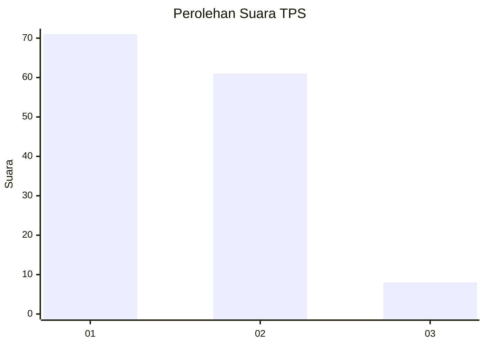
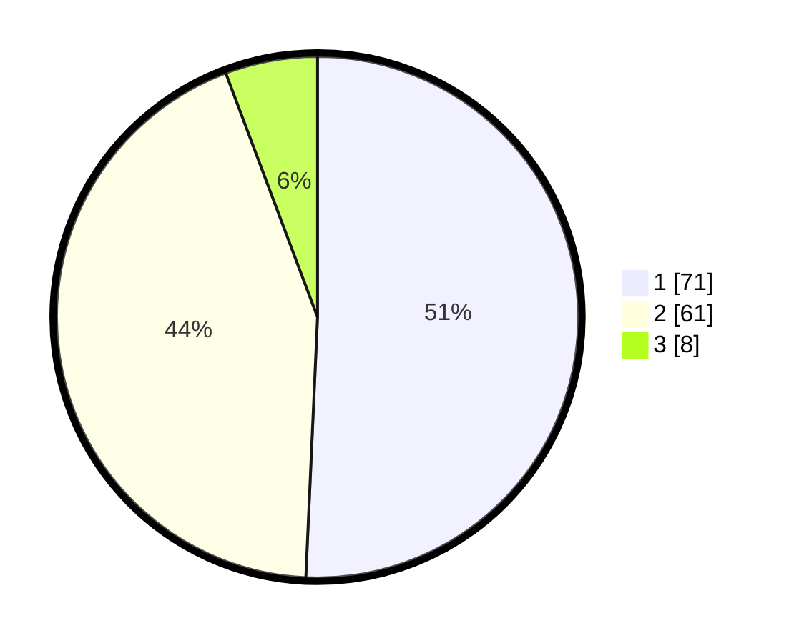

# Hasil

## Grafik

## Tabel

| No. | Nama Paslon    | Suara | Suara (raw) | Persentase |
|:--- |:-------------- | -----:| -----------:| ----------:|
| 1   | ANIES MUHAIMIN | 71    | [71][p-1]   | 50,71      |
| 2   | PRABOWO GIBRAN | 61    | [61][p-2]   | 43,57      |
| 3   | GANJAR MAHFUD  | 8     | [8][p-3]    | 5,71       |

[p-1]: https://github.com/gigit-pemilu/pemilu-2024/blob/main/pilpres/hitung-suara/sub/35-jawa-timur/sub/25-gresik/sub/17-sangkapura/sub/2005-pudakittimur/sub/005-tps/sub/paslon-1.txt
[p-2]: https://github.com/gigit-pemilu/pemilu-2024/blob/main/pilpres/hitung-suara/sub/35-jawa-timur/sub/25-gresik/sub/17-sangkapura/sub/2005-pudakittimur/sub/005-tps/sub/paslon-2.txt
[p-3]: https://github.com/gigit-pemilu/pemilu-2024/blob/main/pilpres/hitung-suara/sub/35-jawa-timur/sub/25-gresik/sub/17-sangkapura/sub/2005-pudakittimur/sub/005-tps/sub/paslon-3.txt

## Foto C Plano

https://sirekap-obj-formc.kpu.go.id/294f/pemilu/ppwp/35/25/17/20/05/3525172005005-20240215-175504--96d01785-f308-41e5-8e2d-e53497b0f928.jpg

https://sirekap-obj-formc.kpu.go.id/294f/pemilu/ppwp/35/25/17/20/05/3525172005005-20240214-223810--9d727d64-1145-4d3a-93dd-02b54aea4f44.jpg

https://sirekap-obj-formc.kpu.go.id/294f/pemilu/ppwp/35/25/17/20/05/3525172005005-20240214-223845--c53e57a3-b49e-484f-b1ec-80c75f12b000.jpg

## Metadata

| Key        | Value               |
| ---------- | ------------------- |
| Time Stamp | 2024-02-15 20:30:46 |

