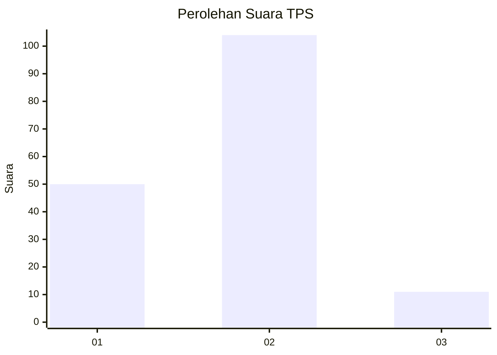
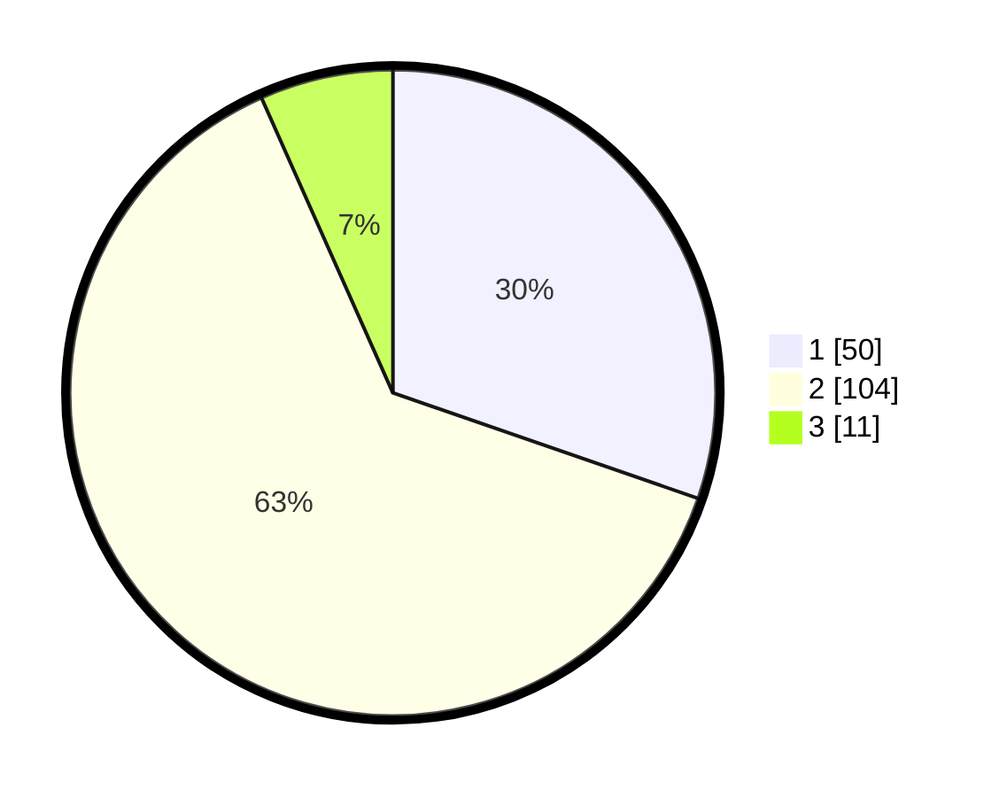

# Hasil

## Grafik

## Tabel

| No. | Nama Paslon    | Suara | Suara (raw) | Persentase |
|:--- |:-------------- | -----:| -----------:| ----------:|
| 1   | ANIES MUHAIMIN | 50    | [50][p-1]   | 30,30      |
| 2   | PRABOWO GIBRAN | 104   | [104][p-2]  | 63,03      |
| 3   | GANJAR MAHFUD  | 11    | [11][p-3]   | 6,67       |

[p-1]: https://github.com/gigit-pemilu/pemilu-2024/blob/main/pilpres/hitung-suara/sub/35-jawa-timur/sub/25-gresik/sub/17-sangkapura/sub/2006-lebak/sub/005-tps/sub/paslon-1.txt
[p-2]: https://github.com/gigit-pemilu/pemilu-2024/blob/main/pilpres/hitung-suara/sub/35-jawa-timur/sub/25-gresik/sub/17-sangkapura/sub/2006-lebak/sub/005-tps/sub/paslon-2.txt
[p-3]: https://github.com/gigit-pemilu/pemilu-2024/blob/main/pilpres/hitung-suara/sub/35-jawa-timur/sub/25-gresik/sub/17-sangkapura/sub/2006-lebak/sub/005-tps/sub/paslon-3.txt

## Foto C Plano

https://sirekap-obj-formc.kpu.go.id/c407/pemilu/ppwp/35/25/17/20/06/3525172006005-20240214-155633--395a0a07-d7aa-47a5-b47f-d03179b0ab61.jpg

https://sirekap-obj-formc.kpu.go.id/c407/pemilu/ppwp/35/25/17/20/06/3525172006005-20240214-155837--3070f3b9-1df3-4114-b8f3-a113f44e223f.jpg

https://sirekap-obj-formc.kpu.go.id/c407/pemilu/ppwp/35/25/17/20/06/3525172006005-20240217-180539--78eed204-5ef4-4f0c-8846-9c35172b5306.jpg

## Metadata

| Key        | Value               |
| ---------- | ------------------- |
| Time Stamp | 2024-02-17 18:30:00 |

