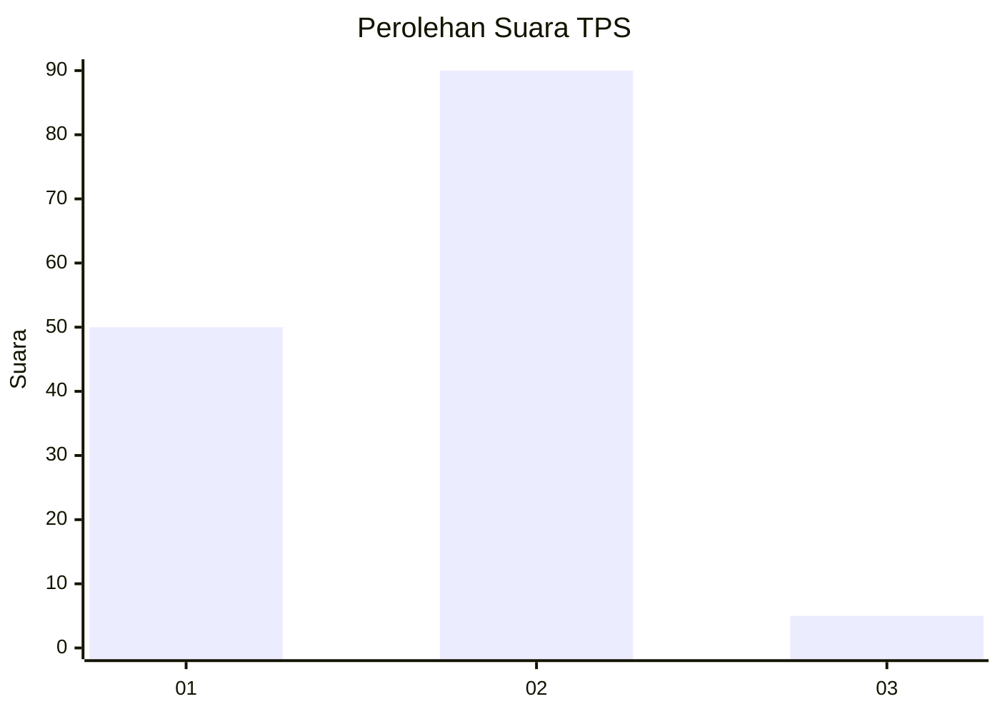
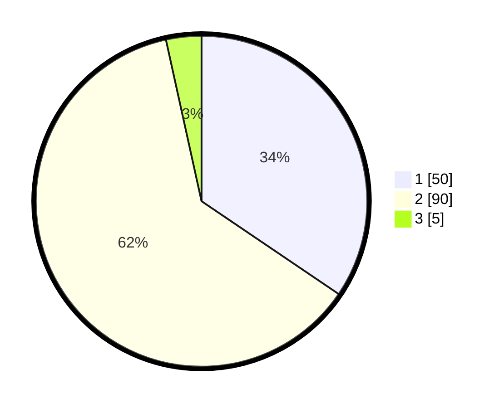

# Hasil

## Grafik

## Tabel

| No. | Nama Paslon    | Suara | Suara (raw) | Persentase |
|:--- |:-------------- | -----:| -----------:| ----------:|
| 1   | ANIES MUHAIMIN | 50    | [50][p-1]   | 34,48      |
| 2   | PRABOWO GIBRAN | 90    | [90][p-2]   | 62,07      |
| 3   | GANJAR MAHFUD  | 5     | [5][p-3]    | 3,45       |

[p-1]: https://github.com/gigit-pemilu/pemilu-2024-35-jawa-timur/blob/main/pilpres/hitung-suara/sub/35-jawa-timur/sub/25-gresik/sub/17-sangkapura/sub/2006-lebak/sub/007-tps/sub/paslon-1.txt
[p-2]: https://github.com/gigit-pemilu/pemilu-2024-35-jawa-timur/blob/main/pilpres/hitung-suara/sub/35-jawa-timur/sub/25-gresik/sub/17-sangkapura/sub/2006-lebak/sub/007-tps/sub/paslon-2.txt
[p-3]: https://github.com/gigit-pemilu/pemilu-2024-35-jawa-timur/blob/main/pilpres/hitung-suara/sub/35-jawa-timur/sub/25-gresik/sub/17-sangkapura/sub/2006-lebak/sub/007-tps/sub/paslon-3.txt

## Foto C Plano

https://sirekap-obj-formc.kpu.go.id/2908/pemilu/ppwp/35/25/17/20/06/3525172006007-20240218-185830--aa304889-bdf0-4b60-baef-efcc4329a48a.jpg

https://sirekap-obj-formc.kpu.go.id/2908/pemilu/ppwp/35/25/17/20/06/3525172006007-20240218-185903--dd21a59e-520f-422a-9833-080e6194f978.jpg

https://sirekap-obj-formc.kpu.go.id/2908/pemilu/ppwp/35/25/17/20/06/3525172006007-20240218-185940--d07a3480-988e-4600-863e-dfeb440ae601.jpg

## Metadata

| Key        | Value               |
| ---------- | ------------------- |
| Time Stamp | 2024-02-20 15:00:00 |

