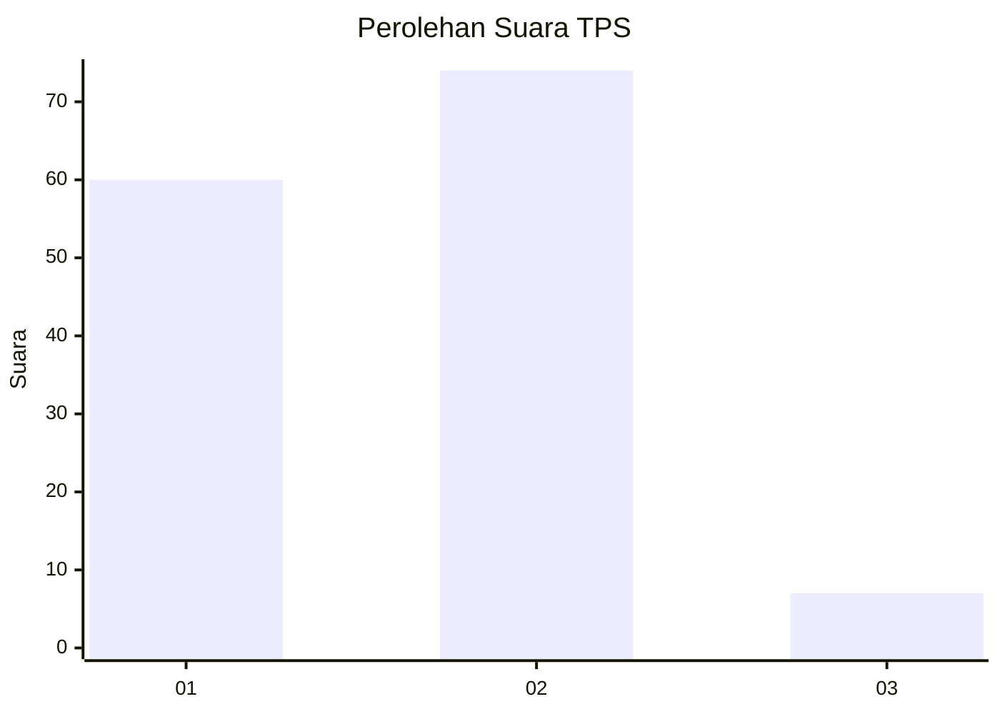
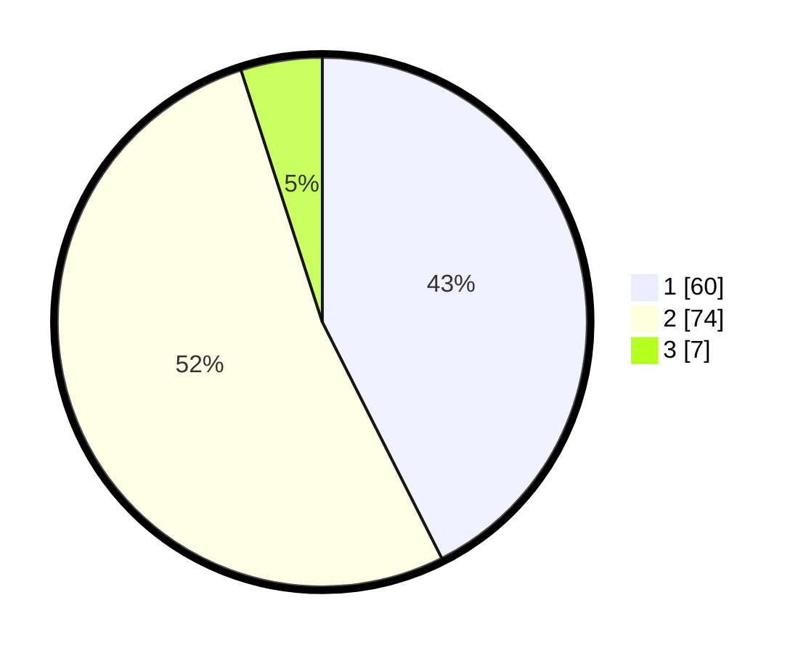

# Hasil

## Grafik

## Tabel

| No. | Nama Paslon    | Suara | Suara (raw) | Persentase |
|:--- |:-------------- | -----:| -----------:| ----------:|
| 1   | ANIES MUHAIMIN | 60    | [60][p-1]   | 42,55      |
| 2   | PRABOWO GIBRAN | 74    | [74][p-2]   | 52,48      |
| 3   | GANJAR MAHFUD  | 7     | [7][p-3]    | 4,96       |

[p-1]: https://github.com/gigit-pemilu/pemilu-2024/blob/main/pilpres/hitung-suara/sub/35-jawa-timur/sub/25-gresik/sub/17-sangkapura/sub/2006-lebak/sub/008-tps/sub/paslon-1.txt
[p-2]: https://github.com/gigit-pemilu/pemilu-2024/blob/main/pilpres/hitung-suara/sub/35-jawa-timur/sub/25-gresik/sub/17-sangkapura/sub/2006-lebak/sub/008-tps/sub/paslon-2.txt
[p-3]: https://github.com/gigit-pemilu/pemilu-2024/blob/main/pilpres/hitung-suara/sub/35-jawa-timur/sub/25-gresik/sub/17-sangkapura/sub/2006-lebak/sub/008-tps/sub/paslon-3.txt

## Foto C Plano

https://sirekap-obj-formc.kpu.go.id/a36f/pemilu/ppwp/35/25/17/20/06/3525172006008-20240215-045746--d944f66d-8d7b-4cbc-84f9-7827d21042a0.jpg

https://sirekap-obj-formc.kpu.go.id/a36f/pemilu/ppwp/35/25/17/20/06/3525172006008-20240214-190855--4afd07e9-27bc-402d-93f9-0b9ddda6658a.jpg

https://sirekap-obj-formc.kpu.go.id/a36f/pemilu/ppwp/35/25/17/20/06/3525172006008-20240214-191135--eec0b6f0-e32d-476b-a99c-4e388e29a312.jpg

## Metadata

| Key        | Value               |
| ---------- | ------------------- |
| Time Stamp | 2024-02-15 15:00:29 |

