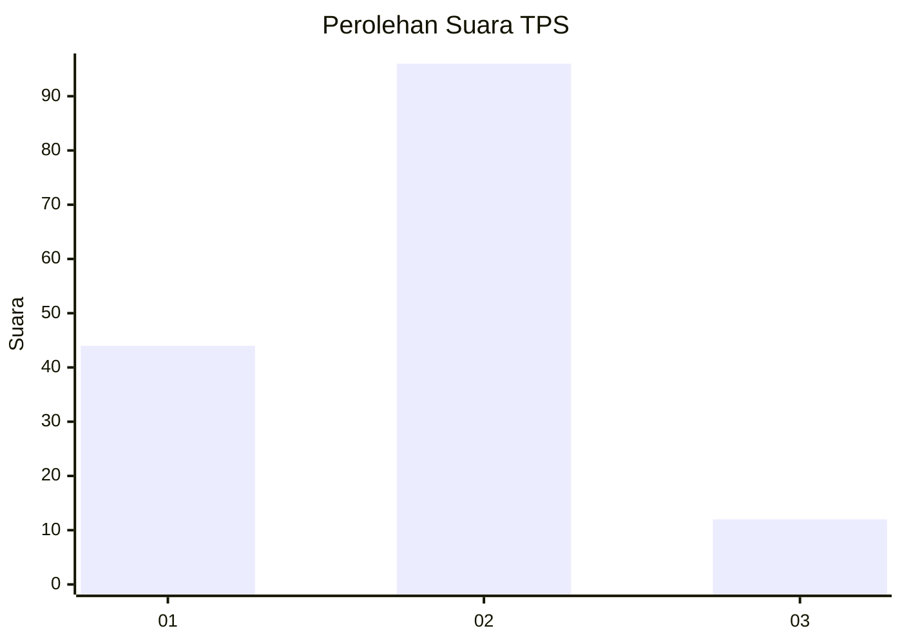
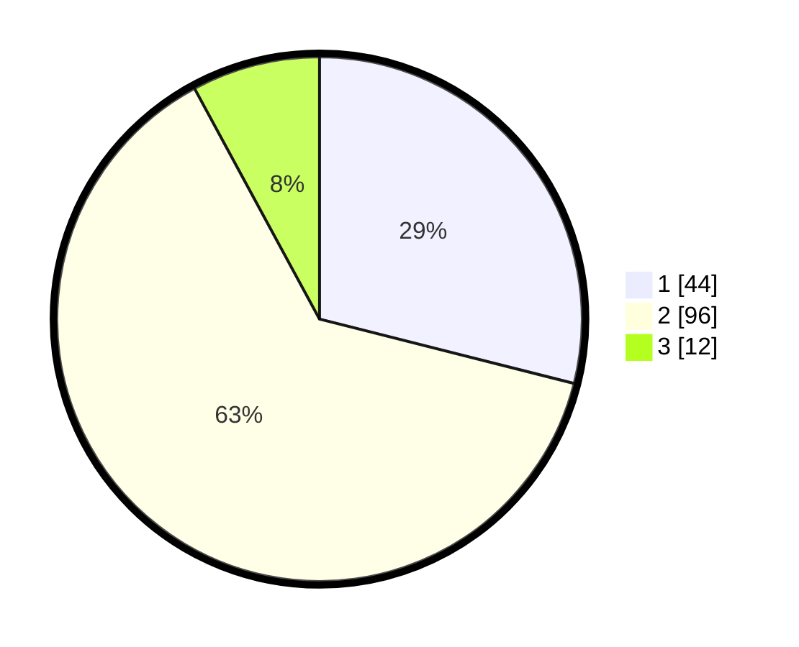

# Hasil

## Grafik

## Tabel

| No. | Nama Paslon    | Suara | Suara (raw) | Persentase |
|:--- |:-------------- | -----:| -----------:| ----------:|
| 1   | ANIES MUHAIMIN | 44    | [44][p-1]   | 28,95      |
| 2   | PRABOWO GIBRAN | 96    | [96][p-2]   | 63,16      |
| 3   | GANJAR MAHFUD  | 12    | [12][p-3]   | 7,89       |

[p-1]: https://github.com/gigit-pemilu/pemilu-2024-35-jawa-timur/blob/main/pilpres/hitung-suara/sub/35-jawa-timur/sub/25-gresik/sub/17-sangkapura/sub/2006-lebak/sub/012-tps/sub/paslon-1.txt
[p-2]: https://github.com/gigit-pemilu/pemilu-2024-35-jawa-timur/blob/main/pilpres/hitung-suara/sub/35-jawa-timur/sub/25-gresik/sub/17-sangkapura/sub/2006-lebak/sub/012-tps/sub/paslon-2.txt
[p-3]: https://github.com/gigit-pemilu/pemilu-2024-35-jawa-timur/blob/main/pilpres/hitung-suara/sub/35-jawa-timur/sub/25-gresik/sub/17-sangkapura/sub/2006-lebak/sub/012-tps/sub/paslon-3.txt

## Foto C Plano

https://sirekap-obj-formc.kpu.go.id/1d15/pemilu/ppwp/35/25/17/20/06/3525172006012-20240218-190811--80af53cb-8a67-4d6a-a6ab-7eac08d925f9.jpg

https://sirekap-obj-formc.kpu.go.id/1d15/pemilu/ppwp/35/25/17/20/06/3525172006012-20240218-190900--f0584606-d1a2-46e5-8cf9-14c19ba5b418.jpg

https://sirekap-obj-formc.kpu.go.id/1d15/pemilu/ppwp/35/25/17/20/06/3525172006012-20240218-190942--d2bb7c08-9fec-427d-b313-7f8e57eac345.jpg

## Metadata

| Key        | Value               |
| ---------- | ------------------- |
| Time Stamp | 2024-02-20 15:00:00 |

