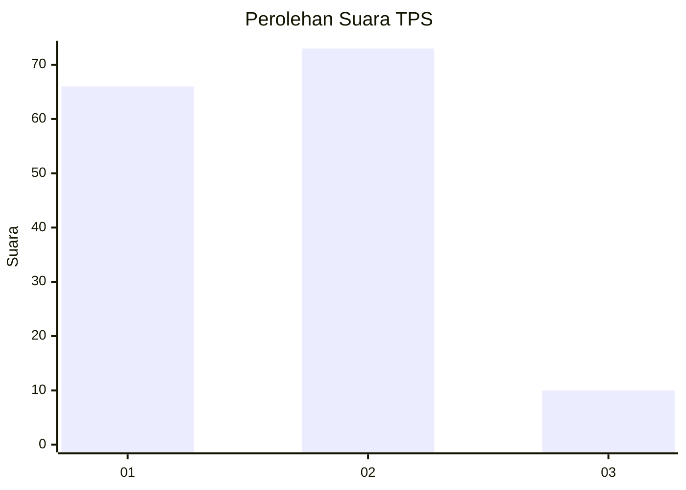
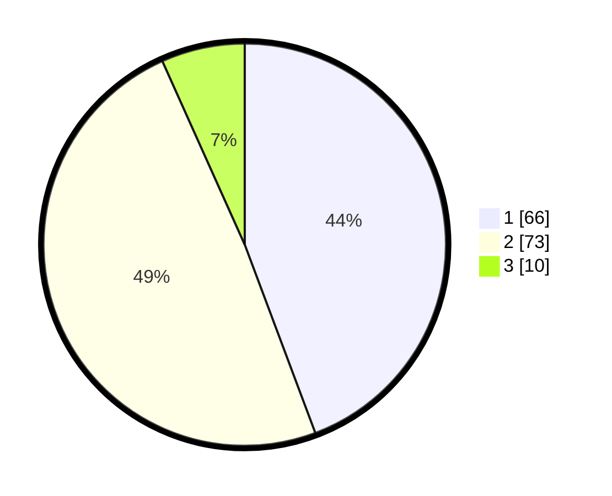

# Hasil

## Grafik

## Tabel

| No. | Nama Paslon    | Suara | Suara (raw) | Persentase |
|:--- |:-------------- | -----:| -----------:| ----------:|
| 1   | ANIES MUHAIMIN | 66    | [66][p-1]   | 44,30      |
| 2   | PRABOWO GIBRAN | 73    | [73][p-2]   | 48,99      |
| 3   | GANJAR MAHFUD  | 10    | [10][p-3]   | 6,71       |

[p-1]: https://github.com/gigit-pemilu/pemilu-2024-35-jawa-timur/blob/main/pilpres/hitung-suara/sub/35-jawa-timur/sub/25-gresik/sub/17-sangkapura/sub/2007-bululanjang/sub/006-tps/sub/paslon-1.txt
[p-2]: https://github.com/gigit-pemilu/pemilu-2024-35-jawa-timur/blob/main/pilpres/hitung-suara/sub/35-jawa-timur/sub/25-gresik/sub/17-sangkapura/sub/2007-bululanjang/sub/006-tps/sub/paslon-2.txt
[p-3]: https://github.com/gigit-pemilu/pemilu-2024-35-jawa-timur/blob/main/pilpres/hitung-suara/sub/35-jawa-timur/sub/25-gresik/sub/17-sangkapura/sub/2007-bululanjang/sub/006-tps/sub/paslon-3.txt

## Foto C Plano

https://sirekap-obj-formc.kpu.go.id/a1f0/pemilu/ppwp/35/25/17/20/07/3525172007006-20240214-222844--5bf3d3c0-f121-4c39-8f10-126e3e82b2a4.jpg

https://sirekap-obj-formc.kpu.go.id/a1f0/pemilu/ppwp/35/25/17/20/07/3525172007006-20240214-223150--94ebea98-b16f-47f3-a7b0-acf28dbaeeb4.jpg

https://sirekap-obj-formc.kpu.go.id/a1f0/pemilu/ppwp/35/25/17/20/07/3525172007006-20240214-223433--8bd93de2-7dcd-4251-8655-a71539df6cba.jpg

## Metadata

| Key        | Value               |
| ---------- | ------------------- |
| Time Stamp | 2024-02-15 16:30:25 |

