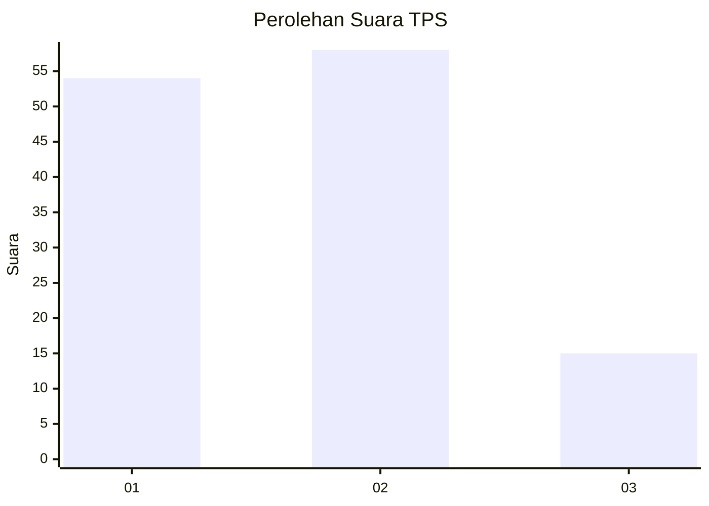
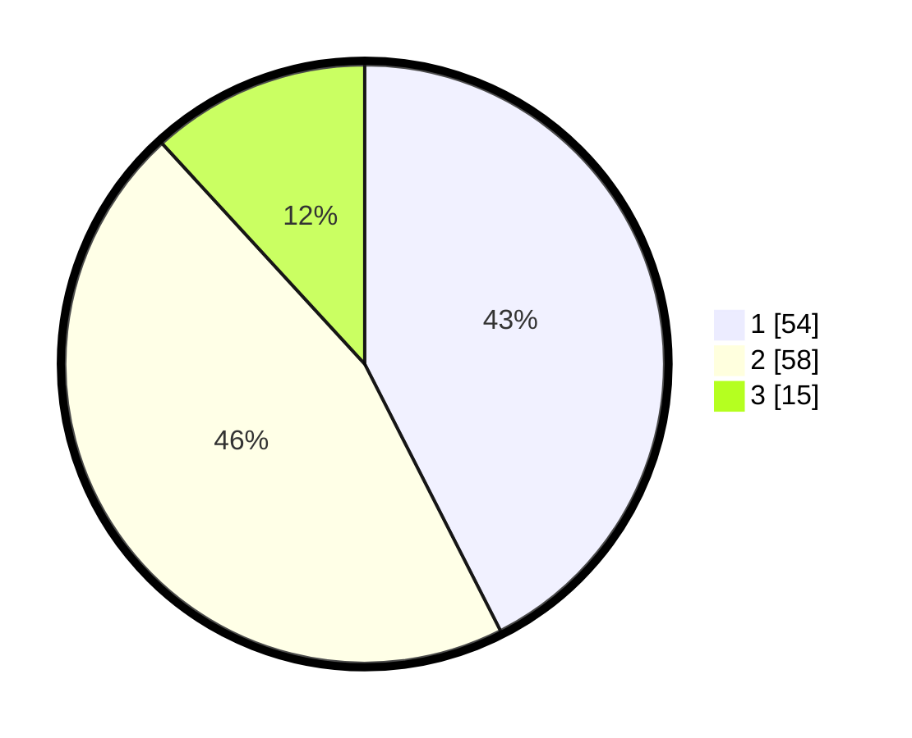

# Hasil

## Grafik

## Tabel

| No. | Nama Paslon    | Suara | Suara (raw) | Persentase |
|:--- |:-------------- | -----:| -----------:| ----------:|
| 1   | ANIES MUHAIMIN | 54    | [54][p-1]   | 42,52      |
| 2   | PRABOWO GIBRAN | 58    | [58][p-2]   | 45,67      |
| 3   | GANJAR MAHFUD  | 15    | [15][p-3]   | 11,81      |

[p-1]: https://github.com/gigit-pemilu/pemilu-2024/blob/main/pilpres/hitung-suara/sub/35-jawa-timur/sub/25-gresik/sub/17-sangkapura/sub/2007-bululanjang/sub/007-tps/sub/paslon-1.txt
[p-2]: https://github.com/gigit-pemilu/pemilu-2024/blob/main/pilpres/hitung-suara/sub/35-jawa-timur/sub/25-gresik/sub/17-sangkapura/sub/2007-bululanjang/sub/007-tps/sub/paslon-2.txt
[p-3]: https://github.com/gigit-pemilu/pemilu-2024/blob/main/pilpres/hitung-suara/sub/35-jawa-timur/sub/25-gresik/sub/17-sangkapura/sub/2007-bululanjang/sub/007-tps/sub/paslon-3.txt

## Foto C Plano

https://sirekap-obj-formc.kpu.go.id/278e/pemilu/ppwp/35/25/17/20/07/3525172007007-20240215-022344--afeb5ed4-4682-434e-8479-6715107d5e97.jpg

https://sirekap-obj-formc.kpu.go.id/278e/pemilu/ppwp/35/25/17/20/07/3525172007007-20240215-023245--c833977b-bfd0-41c8-9eb0-e8ff08e9c50b.jpg

https://sirekap-obj-formc.kpu.go.id/278e/pemilu/ppwp/35/25/17/20/07/3525172007007-20240215-032136--3872f3cf-b969-4761-aa9c-bb5cf5bb13f6.jpg

## Metadata

| Key        | Value               |
| ---------- | ------------------- |
| Time Stamp | 2024-02-16 16:25:10 |

