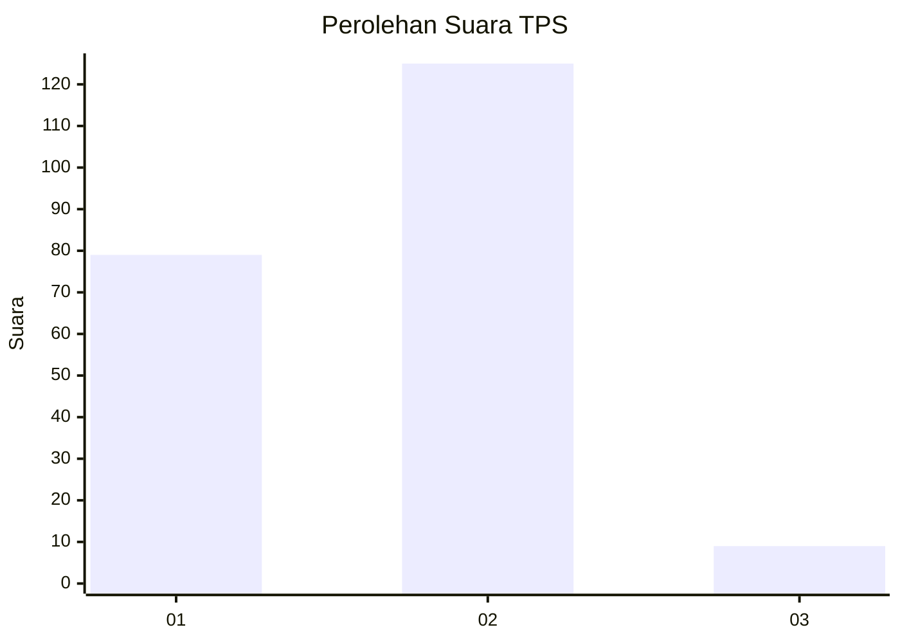
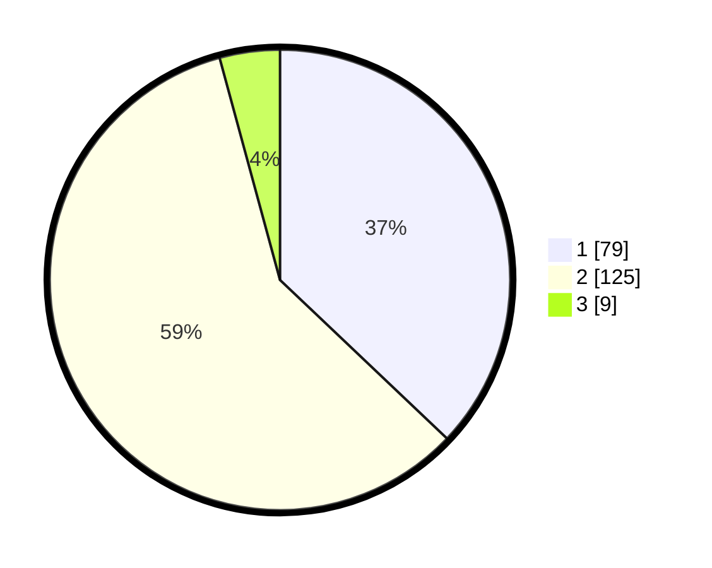

# Hasil

## Grafik

## Tabel

| No. | Nama Paslon    | Suara | Suara (raw) | Persentase |
|:--- |:-------------- | -----:| -----------:| ----------:|
| 1   | ANIES MUHAIMIN | 79    | [79][p-1]   | 37,09      |
| 2   | PRABOWO GIBRAN | 125   | [125][p-2]  | 58,69      |
| 3   | GANJAR MAHFUD  | 9     | [9][p-3]    | 4,23       |

[p-1]: https://github.com/gigit-pemilu/pemilu-2024/blob/main/pilpres/hitung-suara/sub/35-jawa-timur/sub/25-gresik/sub/17-sangkapura/sub/2010-sungaiteluk/sub/005-tps/sub/paslon-1.txt
[p-2]: https://github.com/gigit-pemilu/pemilu-2024/blob/main/pilpres/hitung-suara/sub/35-jawa-timur/sub/25-gresik/sub/17-sangkapura/sub/2010-sungaiteluk/sub/005-tps/sub/paslon-2.txt
[p-3]: https://github.com/gigit-pemilu/pemilu-2024/blob/main/pilpres/hitung-suara/sub/35-jawa-timur/sub/25-gresik/sub/17-sangkapura/sub/2010-sungaiteluk/sub/005-tps/sub/paslon-3.txt

## Foto C Plano

https://sirekap-obj-formc.kpu.go.id/8276/pemilu/ppwp/35/25/17/20/10/3525172010005-20240215-180839--3d2ce3ab-c093-4b5e-b8c8-602da77dc6ad.jpg

https://sirekap-obj-formc.kpu.go.id/8276/pemilu/ppwp/35/25/17/20/10/3525172010005-20240215-180844--6f934fc0-b5dc-42c6-9df9-b2dc3cb2dbc9.jpg

https://sirekap-obj-formc.kpu.go.id/8276/pemilu/ppwp/35/25/17/20/10/3525172010005-20240215-180850--5b84afb8-a497-45ed-9568-5e58706ce432.jpg

## Metadata

| Key        | Value               |
| ---------- | ------------------- |
| Time Stamp | 2024-02-15 22:30:27 |

