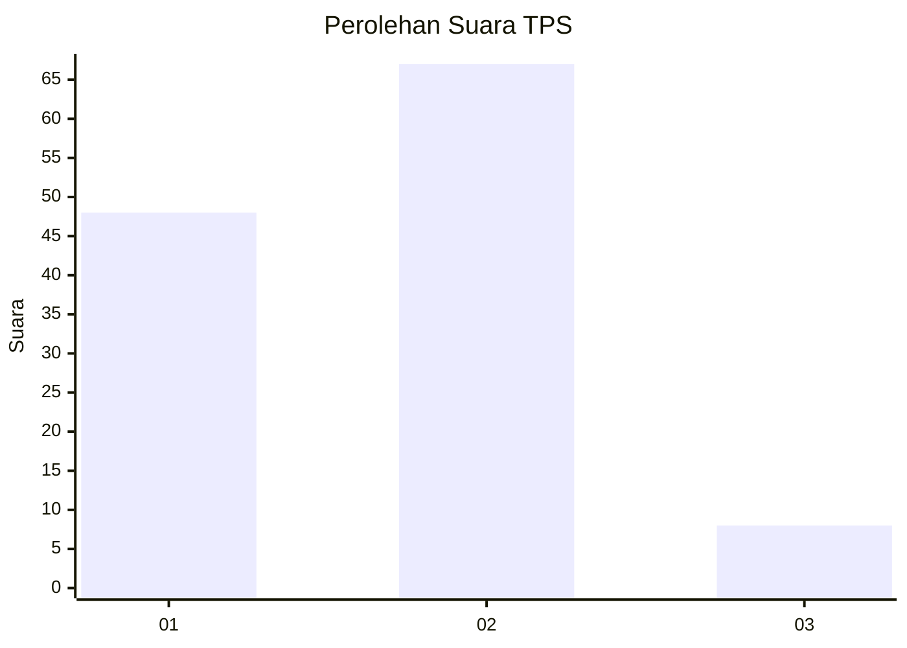
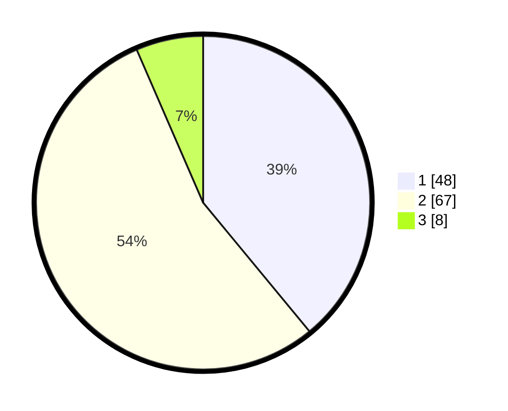

# Hasil

## Grafik

## Tabel

| No. | Nama Paslon    | Suara | Suara (raw) | Persentase |
|:--- |:-------------- | -----:| -----------:| ----------:|
| 1   | ANIES MUHAIMIN | 48    | [48][p-1]   | 39,02      |
| 2   | PRABOWO GIBRAN | 67    | [67][p-2]   | 54,47      |
| 3   | GANJAR MAHFUD  | 8     | [8][p-3]    | 6,50       |

[p-1]: https://github.com/gigit-pemilu/pemilu-2024-35-jawa-timur/blob/main/pilpres/hitung-suara/sub/35-jawa-timur/sub/25-gresik/sub/17-sangkapura/sub/2010-sungaiteluk/sub/009-tps/sub/paslon-1.txt
[p-2]: https://github.com/gigit-pemilu/pemilu-2024-35-jawa-timur/blob/main/pilpres/hitung-suara/sub/35-jawa-timur/sub/25-gresik/sub/17-sangkapura/sub/2010-sungaiteluk/sub/009-tps/sub/paslon-2.txt
[p-3]: https://github.com/gigit-pemilu/pemilu-2024-35-jawa-timur/blob/main/pilpres/hitung-suara/sub/35-jawa-timur/sub/25-gresik/sub/17-sangkapura/sub/2010-sungaiteluk/sub/009-tps/sub/paslon-3.txt

## Foto C Plano

https://sirekap-obj-formc.kpu.go.id/1cc5/pemilu/ppwp/35/25/17/20/10/3525172010009-20240214-233042--193f9ffa-be5f-4a24-91ec-c6264b15a997.jpg

https://sirekap-obj-formc.kpu.go.id/1cc5/pemilu/ppwp/35/25/17/20/10/3525172010009-20240214-233150--9371a6ab-09e4-4ba9-979d-0967782d84ab.jpg

https://sirekap-obj-formc.kpu.go.id/1cc5/pemilu/ppwp/35/25/17/20/10/3525172010009-20240214-233244--d9d378fb-244a-45aa-8a27-cacbdc2a7233.jpg

## Metadata

| Key        | Value               |
| ---------- | ------------------- |
| Time Stamp | 2024-02-15 17:00:25 |

