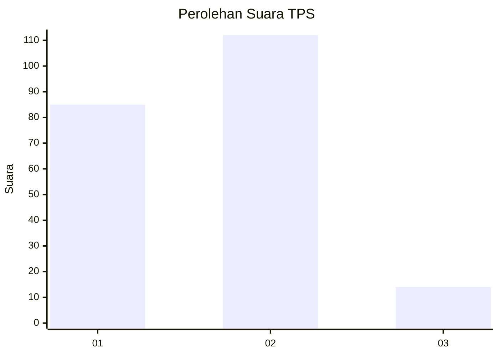

# Hasil

## Grafik

## Tabel

| No. | Nama Paslon    | Suara | Suara (raw) | Persentase |
|:--- |:-------------- | -----:| -----------:| ----------:|
| 1   | ANIES MUHAIMIN | 85    | [85][p-1]   | 40,28      |
| 2   | PRABOWO GIBRAN | 112   | [112][p-2]  | 53,08      |
| 3   | GANJAR MAHFUD  | 14    | [14][p-3]   | 6,64       |

[p-1]: https://github.com/gigit-pemilu/pemilu-2024/blob/main/pilpres/hitung-suara/sub/35-jawa-timur/sub/25-gresik/sub/17-sangkapura/sub/2011-gunungteguh/sub/001-tps/sub/paslon-1.txt
[p-2]: https://github.com/gigit-pemilu/pemilu-2024/blob/main/pilpres/hitung-suara/sub/35-jawa-timur/sub/25-gresik/sub/17-sangkapura/sub/2011-gunungteguh/sub/001-tps/sub/paslon-2.txt
[p-3]: https://github.com/gigit-pemilu/pemilu-2024/blob/main/pilpres/hitung-suara/sub/35-jawa-timur/sub/25-gresik/sub/17-sangkapura/sub/2011-gunungteguh/sub/001-tps/sub/paslon-3.txt

## Foto C Plano

https://sirekap-obj-formc.kpu.go.id/7a07/pemilu/ppwp/35/25/17/20/11/3525172011001-20240215-002032--4af3086b-22bb-41bb-84bf-74e8ffa3196f.jpg

https://sirekap-obj-formc.kpu.go.id/7a07/pemilu/ppwp/35/25/17/20/11/3525172011001-20240215-002207--abbdf19a-50b5-4938-9188-b9097a6dccd7.jpg

https://sirekap-obj-formc.kpu.go.id/7a07/pemilu/ppwp/35/25/17/20/11/3525172011001-20240215-002255--8e67ca28-2632-484d-bf61-7fc0e3916654.jpg

## Metadata

| Key        | Value               |
| ---------- | ------------------- |
| Time Stamp | 2024-02-20 15:00:00 |

