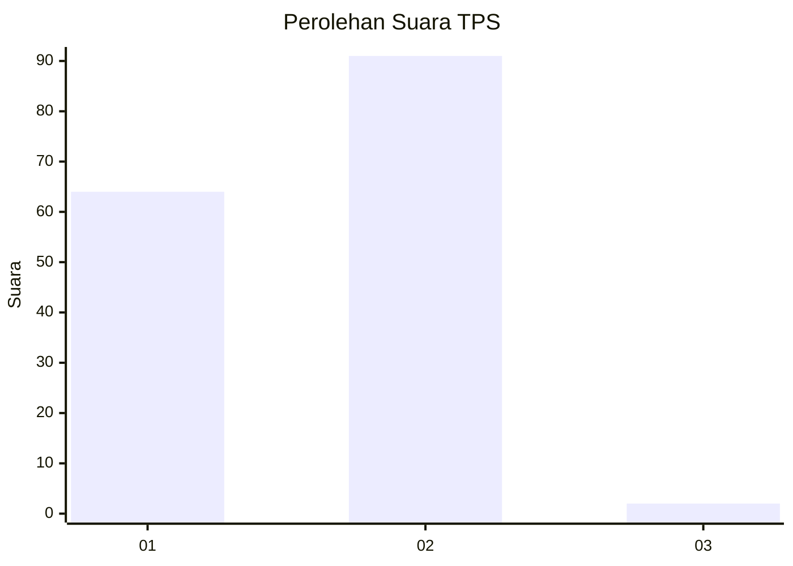
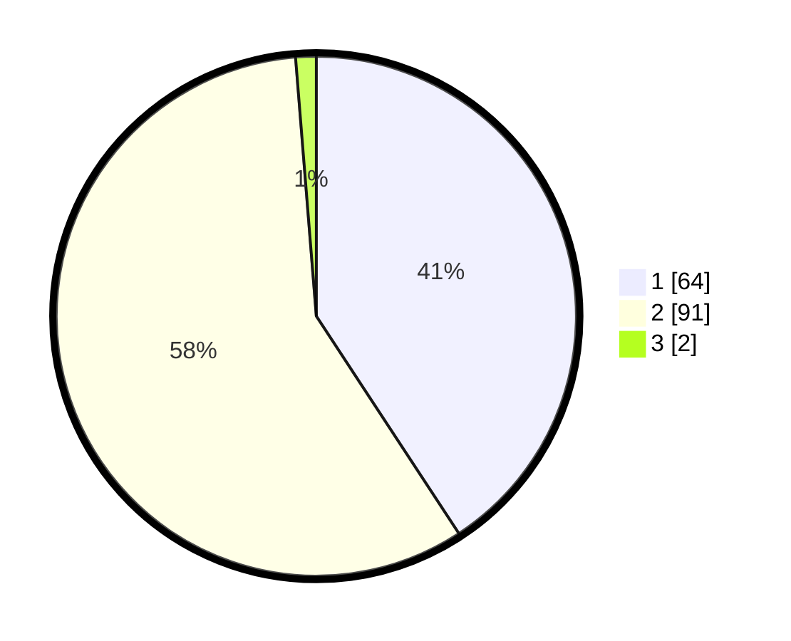

# Hasil

## Grafik

## Tabel

| No. | Nama Paslon    | Suara | Suara (raw) | Persentase |
|:--- |:-------------- | -----:| -----------:| ----------:|
| 1   | ANIES MUHAIMIN | 64    | [64][p-1]   | 40,76      |
| 2   | PRABOWO GIBRAN | 91    | [91][p-2]   | 57,96      |
| 3   | GANJAR MAHFUD  | 2     | [2][p-3]    | 1,27       |

[p-1]: https://github.com/gigit-pemilu/pemilu-2024-35-jawa-timur/blob/main/pilpres/hitung-suara/sub/35-jawa-timur/sub/25-gresik/sub/17-sangkapura/sub/2011-gunungteguh/sub/004-tps/sub/paslon-1.txt
[p-2]: https://github.com/gigit-pemilu/pemilu-2024-35-jawa-timur/blob/main/pilpres/hitung-suara/sub/35-jawa-timur/sub/25-gresik/sub/17-sangkapura/sub/2011-gunungteguh/sub/004-tps/sub/paslon-2.txt
[p-3]: https://github.com/gigit-pemilu/pemilu-2024-35-jawa-timur/blob/main/pilpres/hitung-suara/sub/35-jawa-timur/sub/25-gresik/sub/17-sangkapura/sub/2011-gunungteguh/sub/004-tps/sub/paslon-3.txt

## Foto C Plano

https://sirekap-obj-formc.kpu.go.id/f2d7/pemilu/ppwp/35/25/17/20/11/3525172011004-20240215-005804--cb766c2a-6a35-4e97-992c-ea3ee599eee5.jpg

https://sirekap-obj-formc.kpu.go.id/f2d7/pemilu/ppwp/35/25/17/20/11/3525172011004-20240215-010028--50ce74d6-289f-4da9-8634-c63e211ce7a2.jpg

https://sirekap-obj-formc.kpu.go.id/f2d7/pemilu/ppwp/35/25/17/20/11/3525172011004-20240215-010409--397ac57c-d486-4744-9bc6-4a3ecd275caf.jpg

## Metadata

| Key        | Value               |
| ---------- | ------------------- |
| Time Stamp | 2024-02-16 16:25:10 |

