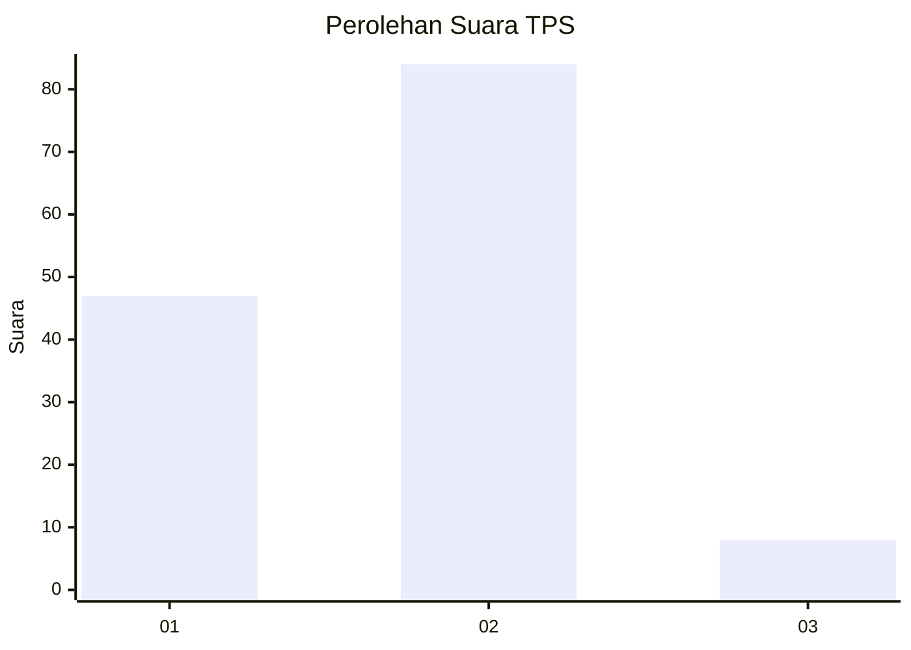
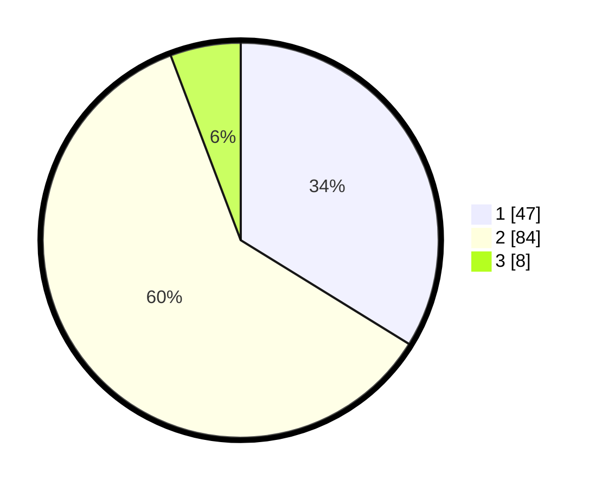

# Hasil

## Grafik

## Tabel

| No. | Nama Paslon    | Suara | Suara (raw) | Persentase |
|:--- |:-------------- | -----:| -----------:| ----------:|
| 1   | ANIES MUHAIMIN | 47    | [47][p-1]   | 33,81      |
| 2   | PRABOWO GIBRAN | 84    | [84][p-2]   | 60,43      |
| 3   | GANJAR MAHFUD  | 8     | [8][p-3]    | 5,76       |

[p-1]: https://github.com/gigit-pemilu/pemilu-2024-35-jawa-timur/blob/main/pilpres/hitung-suara/sub/35-jawa-timur/sub/25-gresik/sub/17-sangkapura/sub/2011-gunungteguh/sub/012-tps/sub/paslon-1.txt
[p-2]: https://github.com/gigit-pemilu/pemilu-2024-35-jawa-timur/blob/main/pilpres/hitung-suara/sub/35-jawa-timur/sub/25-gresik/sub/17-sangkapura/sub/2011-gunungteguh/sub/012-tps/sub/paslon-2.txt
[p-3]: https://github.com/gigit-pemilu/pemilu-2024-35-jawa-timur/blob/main/pilpres/hitung-suara/sub/35-jawa-timur/sub/25-gresik/sub/17-sangkapura/sub/2011-gunungteguh/sub/012-tps/sub/paslon-3.txt

## Foto C Plano

https://sirekap-obj-formc.kpu.go.id/be18/pemilu/ppwp/35/25/17/20/11/3525172011012-20240214-221311--9817802f-2a3e-4272-aeb5-9efea7e55f30.jpg

https://sirekap-obj-formc.kpu.go.id/be18/pemilu/ppwp/35/25/17/20/11/3525172011012-20240216-094731--56d2c975-a26f-4ff2-9b73-fa64348c39b6.jpg

https://sirekap-obj-formc.kpu.go.id/be18/pemilu/ppwp/35/25/17/20/11/3525172011012-20240214-221516--cbd6ab6d-2e0c-4a69-a8f4-6ff934da88ff.jpg

## Metadata

| Key        | Value               |
| ---------- | ------------------- |
| Time Stamp | 2024-02-20 14:00:00 |

