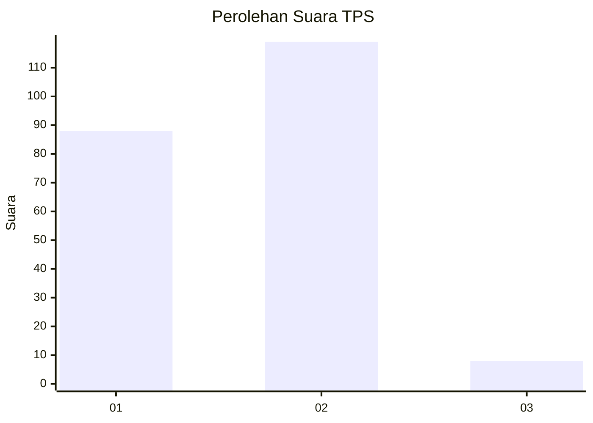
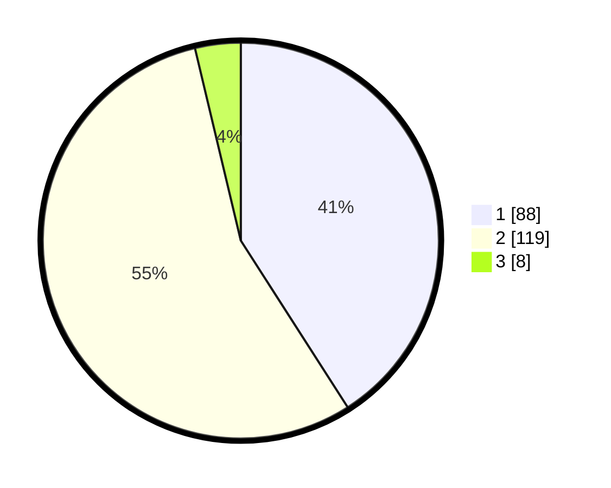

# Hasil

## Grafik

## Tabel

| No. | Nama Paslon    | Suara | Suara (raw) | Persentase |
|:--- |:-------------- | -----:| -----------:| ----------:|
| 1   | ANIES MUHAIMIN | 88    | [88][p-1]   | 40,93      |
| 2   | PRABOWO GIBRAN | 119   | [119][p-2]  | 55,35      |
| 3   | GANJAR MAHFUD  | 8     | [8][p-3]    | 3,72       |

[p-1]: https://github.com/gigit-pemilu/pemilu-2024/blob/main/pilpres/hitung-suara/sub/35-jawa-timur/sub/25-gresik/sub/17-sangkapura/sub/2015-kebontelukdalam/sub/001-tps/sub/paslon-1.txt
[p-2]: https://github.com/gigit-pemilu/pemilu-2024/blob/main/pilpres/hitung-suara/sub/35-jawa-timur/sub/25-gresik/sub/17-sangkapura/sub/2015-kebontelukdalam/sub/001-tps/sub/paslon-2.txt
[p-3]: https://github.com/gigit-pemilu/pemilu-2024/blob/main/pilpres/hitung-suara/sub/35-jawa-timur/sub/25-gresik/sub/17-sangkapura/sub/2015-kebontelukdalam/sub/001-tps/sub/paslon-3.txt

## Foto C Plano

https://sirekap-obj-formc.kpu.go.id/1d13/pemilu/ppwp/35/25/17/20/15/3525172015001-20240215-112320--843687d9-42aa-46a4-854e-e74b5e4765bc.jpg

https://sirekap-obj-formc.kpu.go.id/1d13/pemilu/ppwp/35/25/17/20/15/3525172015001-20240215-112340--168fe4e0-9f1d-4070-93f6-a6b91923a703.jpg

https://sirekap-obj-formc.kpu.go.id/1d13/pemilu/ppwp/35/25/17/20/15/3525172015001-20240215-112404--97492449-43d9-4970-924d-02aac0fe6d96.jpg

## Metadata

| Key        | Value               |
| ---------- | ------------------- |
| Time Stamp | 2024-02-16 16:25:10 |

