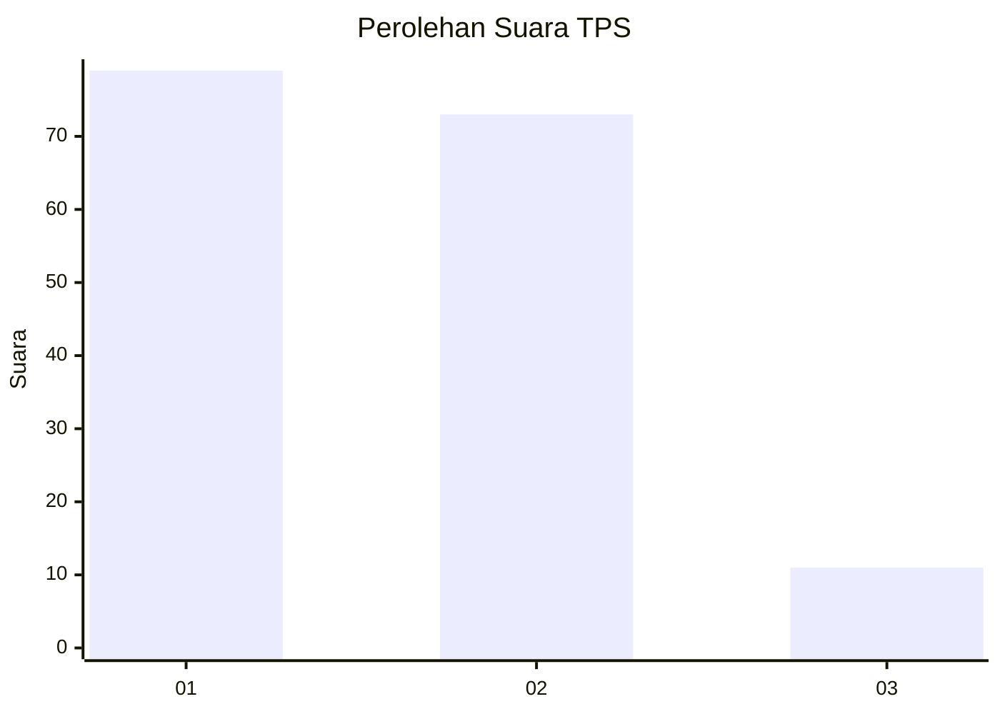
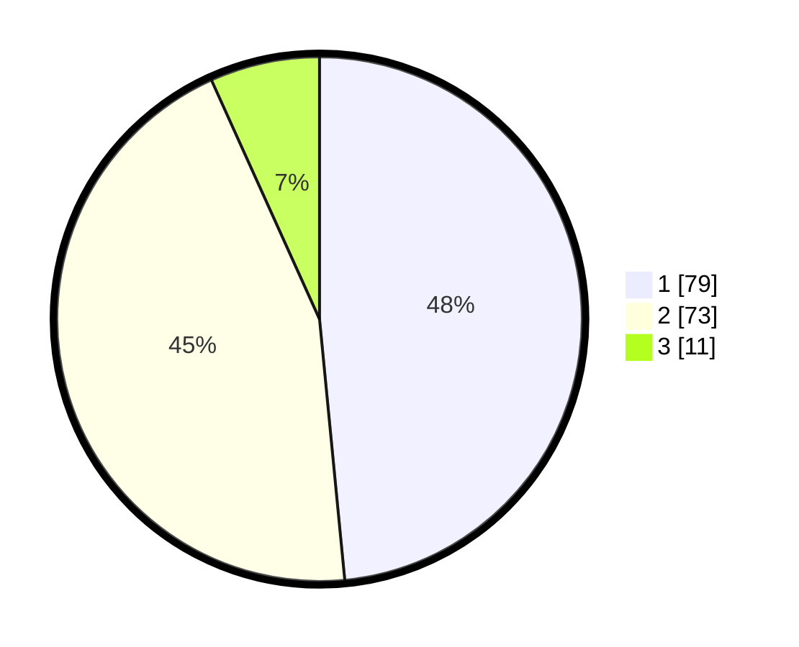

# Hasil

## Grafik

## Tabel

| No. | Nama Paslon    | Suara | Suara (raw) | Persentase |
|:--- |:-------------- | -----:| -----------:| ----------:|
| 1   | ANIES MUHAIMIN | 79    | [79][p-1]   | 48,47      |
| 2   | PRABOWO GIBRAN | 73    | [73][p-2]   | 44,79      |
| 3   | GANJAR MAHFUD  | 11    | [11][p-3]   | 6,75       |

[p-1]: https://github.com/gigit-pemilu/pemilu-2024-35-jawa-timur/blob/main/pilpres/hitung-suara/sub/35-jawa-timur/sub/25-gresik/sub/17-sangkapura/sub/2015-kebontelukdalam/sub/008-tps/sub/paslon-1.txt
[p-2]: https://github.com/gigit-pemilu/pemilu-2024-35-jawa-timur/blob/main/pilpres/hitung-suara/sub/35-jawa-timur/sub/25-gresik/sub/17-sangkapura/sub/2015-kebontelukdalam/sub/008-tps/sub/paslon-2.txt
[p-3]: https://github.com/gigit-pemilu/pemilu-2024-35-jawa-timur/blob/main/pilpres/hitung-suara/sub/35-jawa-timur/sub/25-gresik/sub/17-sangkapura/sub/2015-kebontelukdalam/sub/008-tps/sub/paslon-3.txt

## Foto C Plano

https://sirekap-obj-formc.kpu.go.id/b7f2/pemilu/ppwp/35/25/17/20/15/3525172015008-20240215-103312--31867793-b857-4fc1-b4e7-459fcb5b945f.jpg

https://sirekap-obj-formc.kpu.go.id/b7f2/pemilu/ppwp/35/25/17/20/15/3525172015008-20240215-023227--86221b26-9bef-4910-8ec3-7a68064b33dd.jpg

https://sirekap-obj-formc.kpu.go.id/b7f2/pemilu/ppwp/35/25/17/20/15/3525172015008-20240215-103331--b8cab438-5f03-4556-8c84-2a1f82a765ee.jpg

## Metadata

| Key        | Value               |
| ---------- | ------------------- |
| Time Stamp | 2024-02-20 15:00:00 |

