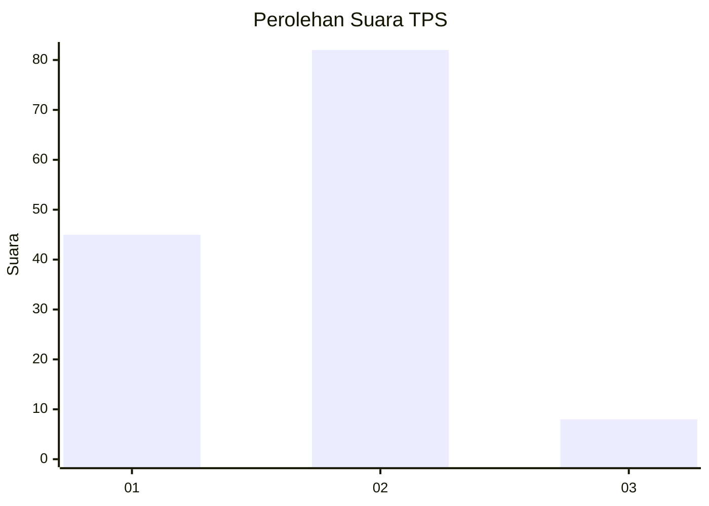
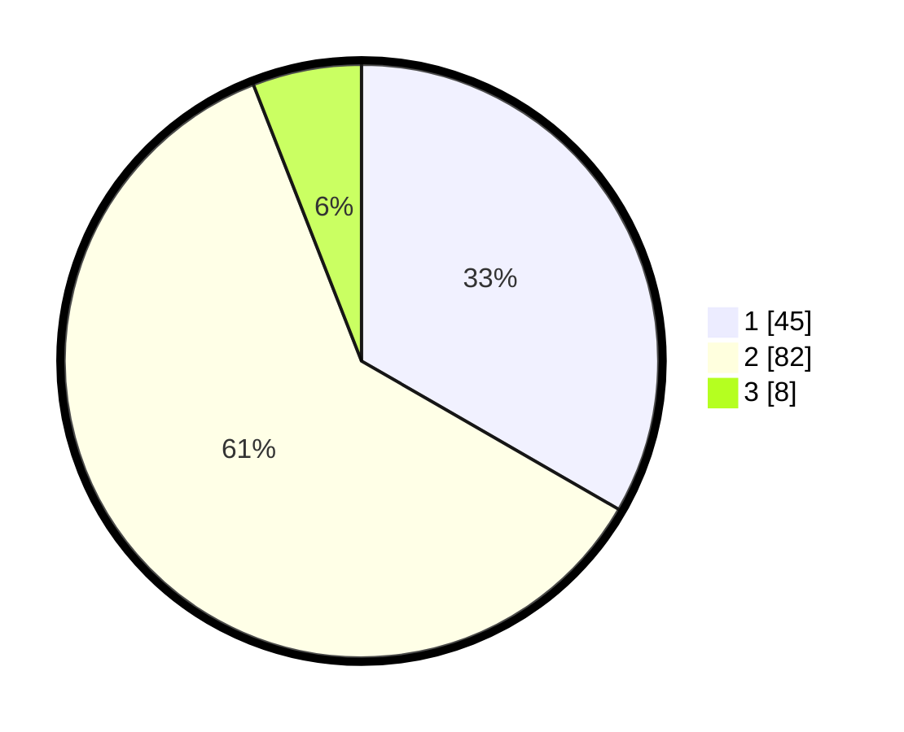

# Hasil

## Grafik

## Tabel

| No. | Nama Paslon    | Suara | Suara (raw) | Persentase |
|:--- |:-------------- | -----:| -----------:| ----------:|
| 1   | ANIES MUHAIMIN | 45    | [45][p-1]   | 33,33      |
| 2   | PRABOWO GIBRAN | 82    | [82][p-2]   | 60,74      |
| 3   | GANJAR MAHFUD  | 8     | [8][p-3]    | 5,93       |

[p-1]: https://github.com/gigit-pemilu/pemilu-2024/blob/main/pilpres/hitung-suara/sub/35-jawa-timur/sub/25-gresik/sub/17-sangkapura/sub/2015-kebontelukdalam/sub/010-tps/sub/paslon-1.txt
[p-2]: https://github.com/gigit-pemilu/pemilu-2024/blob/main/pilpres/hitung-suara/sub/35-jawa-timur/sub/25-gresik/sub/17-sangkapura/sub/2015-kebontelukdalam/sub/010-tps/sub/paslon-2.txt
[p-3]: https://github.com/gigit-pemilu/pemilu-2024/blob/main/pilpres/hitung-suara/sub/35-jawa-timur/sub/25-gresik/sub/17-sangkapura/sub/2015-kebontelukdalam/sub/010-tps/sub/paslon-3.txt

## Foto C Plano

https://sirekap-obj-formc.kpu.go.id/887b/pemilu/ppwp/35/25/17/20/15/3525172015010-20240217-224332--d14f68d3-572b-4faf-833b-9970e09acfbe.jpg

https://sirekap-obj-formc.kpu.go.id/887b/pemilu/ppwp/35/25/17/20/15/3525172015010-20240215-115944--05675798-cf50-4965-9a1a-617a0cfc6113.jpg

https://sirekap-obj-formc.kpu.go.id/887b/pemilu/ppwp/35/25/17/20/15/3525172015010-20240215-120200--0bf1f66e-a351-45e1-84af-c5e0b7228c00.jpg

## Metadata

| Key        | Value               |
| ---------- | ------------------- |
| Time Stamp | 2024-02-19 06:16:00 |

