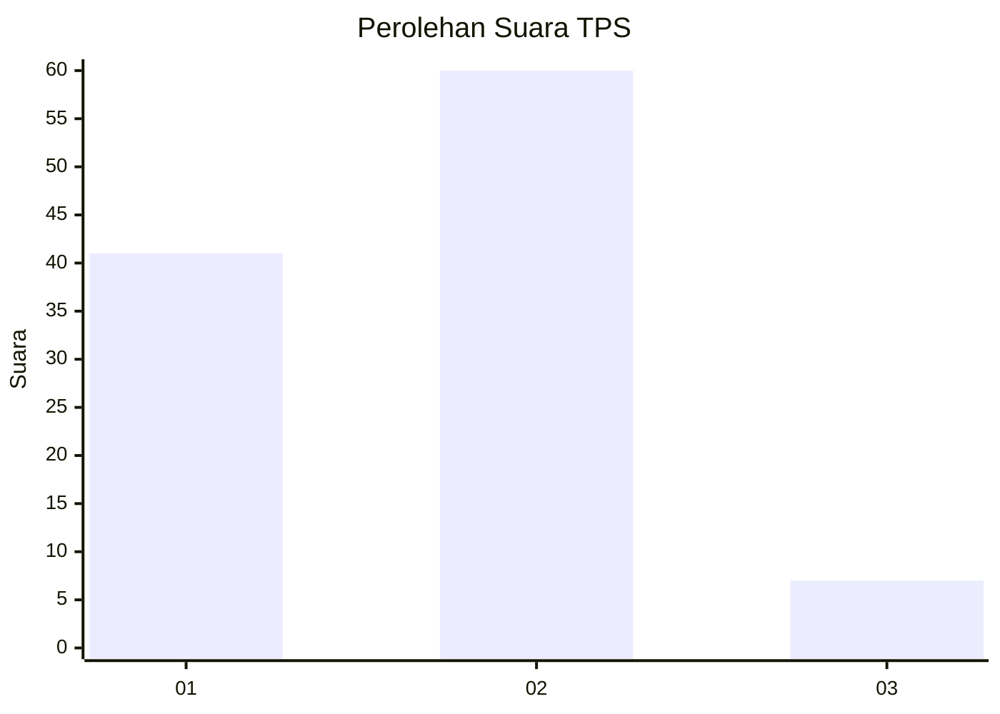
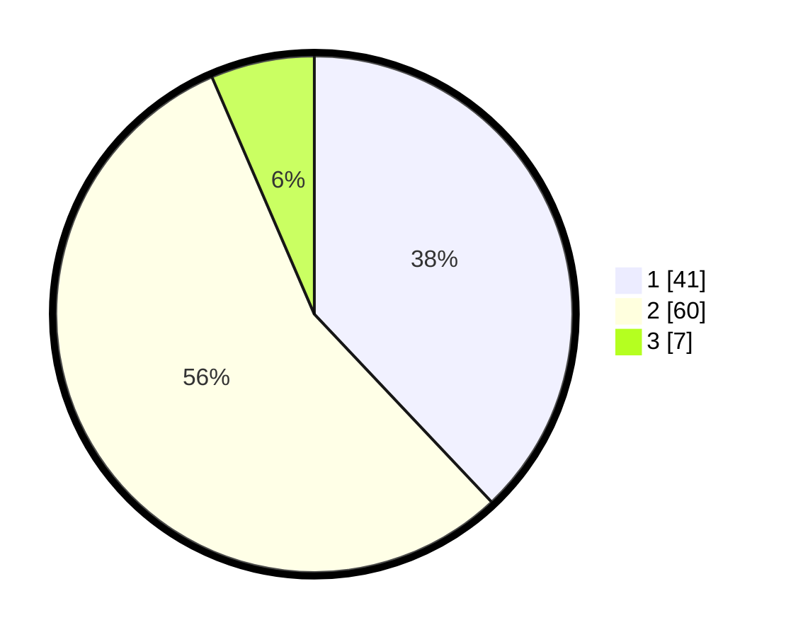

# Hasil

## Grafik

## Tabel

| No. | Nama Paslon    | Suara | Suara (raw) | Persentase |
|:--- |:-------------- | -----:| -----------:| ----------:|
| 1   | ANIES MUHAIMIN | 41    | [41][p-1]   | 37,96      |
| 2   | PRABOWO GIBRAN | 60    | [60][p-2]   | 55,56      |
| 3   | GANJAR MAHFUD  | 7     | [7][p-3]    | 6,48       |

[p-1]: https://github.com/gigit-pemilu/pemilu-2024-35-jawa-timur/blob/main/pilpres/hitung-suara/sub/35-jawa-timur/sub/25-gresik/sub/17-sangkapura/sub/2015-kebontelukdalam/sub/011-tps/sub/paslon-1.txt
[p-2]: https://github.com/gigit-pemilu/pemilu-2024-35-jawa-timur/blob/main/pilpres/hitung-suara/sub/35-jawa-timur/sub/25-gresik/sub/17-sangkapura/sub/2015-kebontelukdalam/sub/011-tps/sub/paslon-2.txt
[p-3]: https://github.com/gigit-pemilu/pemilu-2024-35-jawa-timur/blob/main/pilpres/hitung-suara/sub/35-jawa-timur/sub/25-gresik/sub/17-sangkapura/sub/2015-kebontelukdalam/sub/011-tps/sub/paslon-3.txt

## Foto C Plano

https://sirekap-obj-formc.kpu.go.id/906c/pemilu/ppwp/35/25/17/20/15/3525172015011-20240215-022519--1a9b30c8-5d36-4072-9fa3-237f0f877a5b.jpg

https://sirekap-obj-formc.kpu.go.id/906c/pemilu/ppwp/35/25/17/20/15/3525172015011-20240215-022723--931d812f-cf03-443c-9d8f-839d11cc4be3.jpg

https://sirekap-obj-formc.kpu.go.id/906c/pemilu/ppwp/35/25/17/20/15/3525172015011-20240215-022241--b3fceaf0-4bab-4baa-bf5e-ef87bd2dc808.jpg

## Metadata

| Key        | Value               |
| ---------- | ------------------- |
| Time Stamp | 2024-02-15 16:00:26 |

