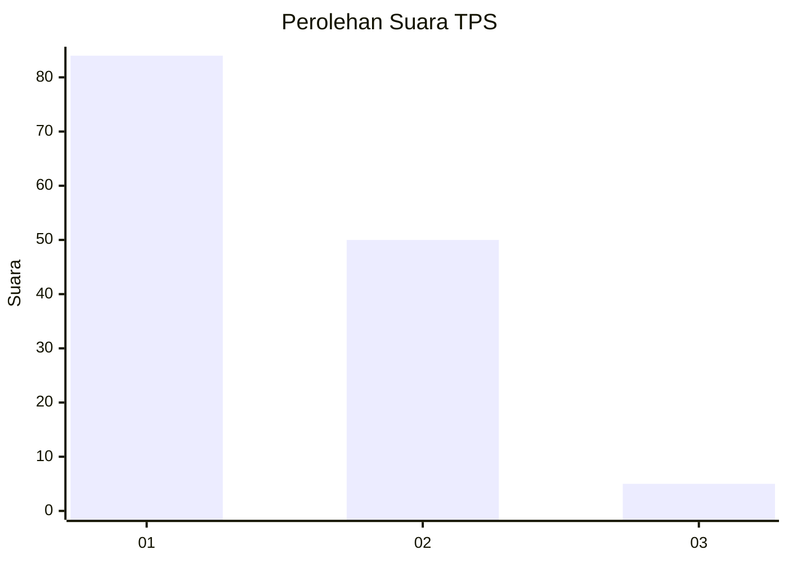
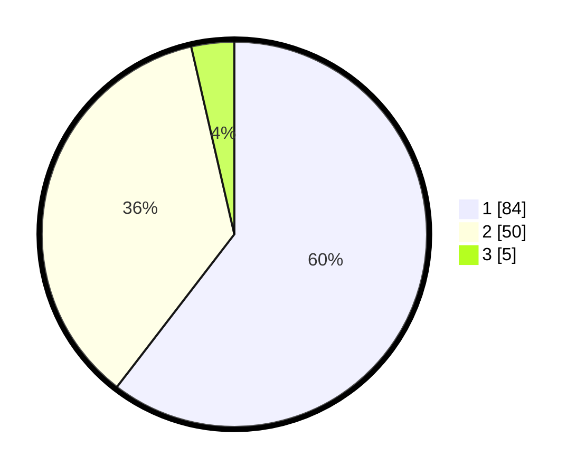

# Hasil

## Grafik

## Tabel

| No. | Nama Paslon    | Suara | Suara (raw) | Persentase |
|:--- |:-------------- | -----:| -----------:| ----------:|
| 1   | ANIES MUHAIMIN | 84    | [84][p-1]   | 60,43      |
| 2   | PRABOWO GIBRAN | 50    | [50][p-2]   | 35,97      |
| 3   | GANJAR MAHFUD  | 5     | [5][p-3]    | 3,60       |

[p-1]: https://github.com/gigit-pemilu/pemilu-2024/blob/main/pilpres/hitung-suara/sub/35-jawa-timur/sub/25-gresik/sub/17-sangkapura/sub/2016-sidogedungbatu/sub/005-tps/sub/paslon-1.txt
[p-2]: https://github.com/gigit-pemilu/pemilu-2024/blob/main/pilpres/hitung-suara/sub/35-jawa-timur/sub/25-gresik/sub/17-sangkapura/sub/2016-sidogedungbatu/sub/005-tps/sub/paslon-2.txt
[p-3]: https://github.com/gigit-pemilu/pemilu-2024/blob/main/pilpres/hitung-suara/sub/35-jawa-timur/sub/25-gresik/sub/17-sangkapura/sub/2016-sidogedungbatu/sub/005-tps/sub/paslon-3.txt

## Foto C Plano

https://sirekap-obj-formc.kpu.go.id/b3b6/pemilu/ppwp/35/25/17/20/16/3525172016005-20240215-021942--12b1bc6d-88dc-461f-8226-2713aaedc086.jpg

https://sirekap-obj-formc.kpu.go.id/b3b6/pemilu/ppwp/35/25/17/20/16/3525172016005-20240215-021947--83315b08-5d22-4180-9507-d2cd0bc4851c.jpg

https://sirekap-obj-formc.kpu.go.id/b3b6/pemilu/ppwp/35/25/17/20/16/3525172016005-20240215-021951--ba187e72-7bae-4f18-a1d0-9ead0e49962c.jpg

## Metadata

| Key        | Value               |
| ---------- | ------------------- |
| Time Stamp | 2024-02-16 16:25:10 |

