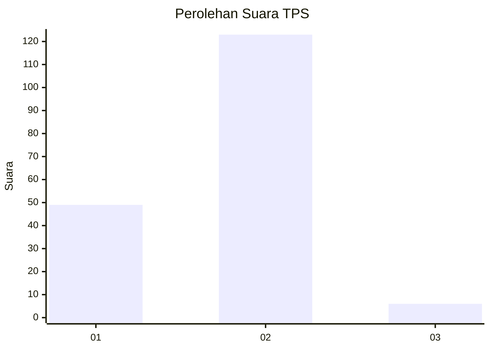
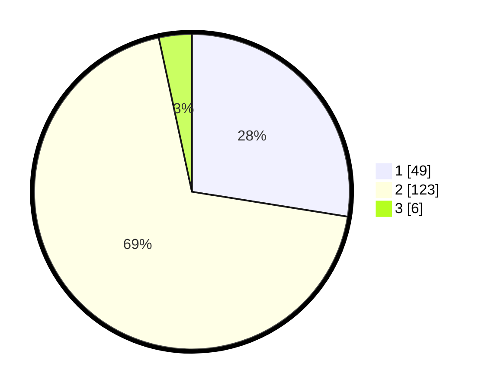

# Hasil

## Grafik

## Tabel

| No. | Nama Paslon    | Suara | Suara (raw) | Persentase |
|:--- |:-------------- | -----:| -----------:| ----------:|
| 1   | ANIES MUHAIMIN | 49    | [49][p-1]   | 27,53      |
| 2   | PRABOWO GIBRAN | 123   | [123][p-2]  | 69,10      |
| 3   | GANJAR MAHFUD  | 6     | [6][p-3]    | 3,37       |

[p-1]: https://github.com/gigit-pemilu/pemilu-2024/blob/main/pilpres/hitung-suara/sub/35-jawa-timur/sub/25-gresik/sub/17-sangkapura/sub/2016-sidogedungbatu/sub/014-tps/sub/paslon-1.txt
[p-2]: https://github.com/gigit-pemilu/pemilu-2024/blob/main/pilpres/hitung-suara/sub/35-jawa-timur/sub/25-gresik/sub/17-sangkapura/sub/2016-sidogedungbatu/sub/014-tps/sub/paslon-2.txt
[p-3]: https://github.com/gigit-pemilu/pemilu-2024/blob/main/pilpres/hitung-suara/sub/35-jawa-timur/sub/25-gresik/sub/17-sangkapura/sub/2016-sidogedungbatu/sub/014-tps/sub/paslon-3.txt

## Foto C Plano

https://sirekap-obj-formc.kpu.go.id/f00d/pemilu/ppwp/35/25/17/20/16/3525172016014-20240215-153839--28f98bbb-f3ff-463f-a9b2-ca01f96162ae.jpg

https://sirekap-obj-formc.kpu.go.id/f00d/pemilu/ppwp/35/25/17/20/16/3525172016014-20240215-153839--26d2bfae-1384-45cb-9cee-e951c8d38b6a.jpg

https://sirekap-obj-formc.kpu.go.id/f00d/pemilu/ppwp/35/25/17/20/16/3525172016014-20240215-153849--ae8a8f10-85de-44b9-bae0-664c70813fa8.jpg

## Metadata

| Key        | Value               |
| ---------- | ------------------- |
| Time Stamp | 2024-02-20 15:00:00 |

