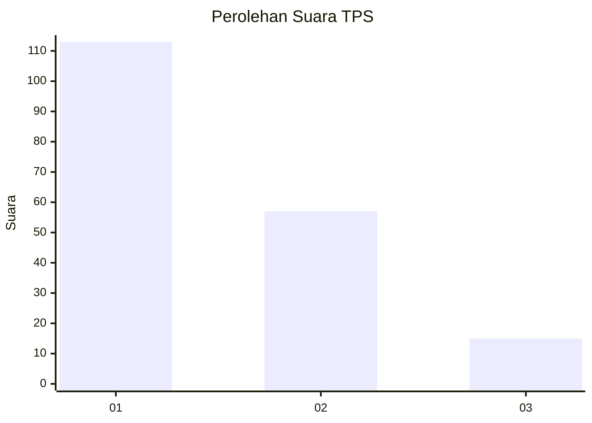
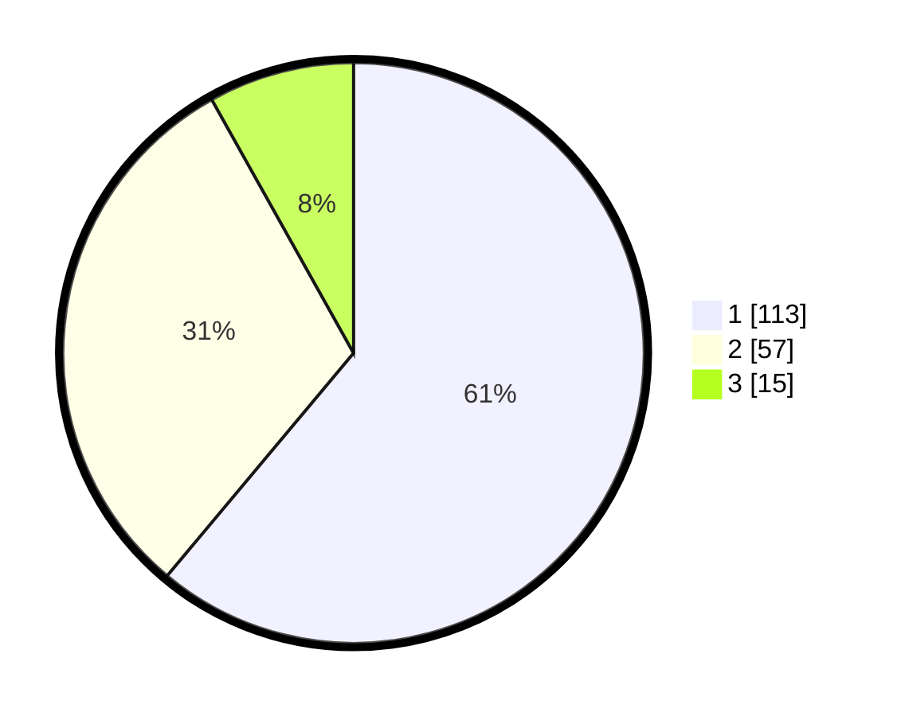

# Hasil

## Grafik

## Tabel

| No. | Nama Paslon    | Suara | Suara (raw) | Persentase |
|:--- |:-------------- | -----:| -----------:| ----------:|
| 1   | ANIES MUHAIMIN | 113   | [113][p-1]  | 61,08      |
| 2   | PRABOWO GIBRAN | 57    | [57][p-2]   | 30,81      |
| 3   | GANJAR MAHFUD  | 15    | [15][p-3]   | 8,11       |

[p-1]: https://github.com/gigit-pemilu/pemilu-2024-35-jawa-timur/blob/main/pilpres/hitung-suara/sub/35-jawa-timur/sub/25-gresik/sub/17-sangkapura/sub/2017-daun/sub/005-tps/sub/paslon-1.txt
[p-2]: https://github.com/gigit-pemilu/pemilu-2024-35-jawa-timur/blob/main/pilpres/hitung-suara/sub/35-jawa-timur/sub/25-gresik/sub/17-sangkapura/sub/2017-daun/sub/005-tps/sub/paslon-2.txt
[p-3]: https://github.com/gigit-pemilu/pemilu-2024-35-jawa-timur/blob/main/pilpres/hitung-suara/sub/35-jawa-timur/sub/25-gresik/sub/17-sangkapura/sub/2017-daun/sub/005-tps/sub/paslon-3.txt

## Foto C Plano

https://sirekap-obj-formc.kpu.go.id/a395/pemilu/ppwp/35/25/17/20/17/3525172017005-20240215-005717--a5b8a947-22c9-4506-86cd-e95d8993a265.jpg

https://sirekap-obj-formc.kpu.go.id/a395/pemilu/ppwp/35/25/17/20/17/3525172017005-20240215-005841--65f85422-14f2-42bf-bf23-d67b31c1e11e.jpg

https://sirekap-obj-formc.kpu.go.id/a395/pemilu/ppwp/35/25/17/20/17/3525172017005-20240215-005948--dc6166c3-6e6c-488d-84eb-d6823e7c7c76.jpg

## Metadata

| Key        | Value               |
| ---------- | ------------------- |
| Time Stamp | 2024-02-15 22:00:27 |

