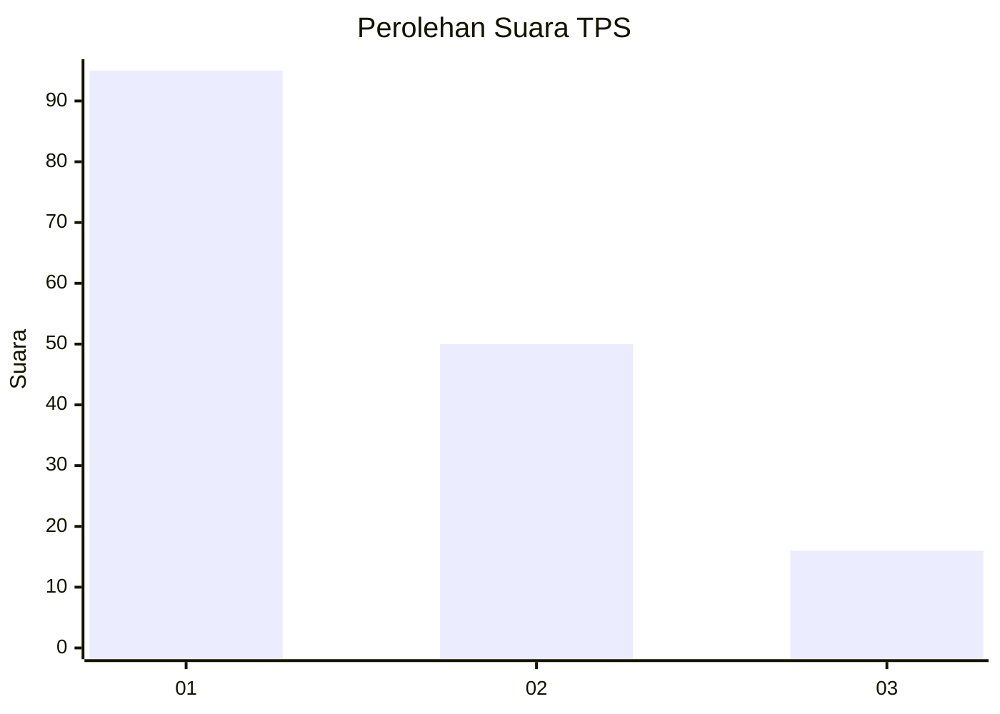
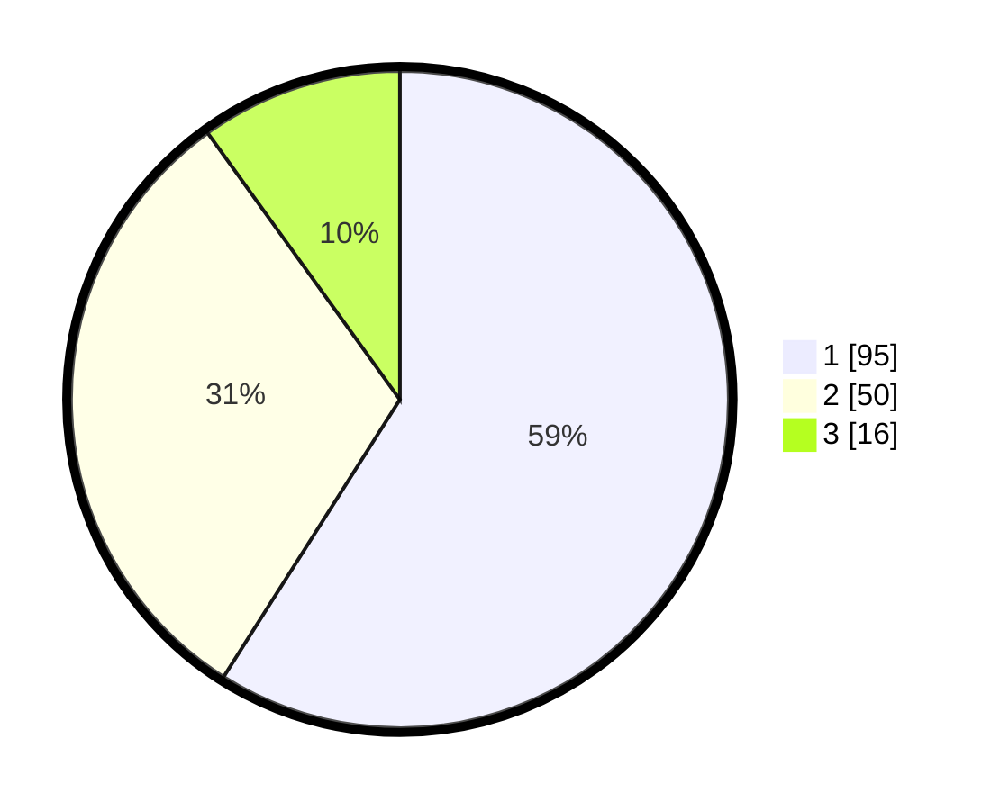

# Hasil

## Grafik

## Tabel

| No. | Nama Paslon    | Suara | Suara (raw) | Persentase |
|:--- |:-------------- | -----:| -----------:| ----------:|
| 1   | ANIES MUHAIMIN | 95    | [95][p-1]   | 59,01      |
| 2   | PRABOWO GIBRAN | 50    | [50][p-2]   | 31,06      |
| 3   | GANJAR MAHFUD  | 16    | [16][p-3]   | 9,94       |

[p-1]: https://github.com/gigit-pemilu/pemilu-2024/blob/main/pilpres/hitung-suara/sub/35-jawa-timur/sub/25-gresik/sub/17-sangkapura/sub/2017-daun/sub/007-tps/sub/paslon-1.txt
[p-2]: https://github.com/gigit-pemilu/pemilu-2024/blob/main/pilpres/hitung-suara/sub/35-jawa-timur/sub/25-gresik/sub/17-sangkapura/sub/2017-daun/sub/007-tps/sub/paslon-2.txt
[p-3]: https://github.com/gigit-pemilu/pemilu-2024/blob/main/pilpres/hitung-suara/sub/35-jawa-timur/sub/25-gresik/sub/17-sangkapura/sub/2017-daun/sub/007-tps/sub/paslon-3.txt

## Foto C Plano

https://sirekap-obj-formc.kpu.go.id/3a10/pemilu/ppwp/35/25/17/20/17/3525172017007-20240215-123242--af07ab3a-a5b1-403e-999b-08c71914a81f.jpg

https://sirekap-obj-formc.kpu.go.id/3a10/pemilu/ppwp/35/25/17/20/17/3525172017007-20240215-124136--b6f5a44b-77e7-4412-a70c-617f1821b287.jpg

https://sirekap-obj-formc.kpu.go.id/3a10/pemilu/ppwp/35/25/17/20/17/3525172017007-20240215-124404--32c7be1d-288a-45cc-9dac-87f4defca5da.jpg

## Metadata

| Key        | Value               |
| ---------- | ------------------- |
| Time Stamp | 2024-02-16 16:25:10 |

