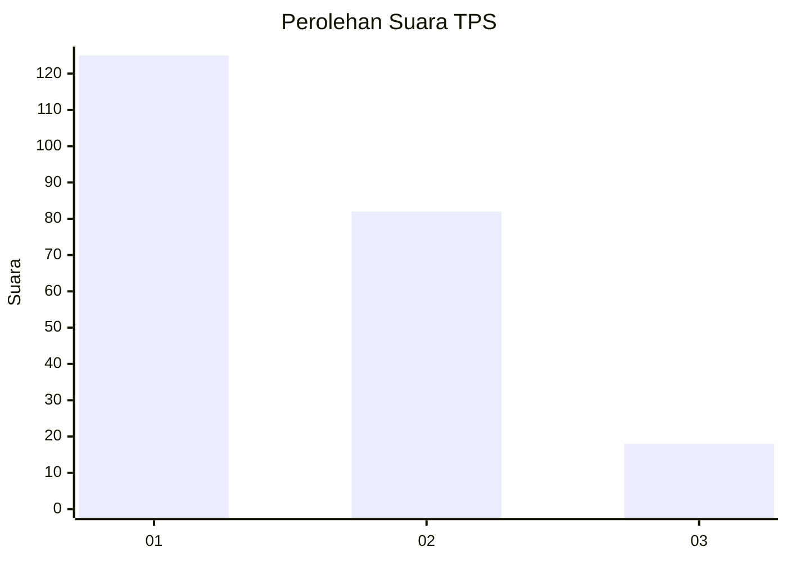
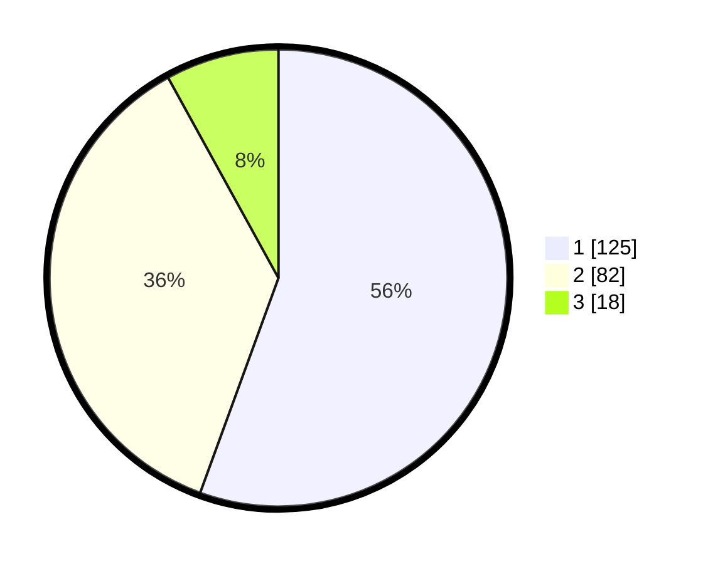

# Hasil

## Grafik

## Tabel

| No. | Nama Paslon    | Suara | Suara (raw) | Persentase |
|:--- |:-------------- | -----:| -----------:| ----------:|
| 1   | ANIES MUHAIMIN | 125   | [125][p-1]  | 55,56      |
| 2   | PRABOWO GIBRAN | 82    | [82][p-2]   | 36,44      |
| 3   | GANJAR MAHFUD  | 18    | [18][p-3]   | 8,00       |

[p-1]: https://github.com/gigit-pemilu/pemilu-2024/blob/main/pilpres/hitung-suara/sub/35-jawa-timur/sub/25-gresik/sub/17-sangkapura/sub/2017-daun/sub/009-tps/sub/paslon-1.txt
[p-2]: https://github.com/gigit-pemilu/pemilu-2024/blob/main/pilpres/hitung-suara/sub/35-jawa-timur/sub/25-gresik/sub/17-sangkapura/sub/2017-daun/sub/009-tps/sub/paslon-2.txt
[p-3]: https://github.com/gigit-pemilu/pemilu-2024/blob/main/pilpres/hitung-suara/sub/35-jawa-timur/sub/25-gresik/sub/17-sangkapura/sub/2017-daun/sub/009-tps/sub/paslon-3.txt

## Foto C Plano

https://sirekap-obj-formc.kpu.go.id/0155/pemilu/ppwp/35/25/17/20/17/3525172017009-20240215-203353--4cdbf791-5011-4c22-ac4b-09b4e05938f2.jpg

https://sirekap-obj-formc.kpu.go.id/0155/pemilu/ppwp/35/25/17/20/17/3525172017009-20240215-203529--7095ad26-d0f5-4958-a8d8-3930f1750cb0.jpg

https://sirekap-obj-formc.kpu.go.id/0155/pemilu/ppwp/35/25/17/20/17/3525172017009-20240215-174443--106fa0ef-5615-4bb4-80a8-ad0888571f39.jpg

## Metadata

| Key        | Value               |
| ---------- | ------------------- |
| Time Stamp | 2024-02-16 16:25:10 |

