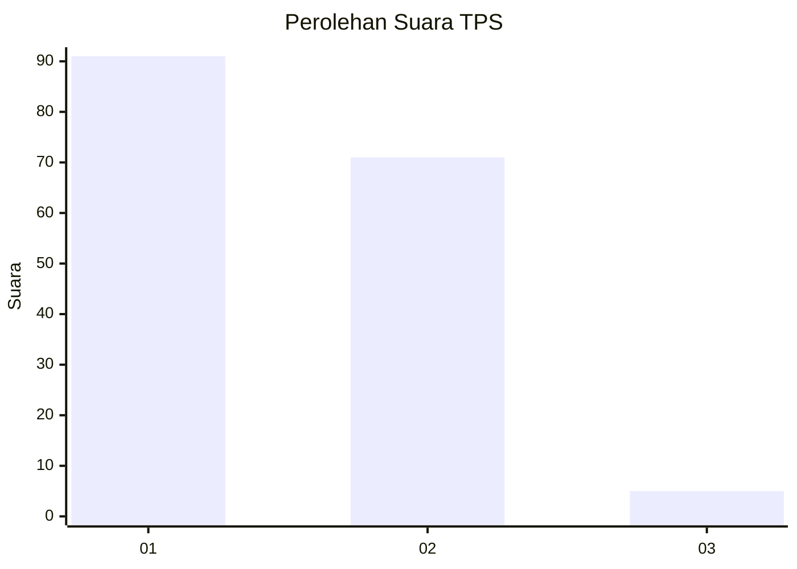
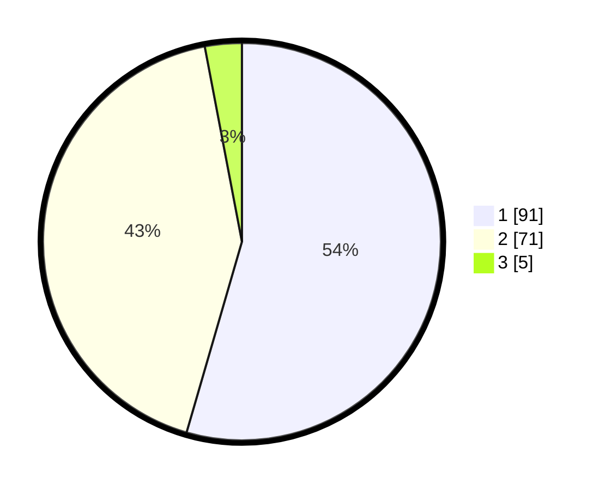

# Hasil

## Grafik

## Tabel

| No. | Nama Paslon    | Suara | Suara (raw) | Persentase |
|:--- |:-------------- | -----:| -----------:| ----------:|
| 1   | ANIES MUHAIMIN | 91    | [91][p-1]   | 54,49      |
| 2   | PRABOWO GIBRAN | 71    | [71][p-2]   | 42,51      |
| 3   | GANJAR MAHFUD  | 5     | [5][p-3]    | 2,99       |

[p-1]: https://github.com/gigit-pemilu/pemilu-2024/blob/main/pilpres/hitung-suara/sub/35-jawa-timur/sub/25-gresik/sub/17-sangkapura/sub/2017-daun/sub/011-tps/sub/paslon-1.txt
[p-2]: https://github.com/gigit-pemilu/pemilu-2024/blob/main/pilpres/hitung-suara/sub/35-jawa-timur/sub/25-gresik/sub/17-sangkapura/sub/2017-daun/sub/011-tps/sub/paslon-2.txt
[p-3]: https://github.com/gigit-pemilu/pemilu-2024/blob/main/pilpres/hitung-suara/sub/35-jawa-timur/sub/25-gresik/sub/17-sangkapura/sub/2017-daun/sub/011-tps/sub/paslon-3.txt

## Foto C Plano

https://sirekap-obj-formc.kpu.go.id/a3f8/pemilu/ppwp/35/25/17/20/17/3525172017011-20240215-103433--1e8cadaf-51ab-47f2-8150-b2877372c2a0.jpg

https://sirekap-obj-formc.kpu.go.id/a3f8/pemilu/ppwp/35/25/17/20/17/3525172017011-20240215-103455--c46eb667-8ac8-4a2d-b180-e3df7bc8e28e.jpg

https://sirekap-obj-formc.kpu.go.id/a3f8/pemilu/ppwp/35/25/17/20/17/3525172017011-20240215-103513--25ac33c7-1c2b-4503-9802-95fb10700705.jpg

## Metadata

| Key        | Value               |
| ---------- | ------------------- |
| Time Stamp | 2024-02-20 15:00:00 |

