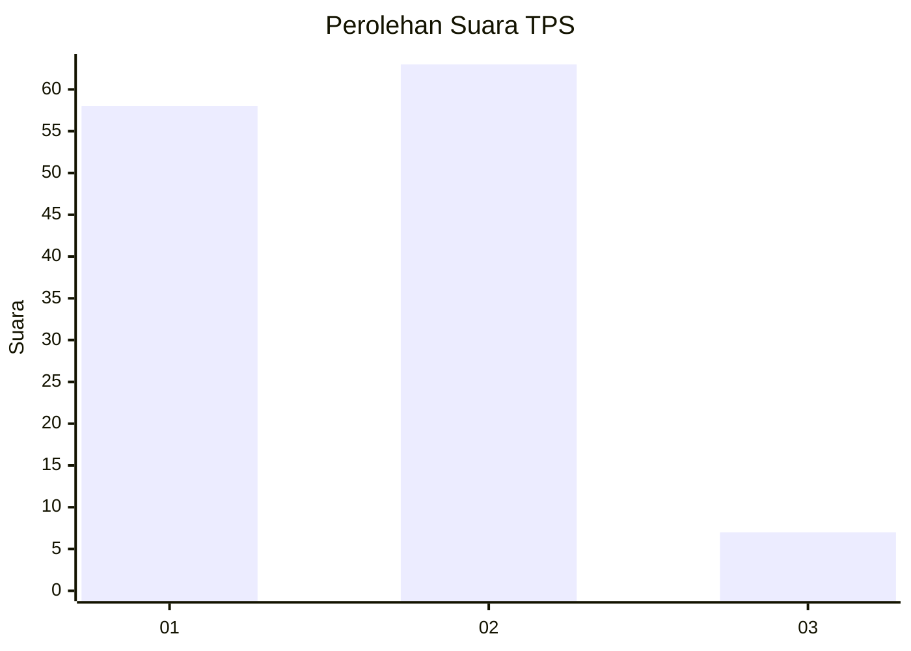
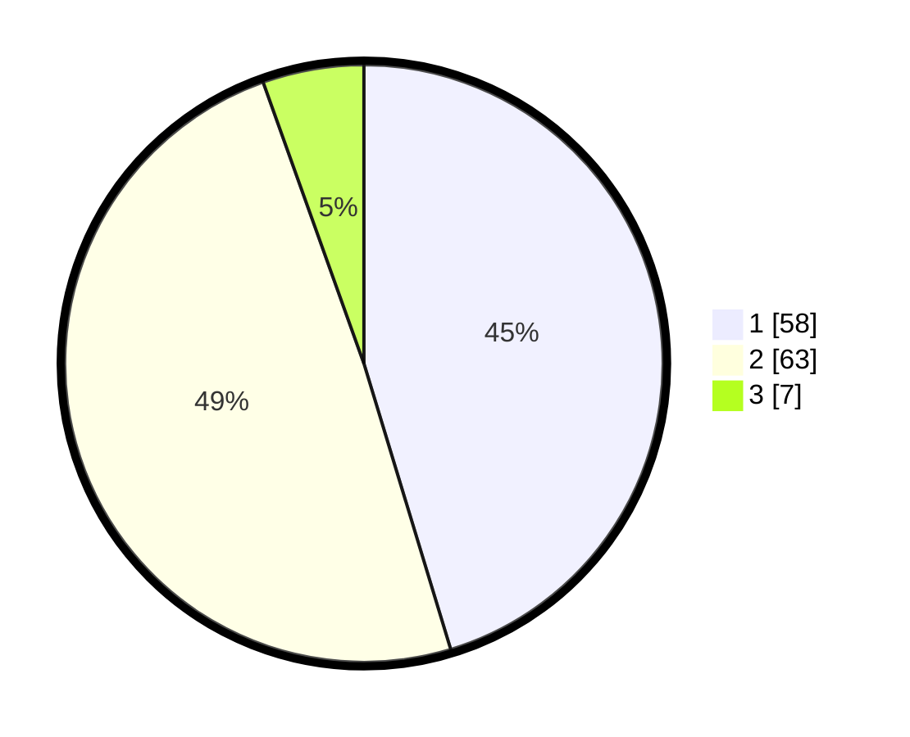

# Hasil

## Grafik

## Tabel

| No. | Nama Paslon    | Suara | Suara (raw) | Persentase |
|:--- |:-------------- | -----:| -----------:| ----------:|
| 1   | ANIES MUHAIMIN | 58    | [58][p-1]   | 45,31      |
| 2   | PRABOWO GIBRAN | 63    | [63][p-2]   | 49,22      |
| 3   | GANJAR MAHFUD  | 7     | [7][p-3]    | 5,47       |

[p-1]: https://github.com/gigit-pemilu/pemilu-2024/blob/main/pilpres/hitung-suara/sub/35-jawa-timur/sub/25-gresik/sub/17-sangkapura/sub/2017-daun/sub/019-tps/sub/paslon-1.txt
[p-2]: https://github.com/gigit-pemilu/pemilu-2024/blob/main/pilpres/hitung-suara/sub/35-jawa-timur/sub/25-gresik/sub/17-sangkapura/sub/2017-daun/sub/019-tps/sub/paslon-2.txt
[p-3]: https://github.com/gigit-pemilu/pemilu-2024/blob/main/pilpres/hitung-suara/sub/35-jawa-timur/sub/25-gresik/sub/17-sangkapura/sub/2017-daun/sub/019-tps/sub/paslon-3.txt

## Foto C Plano

https://sirekap-obj-formc.kpu.go.id/466d/pemilu/ppwp/35/25/17/20/17/3525172017019-20240215-004710--adc7e04f-6f37-47e8-b1e6-28b0ecad1db1.jpg

https://sirekap-obj-formc.kpu.go.id/466d/pemilu/ppwp/35/25/17/20/17/3525172017019-20240215-004920--cf520352-a9cc-436f-9cf7-24e3f72921c6.jpg

https://sirekap-obj-formc.kpu.go.id/466d/pemilu/ppwp/35/25/17/20/17/3525172017019-20240215-005105--2dbfd225-ce53-45fe-9a20-0854591a2d53.jpg

## Metadata

| Key        | Value               |
| ---------- | ------------------- |
| Time Stamp | 2024-02-16 16:25:10 |

