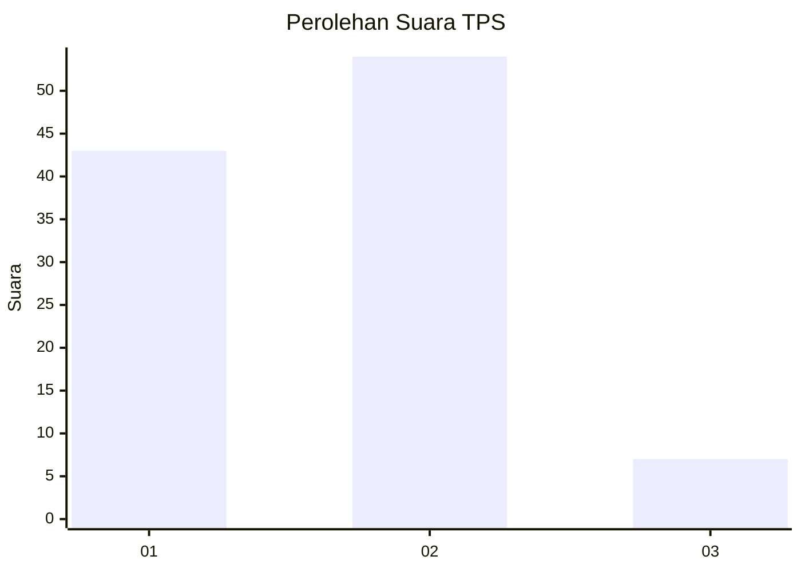
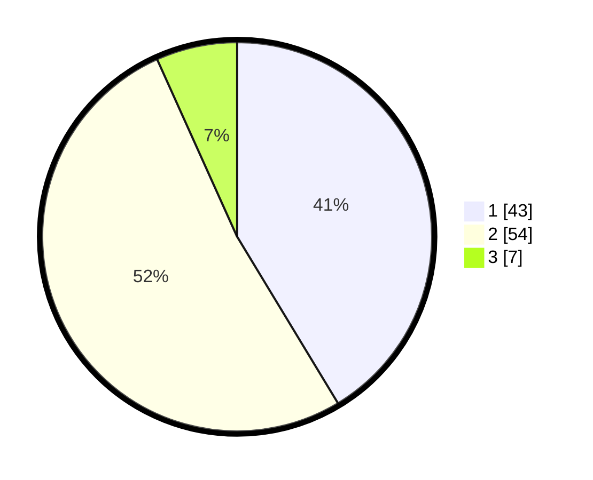

# Hasil

## Grafik

## Tabel

| No. | Nama Paslon    | Suara | Suara (raw) | Persentase |
|:--- |:-------------- | -----:| -----------:| ----------:|
| 1   | ANIES MUHAIMIN | 43    | [43][p-1]   | 41,35      |
| 2   | PRABOWO GIBRAN | 54    | [54][p-2]   | 51,92      |
| 3   | GANJAR MAHFUD  | 7     | [7][p-3]    | 6,73       |

[p-1]: https://github.com/gigit-pemilu/pemilu-2024/blob/main/pilpres/hitung-suara/sub/35-jawa-timur/sub/25-gresik/sub/18-tambak/sub/2001-gelam/sub/004-tps/sub/paslon-1.txt
[p-2]: https://github.com/gigit-pemilu/pemilu-2024/blob/main/pilpres/hitung-suara/sub/35-jawa-timur/sub/25-gresik/sub/18-tambak/sub/2001-gelam/sub/004-tps/sub/paslon-2.txt
[p-3]: https://github.com/gigit-pemilu/pemilu-2024/blob/main/pilpres/hitung-suara/sub/35-jawa-timur/sub/25-gresik/sub/18-tambak/sub/2001-gelam/sub/004-tps/sub/paslon-3.txt

## Foto C Plano

https://sirekap-obj-formc.kpu.go.id/b7d4/pemilu/ppwp/35/25/18/20/01/3525182001004-20240214-221152--cd5dabea-3727-468a-8d60-c8e136cb3b72.jpg

https://sirekap-obj-formc.kpu.go.id/b7d4/pemilu/ppwp/35/25/18/20/01/3525182001004-20240214-141745--b93901b7-40e3-4b8a-9839-d511ac6d57ae.jpg

https://sirekap-obj-formc.kpu.go.id/b7d4/pemilu/ppwp/35/25/18/20/01/3525182001004-20240215-121242--8f1745ff-c574-4cd2-a3a7-cd6632a5ef3e.jpg

## Metadata

| Key        | Value               |
| ---------- | ------------------- |
| Time Stamp | 2024-02-15 15:00:29 |

## DATA PEMILIH TETAP

Jumlah pemilih dalam DPT: **154**.
 * L: **72**.
 * P: **82**.

## DATA PENGGUNA HAK PILIH

Jumlah pengguna hak pilih dalam DPT: **111**.
 * L: **46**.
 * P: **65**.

Jumlah pengguna hak pilih dalam DPTb: **0**.
 * L: **0**.
 * P: **0**.

Jumlah pengguna hak pilih dalam DPK: **1**.
 * L: **1**.
 * P: **0**.

Jumlah pengguna hak pilih: **112**.
 * L: **47**.
 * P: **65**.

## JUMLAH SUARA SAH DAN TIDAK SAH

JUMLAH SELURUH SUARA SAH: **104**.

JUMLAH SUARA TIDAK SAH: **8**.

JUMLAH SELURUH SUARA SAH DAN SUARA TIDAK SAH: **112**.

