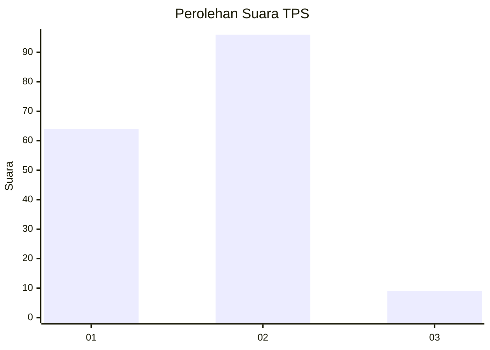
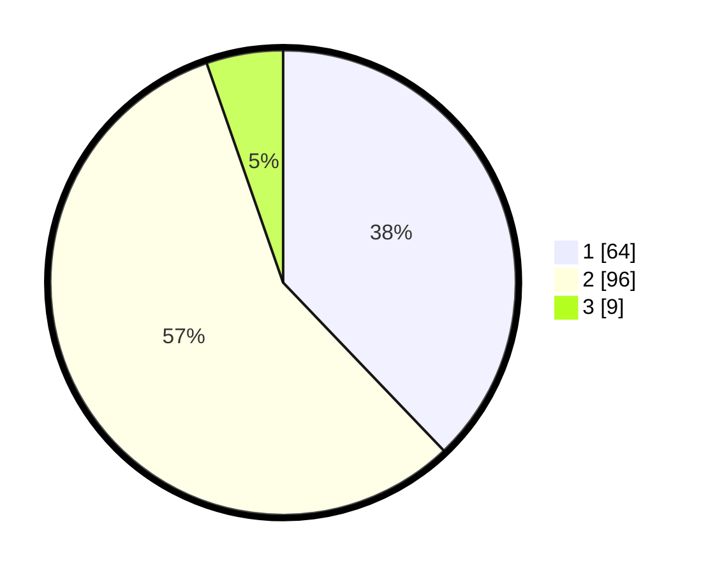

# Hasil

## Grafik

## Tabel

| No. | Nama Paslon    | Suara | Suara (raw) | Persentase |
|:--- |:-------------- | -----:| -----------:| ----------:|
| 1   | ANIES MUHAIMIN | 64    | [64][p-1]   | 37,87      |
| 2   | PRABOWO GIBRAN | 96    | [96][p-2]   | 56,80      |
| 3   | GANJAR MAHFUD  | 9     | [9][p-3]    | 5,33       |

[p-1]: https://github.com/gigit-pemilu/pemilu-2024-35-jawa-timur/blob/main/pilpres/hitung-suara/sub/35-jawa-timur/sub/25-gresik/sub/18-tambak/sub/2002-sukaoneng/sub/003-tps/sub/paslon-1.txt
[p-2]: https://github.com/gigit-pemilu/pemilu-2024-35-jawa-timur/blob/main/pilpres/hitung-suara/sub/35-jawa-timur/sub/25-gresik/sub/18-tambak/sub/2002-sukaoneng/sub/003-tps/sub/paslon-2.txt
[p-3]: https://github.com/gigit-pemilu/pemilu-2024-35-jawa-timur/blob/main/pilpres/hitung-suara/sub/35-jawa-timur/sub/25-gresik/sub/18-tambak/sub/2002-sukaoneng/sub/003-tps/sub/paslon-3.txt

## Foto C Plano

https://sirekap-obj-formc.kpu.go.id/4b1a/pemilu/ppwp/35/25/18/20/02/3525182002003-20240214-201631--31c5856e-2447-4cba-b845-617fb189f43e.jpg

https://sirekap-obj-formc.kpu.go.id/4b1a/pemilu/ppwp/35/25/18/20/02/3525182002003-20240214-201736--f71d983e-341f-4a65-831f-f36ea86b29fe.jpg

https://sirekap-obj-formc.kpu.go.id/4b1a/pemilu/ppwp/35/25/18/20/02/3525182002003-20240214-235705--5dadc98e-12d7-402c-9d77-a3f639e6715b.jpg

## Metadata

| Key        | Value               |
| ---------- | ------------------- |
| Time Stamp | 2024-02-16 14:30:33 |

