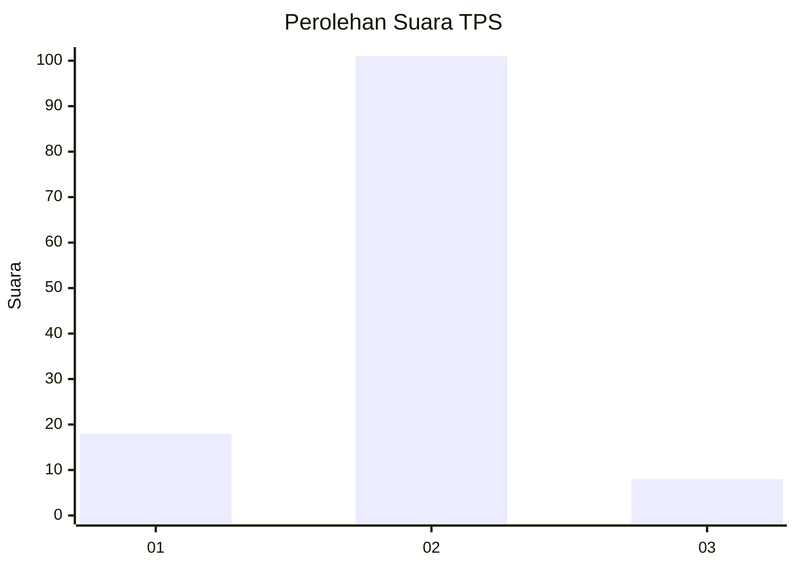
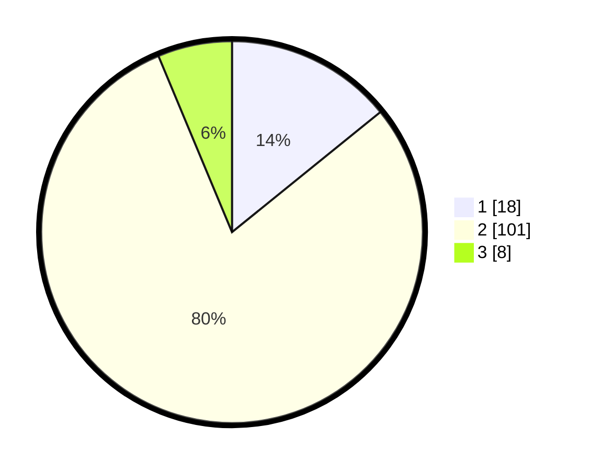

# Hasil

## Grafik

## Tabel

| No. | Nama Paslon    | Suara | Suara (raw) | Persentase |
|:--- |:-------------- | -----:| -----------:| ----------:|
| 1   | ANIES MUHAIMIN | 18    | [18][p-1]   | 14,17      |
| 2   | PRABOWO GIBRAN | 101   | [101][p-2]  | 79,53      |
| 3   | GANJAR MAHFUD  | 8     | [8][p-3]    | 6,30       |

[p-1]: https://github.com/gigit-pemilu/pemilu-2024/blob/main/pilpres/hitung-suara/sub/35-jawa-timur/sub/25-gresik/sub/18-tambak/sub/2002-sukaoneng/sub/006-tps/sub/paslon-1.txt
[p-2]: https://github.com/gigit-pemilu/pemilu-2024/blob/main/pilpres/hitung-suara/sub/35-jawa-timur/sub/25-gresik/sub/18-tambak/sub/2002-sukaoneng/sub/006-tps/sub/paslon-2.txt
[p-3]: https://github.com/gigit-pemilu/pemilu-2024/blob/main/pilpres/hitung-suara/sub/35-jawa-timur/sub/25-gresik/sub/18-tambak/sub/2002-sukaoneng/sub/006-tps/sub/paslon-3.txt

## Foto C Plano

https://sirekap-obj-formc.kpu.go.id/f286/pemilu/ppwp/35/25/18/20/02/3525182002006-20240219-215048--185a0bc1-a0d4-4b9f-952a-602378b917dc.jpg

https://sirekap-obj-formc.kpu.go.id/f286/pemilu/ppwp/35/25/18/20/02/3525182002006-20240219-215150--4336c3ac-8044-49d8-aedb-f061d7616a04.jpg

https://sirekap-obj-formc.kpu.go.id/f286/pemilu/ppwp/35/25/18/20/02/3525182002006-20240219-215222--86ba729c-5150-4d36-a362-3acd3d3a6e7a.jpg

## Metadata

| Key        | Value               |
| ---------- | ------------------- |
| Time Stamp | 2024-02-20 16:00:00 |

