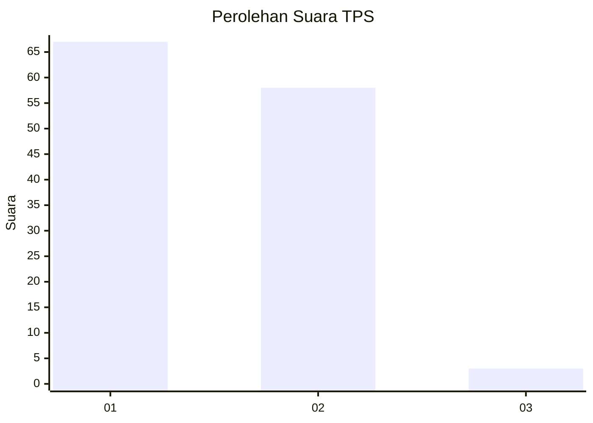
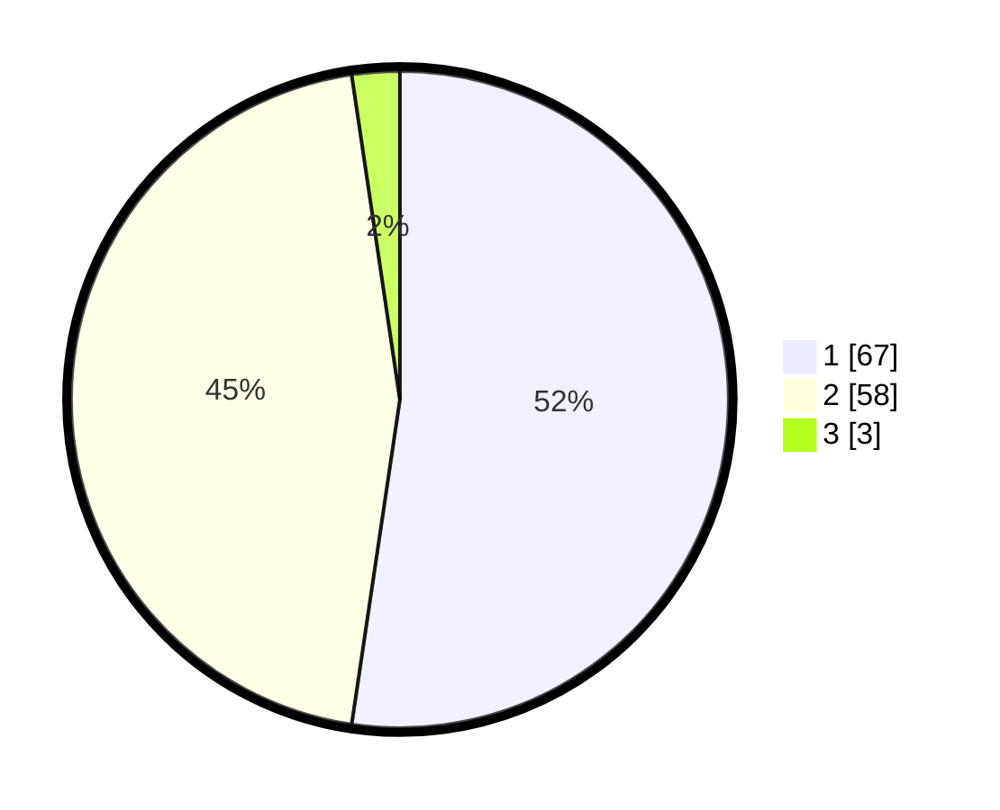

# Hasil

## Grafik

## Tabel

| No. | Nama Paslon    | Suara | Suara (raw) | Persentase |
|:--- |:-------------- | -----:| -----------:| ----------:|
| 1   | ANIES MUHAIMIN | 67    | [67][p-1]   | 52,34      |
| 2   | PRABOWO GIBRAN | 58    | [58][p-2]   | 45,31      |
| 3   | GANJAR MAHFUD  | 3     | [3][p-3]    | 2,34       |

[p-1]: https://github.com/gigit-pemilu/pemilu-2024-35-jawa-timur/blob/main/pilpres/hitung-suara/sub/35-jawa-timur/sub/25-gresik/sub/18-tambak/sub/2003-sukalela/sub/001-tps/sub/paslon-1.txt
[p-2]: https://github.com/gigit-pemilu/pemilu-2024-35-jawa-timur/blob/main/pilpres/hitung-suara/sub/35-jawa-timur/sub/25-gresik/sub/18-tambak/sub/2003-sukalela/sub/001-tps/sub/paslon-2.txt
[p-3]: https://github.com/gigit-pemilu/pemilu-2024-35-jawa-timur/blob/main/pilpres/hitung-suara/sub/35-jawa-timur/sub/25-gresik/sub/18-tambak/sub/2003-sukalela/sub/001-tps/sub/paslon-3.txt

## Foto C Plano

https://sirekap-obj-formc.kpu.go.id/3e02/pemilu/ppwp/35/25/18/20/03/3525182003001-20240220-135213--9b72c400-8462-48a7-9913-8c828f050a05.jpg

https://sirekap-obj-formc.kpu.go.id/3e02/pemilu/ppwp/35/25/18/20/03/3525182003001-20240215-002014--5283344d-3419-436b-b229-34299a9a7044.jpg

https://sirekap-obj-formc.kpu.go.id/3e02/pemilu/ppwp/35/25/18/20/03/3525182003001-20240214-220651--b60a5878-9530-41c8-bc95-0df118ddfaf7.jpg

## Metadata

| Key        | Value               |
| ---------- | ------------------- |
| Time Stamp | 2024-02-20 14:00:00 |

