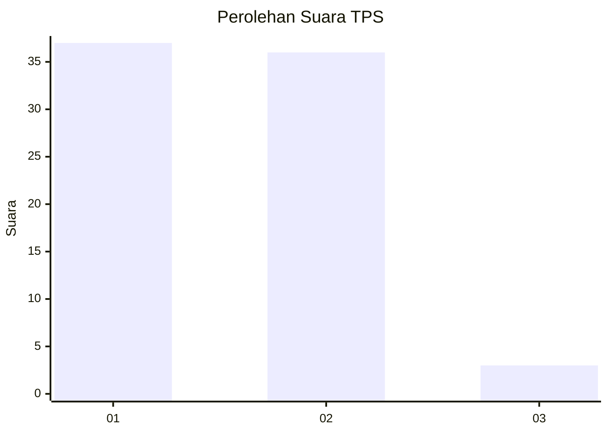
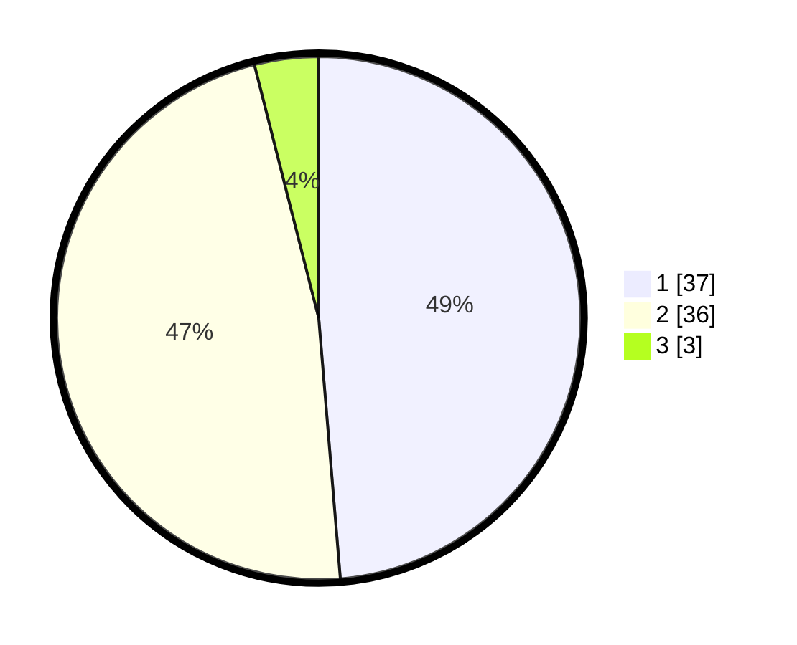

# Hasil

## Grafik

## Tabel

| No. | Nama Paslon    | Suara | Suara (raw) | Persentase |
|:--- |:-------------- | -----:| -----------:| ----------:|
| 1   | ANIES MUHAIMIN | 37    | [37][p-1]   | 48,68      |
| 2   | PRABOWO GIBRAN | 36    | [36][p-2]   | 47,37      |
| 3   | GANJAR MAHFUD  | 3     | [3][p-3]    | 3,95       |

[p-1]: https://github.com/gigit-pemilu/pemilu-2024/blob/main/pilpres/hitung-suara/sub/35-jawa-timur/sub/25-gresik/sub/18-tambak/sub/2003-sukalela/sub/002-tps/sub/paslon-1.txt
[p-2]: https://github.com/gigit-pemilu/pemilu-2024/blob/main/pilpres/hitung-suara/sub/35-jawa-timur/sub/25-gresik/sub/18-tambak/sub/2003-sukalela/sub/002-tps/sub/paslon-2.txt
[p-3]: https://github.com/gigit-pemilu/pemilu-2024/blob/main/pilpres/hitung-suara/sub/35-jawa-timur/sub/25-gresik/sub/18-tambak/sub/2003-sukalela/sub/002-tps/sub/paslon-3.txt

## Foto C Plano

https://sirekap-obj-formc.kpu.go.id/c9af/pemilu/ppwp/35/25/18/20/03/3525182003002-20240214-232716--8b42afbb-fb7c-4356-8635-5f958e67dec4.jpg

https://sirekap-obj-formc.kpu.go.id/c9af/pemilu/ppwp/35/25/18/20/03/3525182003002-20240214-232820--4a1bd20a-9ae2-4ab6-ab6b-93365131e5f6.jpg

https://sirekap-obj-formc.kpu.go.id/c9af/pemilu/ppwp/35/25/18/20/03/3525182003002-20240214-232952--830402c9-cb2d-4810-ba3b-41e168f7d26d.jpg

## Metadata

| Key        | Value               |
| ---------- | ------------------- |
| Time Stamp | 2024-02-15 21:30:27 |

