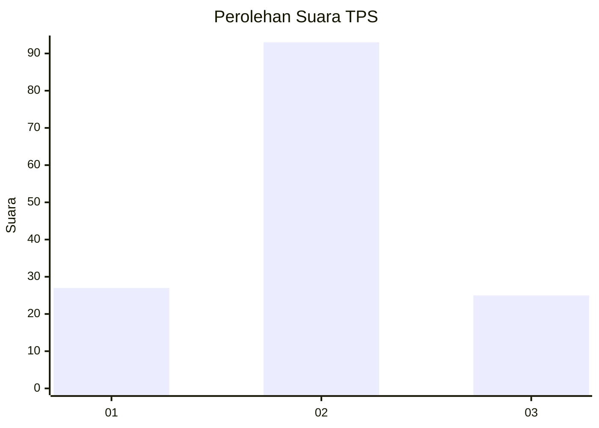
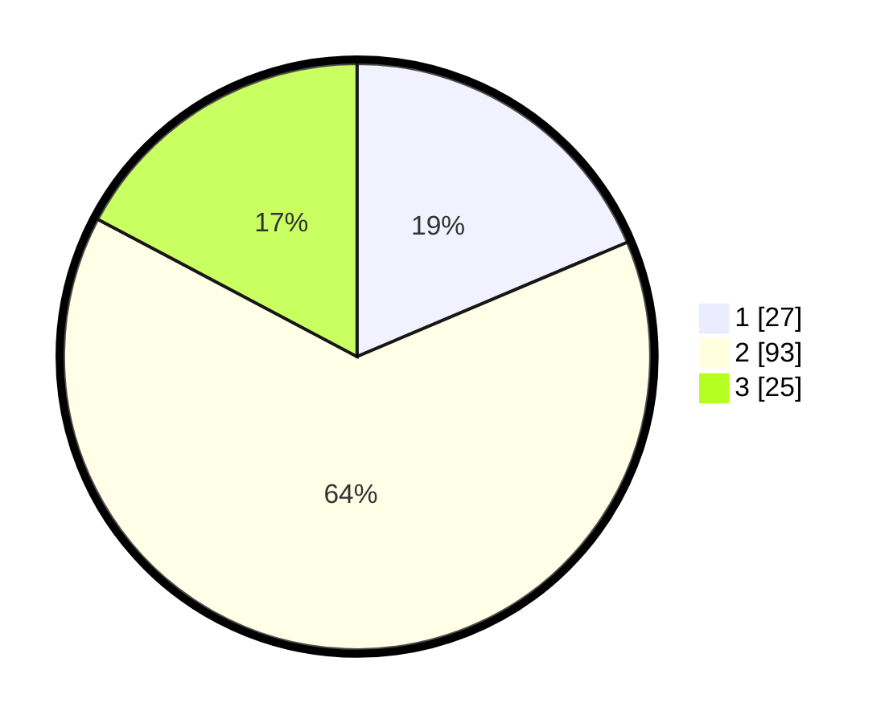

# Hasil

## Grafik

## Tabel

| No. | Nama Paslon    | Suara | Suara (raw) | Persentase |
|:--- |:-------------- | -----:| -----------:| ----------:|
| 1   | ANIES MUHAIMIN | 27    | [27][p-1]   | 18,62      |
| 2   | PRABOWO GIBRAN | 93    | [93][p-2]   | 64,14      |
| 3   | GANJAR MAHFUD  | 25    | [25][p-3]   | 17,24      |

[p-1]: https://github.com/gigit-pemilu/pemilu-2024-35-jawa-timur/blob/main/pilpres/hitung-suara/sub/35-jawa-timur/sub/25-gresik/sub/18-tambak/sub/2003-sukalela/sub/003-tps/sub/paslon-1.txt
[p-2]: https://github.com/gigit-pemilu/pemilu-2024-35-jawa-timur/blob/main/pilpres/hitung-suara/sub/35-jawa-timur/sub/25-gresik/sub/18-tambak/sub/2003-sukalela/sub/003-tps/sub/paslon-2.txt
[p-3]: https://github.com/gigit-pemilu/pemilu-2024-35-jawa-timur/blob/main/pilpres/hitung-suara/sub/35-jawa-timur/sub/25-gresik/sub/18-tambak/sub/2003-sukalela/sub/003-tps/sub/paslon-3.txt

## Foto C Plano

https://sirekap-obj-formc.kpu.go.id/8068/pemilu/ppwp/35/25/18/20/03/3525182003003-20240215-021615--011d06e0-b61b-4004-a870-345150b7d2e3.jpg

https://sirekap-obj-formc.kpu.go.id/8068/pemilu/ppwp/35/25/18/20/03/3525182003003-20240215-022258--288e70f8-243b-4f9b-91e7-ddee38fce2ba.jpg

https://sirekap-obj-formc.kpu.go.id/8068/pemilu/ppwp/35/25/18/20/03/3525182003003-20240215-021813--9f72dd85-43d4-4ab2-92ed-daa842a06df2.jpg

## Metadata

| Key        | Value               |
| ---------- | ------------------- |
| Time Stamp | 2024-02-16 14:30:33 |

