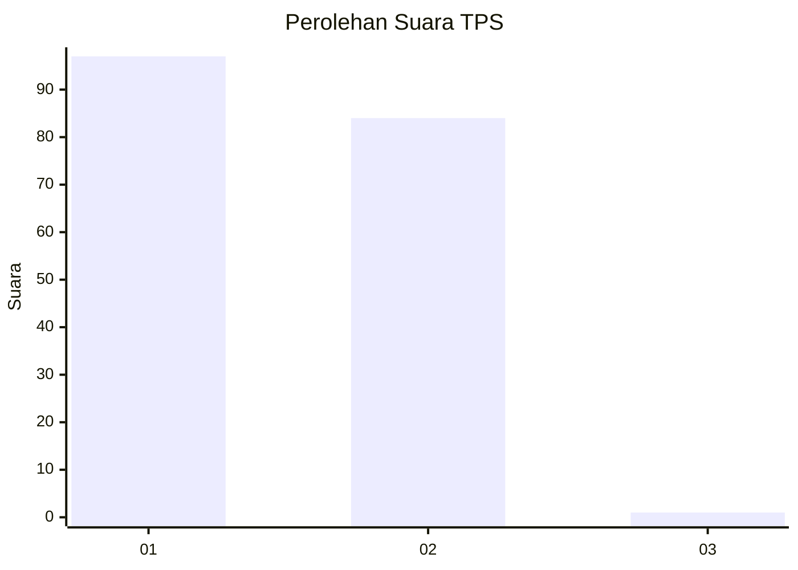
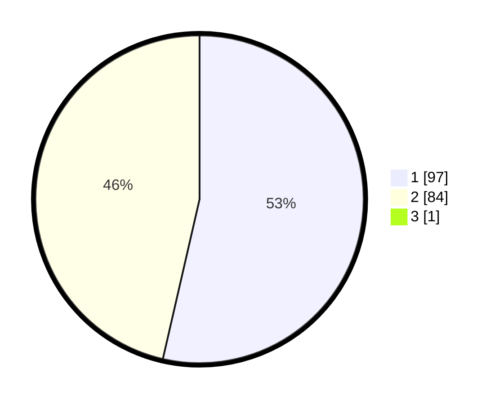

# Hasil

## Grafik

## Tabel

| No. | Nama Paslon    | Suara | Suara (raw) | Persentase |
|:--- |:-------------- | -----:| -----------:| ----------:|
| 1   | ANIES MUHAIMIN | 97    | [97][p-1]   | 53,30      |
| 2   | PRABOWO GIBRAN | 84    | [84][p-2]   | 46,15      |
| 3   | GANJAR MAHFUD  | 1     | [1][p-3]    | 0,55       |

[p-1]: https://github.com/gigit-pemilu/pemilu-2024/blob/main/pilpres/hitung-suara/sub/35-jawa-timur/sub/25-gresik/sub/18-tambak/sub/2004-pekalongan/sub/003-tps/sub/paslon-1.txt
[p-2]: https://github.com/gigit-pemilu/pemilu-2024/blob/main/pilpres/hitung-suara/sub/35-jawa-timur/sub/25-gresik/sub/18-tambak/sub/2004-pekalongan/sub/003-tps/sub/paslon-2.txt
[p-3]: https://github.com/gigit-pemilu/pemilu-2024/blob/main/pilpres/hitung-suara/sub/35-jawa-timur/sub/25-gresik/sub/18-tambak/sub/2004-pekalongan/sub/003-tps/sub/paslon-3.txt

## Foto C Plano

https://sirekap-obj-formc.kpu.go.id/87b6/pemilu/ppwp/35/25/18/20/04/3525182004003-20240215-003554--a11bebe2-980e-4115-9075-d4f26a007295.jpg

https://sirekap-obj-formc.kpu.go.id/87b6/pemilu/ppwp/35/25/18/20/04/3525182004003-20240215-003758--b1c6a305-5c50-475a-afbc-d3b41361fa2a.jpg

https://sirekap-obj-formc.kpu.go.id/87b6/pemilu/ppwp/35/25/18/20/04/3525182004003-20240215-003959--e67c9e1a-76c9-47ee-834d-9794dbbf3d24.jpg

## Metadata

| Key        | Value               |
| ---------- | ------------------- |
| Time Stamp | 2024-02-16 16:25:10 |

