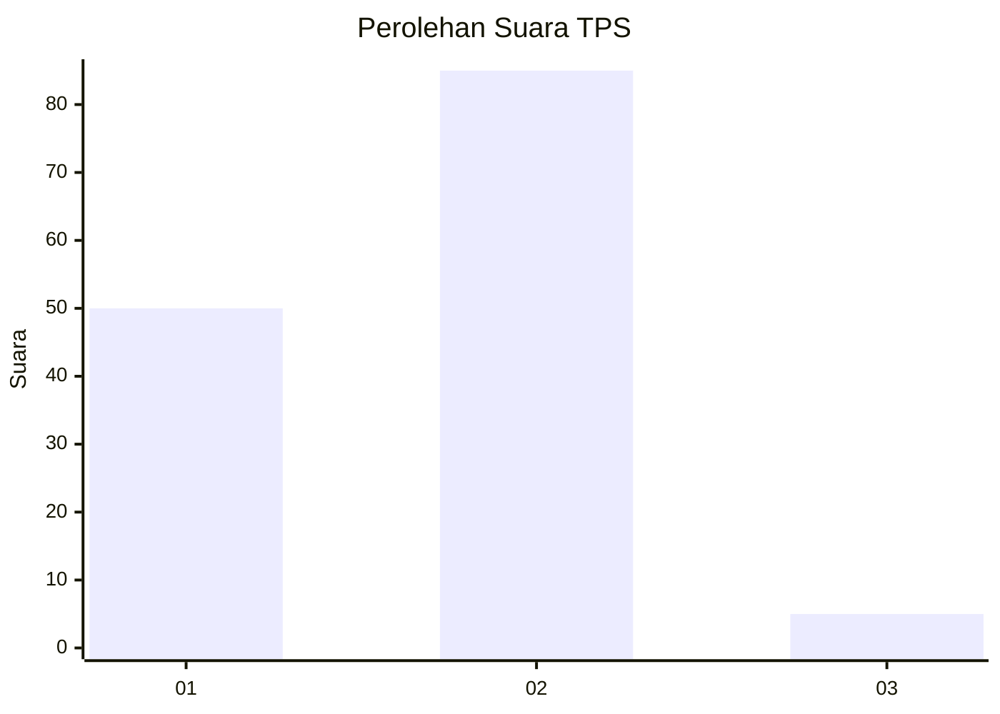
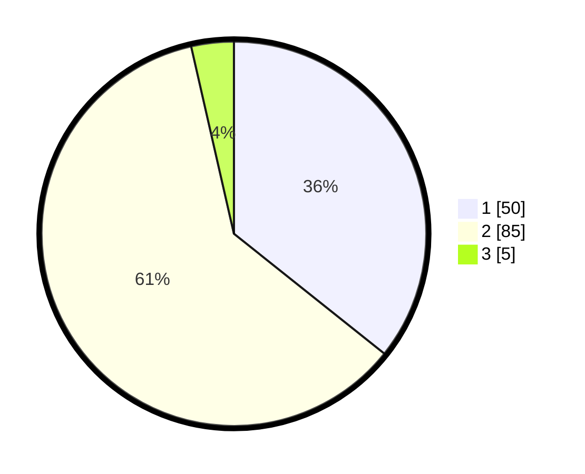

# Hasil

## Grafik

## Tabel

| No. | Nama Paslon    | Suara | Suara (raw) | Persentase |
|:--- |:-------------- | -----:| -----------:| ----------:|
| 1   | ANIES MUHAIMIN | 50    | [50][p-1]   | 35,71      |
| 2   | PRABOWO GIBRAN | 85    | [85][p-2]   | 60,71      |
| 3   | GANJAR MAHFUD  | 5     | [5][p-3]    | 3,57       |

[p-1]: https://github.com/gigit-pemilu/pemilu-2024-35-jawa-timur/blob/main/pilpres/hitung-suara/sub/35-jawa-timur/sub/25-gresik/sub/18-tambak/sub/2004-pekalongan/sub/006-tps/sub/paslon-1.txt
[p-2]: https://github.com/gigit-pemilu/pemilu-2024-35-jawa-timur/blob/main/pilpres/hitung-suara/sub/35-jawa-timur/sub/25-gresik/sub/18-tambak/sub/2004-pekalongan/sub/006-tps/sub/paslon-2.txt
[p-3]: https://github.com/gigit-pemilu/pemilu-2024-35-jawa-timur/blob/main/pilpres/hitung-suara/sub/35-jawa-timur/sub/25-gresik/sub/18-tambak/sub/2004-pekalongan/sub/006-tps/sub/paslon-3.txt

## Foto C Plano

https://sirekap-obj-formc.kpu.go.id/7d8c/pemilu/ppwp/35/25/18/20/04/3525182004006-20240220-223407--f02a51c2-0477-47ab-9866-532221c8e75c.jpg

https://sirekap-obj-formc.kpu.go.id/7d8c/pemilu/ppwp/35/25/18/20/04/3525182004006-20240215-011010--1e04bee8-a210-46c1-b440-fac1f02588c5.jpg

https://sirekap-obj-formc.kpu.go.id/7d8c/pemilu/ppwp/35/25/18/20/04/3525182004006-20240215-011130--e1e3e0af-39af-4771-a056-dcdca9223e82.jpg

## Metadata

| Key        | Value               |
| ---------- | ------------------- |
| Time Stamp | 2024-02-20 23:00:00 |

