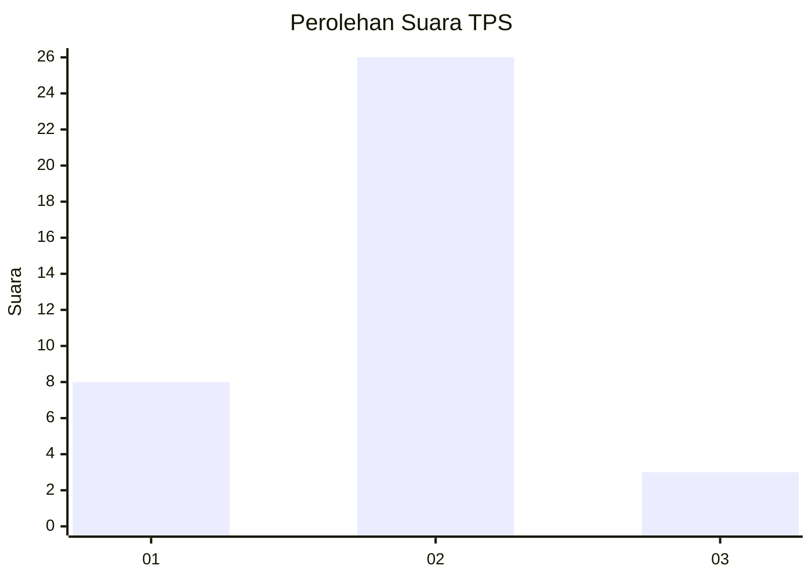
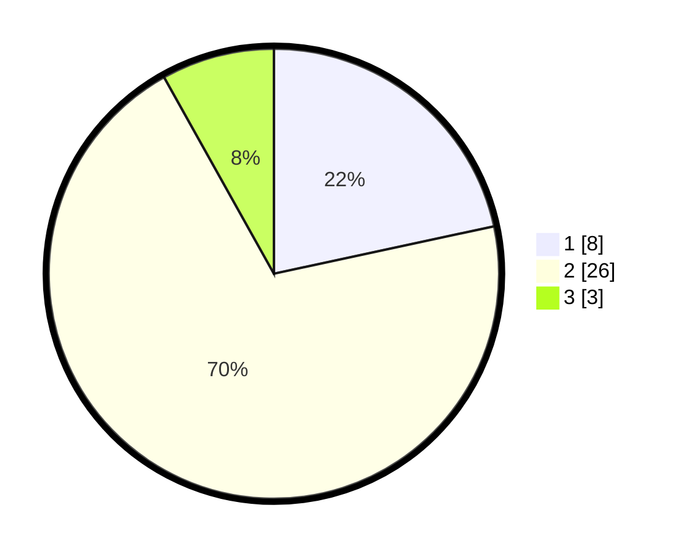

# Hasil

## Grafik

## Tabel

| No. | Nama Paslon    | Suara | Suara (raw) | Persentase |
|:--- |:-------------- | -----:| -----------:| ----------:|
| 1   | ANIES MUHAIMIN | 8     | [8][p-1]    | 21,62      |
| 2   | PRABOWO GIBRAN | 26    | [26][p-2]   | 70,27      |
| 3   | GANJAR MAHFUD  | 3     | [3][p-3]    | 8,11       |

[p-1]: https://github.com/gigit-pemilu/pemilu-2024/blob/main/pilpres/hitung-suara/sub/35-jawa-timur/sub/25-gresik/sub/18-tambak/sub/2005-tambak/sub/001-tps/sub/paslon-1.txt
[p-2]: https://github.com/gigit-pemilu/pemilu-2024/blob/main/pilpres/hitung-suara/sub/35-jawa-timur/sub/25-gresik/sub/18-tambak/sub/2005-tambak/sub/001-tps/sub/paslon-2.txt
[p-3]: https://github.com/gigit-pemilu/pemilu-2024/blob/main/pilpres/hitung-suara/sub/35-jawa-timur/sub/25-gresik/sub/18-tambak/sub/2005-tambak/sub/001-tps/sub/paslon-3.txt

## Foto C Plano

https://sirekap-obj-formc.kpu.go.id/2ab4/pemilu/ppwp/35/25/18/20/05/3525182005001-20240214-211224--b150a673-0fea-4ffd-84f2-0382c65fc4ff.jpg

https://sirekap-obj-formc.kpu.go.id/2ab4/pemilu/ppwp/35/25/18/20/05/3525182005001-20240214-211409--89ad3cb6-ffc4-4962-804b-954c6cdc8e16.jpg

https://sirekap-obj-formc.kpu.go.id/2ab4/pemilu/ppwp/35/25/18/20/05/3525182005001-20240214-211516--2cee2a2d-50d8-418c-a1ff-fa424f99e223.jpg

## Metadata

| Key        | Value               |
| ---------- | ------------------- |
| Time Stamp | 2024-02-15 00:41:44 |

## DATA PEMILIH TETAP

Jumlah pemilih dalam DPT: **89**.
 * L: **36**.
 * P: **53**.

## DATA PENGGUNA HAK PILIH

Jumlah pengguna hak pilih dalam DPT: **35**.
 * L: **11**.
 * P: **24**.

Jumlah pengguna hak pilih dalam DPTb: **0**.
 * L: **0**.
 * P: **0**.

Jumlah pengguna hak pilih dalam DPK: **5**.
 * L: **4**.
 * P: **1**.

Jumlah pengguna hak pilih: **40**.
 * L: **15**.
 * P: **25**.

## JUMLAH SUARA SAH DAN TIDAK SAH

JUMLAH SELURUH SUARA SAH: **37**.

JUMLAH SUARA TIDAK SAH: **3**.

JUMLAH SELURUH SUARA SAH DAN SUARA TIDAK SAH: **40**.

