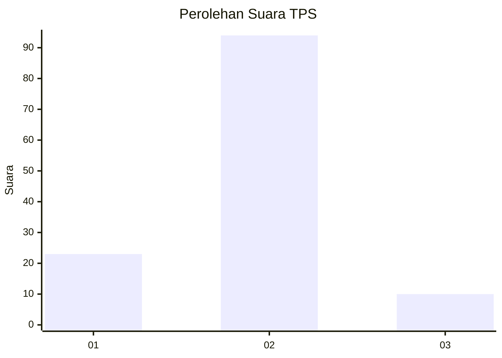
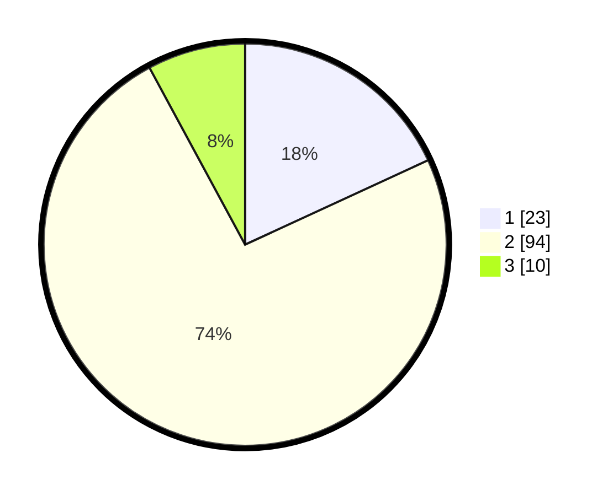

# Hasil

## Grafik

## Tabel

| No. | Nama Paslon    | Suara | Suara (raw) | Persentase |
|:--- |:-------------- | -----:| -----------:| ----------:|
| 1   | ANIES MUHAIMIN | 23    | [23][p-1]   | 18,11      |
| 2   | PRABOWO GIBRAN | 94    | [94][p-2]   | 74,02      |
| 3   | GANJAR MAHFUD  | 10    | [10][p-3]   | 7,87       |

[p-1]: https://github.com/gigit-pemilu/pemilu-2024/blob/main/pilpres/hitung-suara/sub/35-jawa-timur/sub/25-gresik/sub/18-tambak/sub/2005-tambak/sub/007-tps/sub/paslon-1.txt
[p-2]: https://github.com/gigit-pemilu/pemilu-2024/blob/main/pilpres/hitung-suara/sub/35-jawa-timur/sub/25-gresik/sub/18-tambak/sub/2005-tambak/sub/007-tps/sub/paslon-2.txt
[p-3]: https://github.com/gigit-pemilu/pemilu-2024/blob/main/pilpres/hitung-suara/sub/35-jawa-timur/sub/25-gresik/sub/18-tambak/sub/2005-tambak/sub/007-tps/sub/paslon-3.txt

## Foto C Plano

https://sirekap-obj-formc.kpu.go.id/2b1c/pemilu/ppwp/35/25/18/20/05/3525182005007-20240215-003536--f2d28cc8-5353-4309-aeeb-3ce997a82210.jpg

https://sirekap-obj-formc.kpu.go.id/2b1c/pemilu/ppwp/35/25/18/20/05/3525182005007-20240215-003723--b6c80761-7ad6-47bc-9e67-71c5c422cc6b.jpg

https://sirekap-obj-formc.kpu.go.id/2b1c/pemilu/ppwp/35/25/18/20/05/3525182005007-20240215-003851--ce68e776-eced-43fa-a493-884202d754ca.jpg

## Metadata

| Key        | Value               |
| ---------- | ------------------- |
| Time Stamp | 2024-02-16 14:30:33 |

