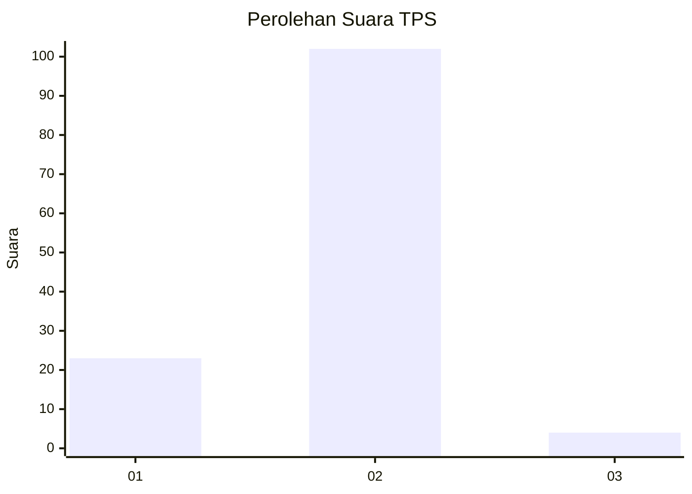
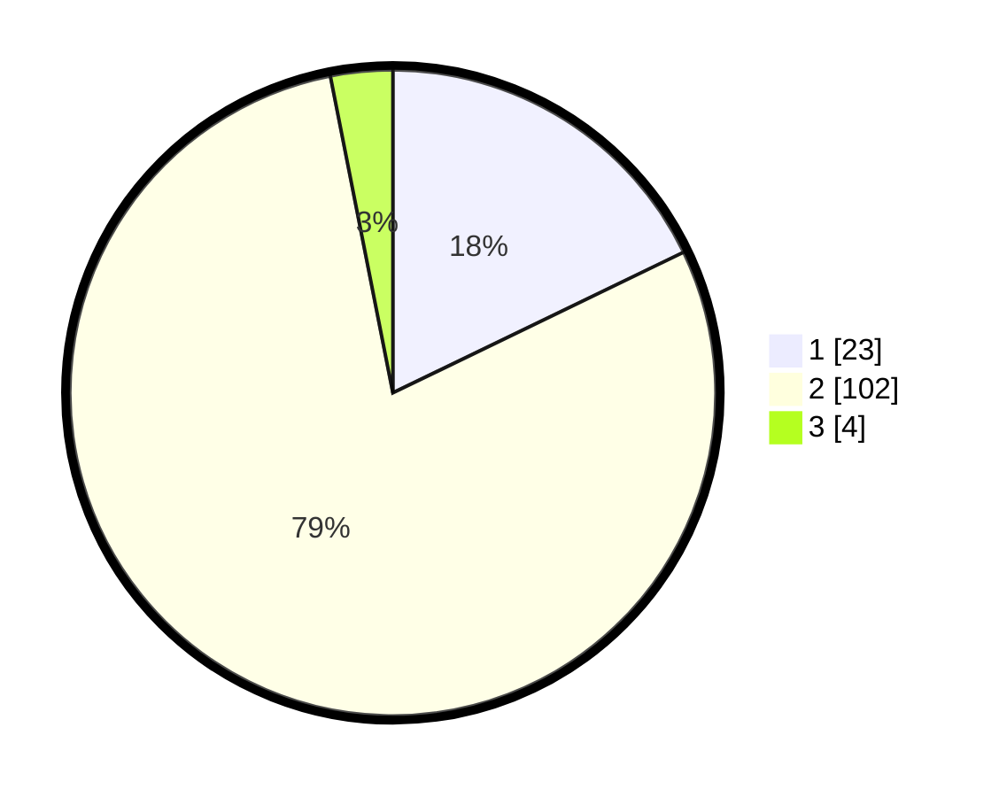

# Hasil

## Grafik

## Tabel

| No. | Nama Paslon    | Suara | Suara (raw) | Persentase |
|:--- |:-------------- | -----:| -----------:| ----------:|
| 1   | ANIES MUHAIMIN | 23    | [23][p-1]   | 17,83      |
| 2   | PRABOWO GIBRAN | 102   | [102][p-2]  | 79,07      |
| 3   | GANJAR MAHFUD  | 4     | [4][p-3]    | 3,10       |

[p-1]: https://github.com/gigit-pemilu/pemilu-2024-35-jawa-timur/blob/main/pilpres/hitung-suara/sub/35-jawa-timur/sub/25-gresik/sub/18-tambak/sub/2005-tambak/sub/012-tps/sub/paslon-1.txt
[p-2]: https://github.com/gigit-pemilu/pemilu-2024-35-jawa-timur/blob/main/pilpres/hitung-suara/sub/35-jawa-timur/sub/25-gresik/sub/18-tambak/sub/2005-tambak/sub/012-tps/sub/paslon-2.txt
[p-3]: https://github.com/gigit-pemilu/pemilu-2024-35-jawa-timur/blob/main/pilpres/hitung-suara/sub/35-jawa-timur/sub/25-gresik/sub/18-tambak/sub/2005-tambak/sub/012-tps/sub/paslon-3.txt

## Foto C Plano

https://sirekap-obj-formc.kpu.go.id/9f6e/pemilu/ppwp/35/25/18/20/05/3525182005012-20240215-112956--fbfeb0a3-56ce-420a-9af2-60ea5a124914.jpg

https://sirekap-obj-formc.kpu.go.id/9f6e/pemilu/ppwp/35/25/18/20/05/3525182005012-20240215-113045--0e6bb5f9-bb34-4552-9182-c1adbf7987b6.jpg

https://sirekap-obj-formc.kpu.go.id/9f6e/pemilu/ppwp/35/25/18/20/05/3525182005012-20240215-132540--433a61fc-8493-458c-ba17-e83a554fefef.jpg

## Metadata

| Key        | Value               |
| ---------- | ------------------- |
| Time Stamp | 2024-02-16 16:25:10 |

