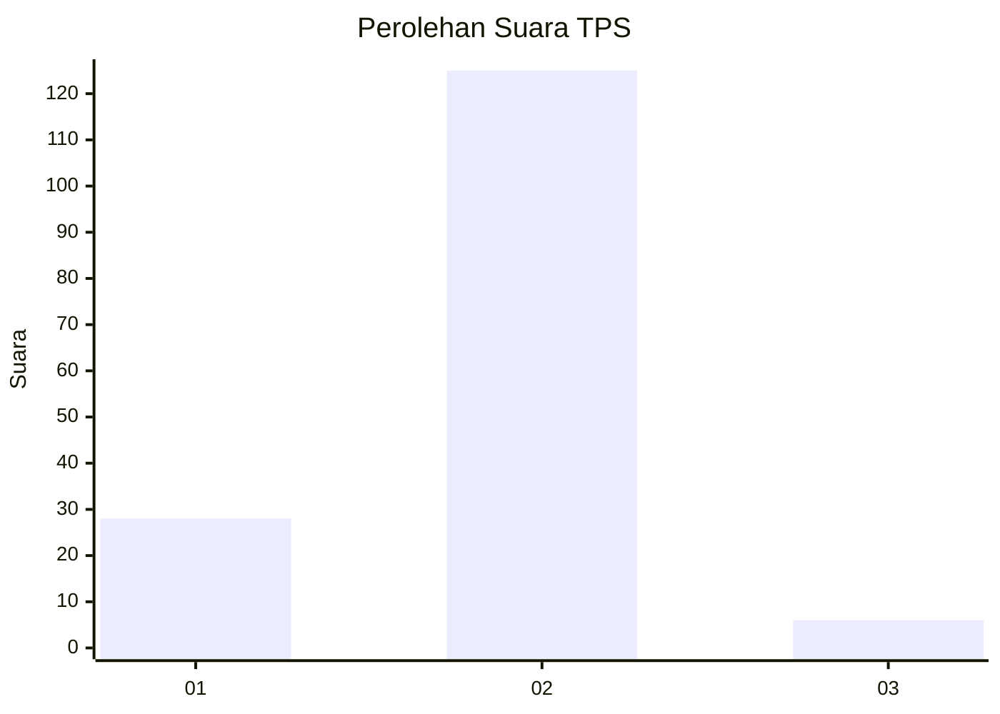
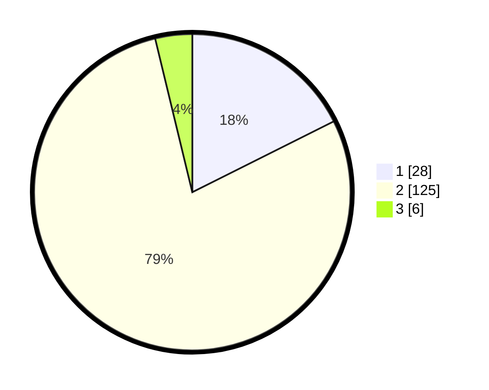

# Hasil

## Grafik

## Tabel

| No. | Nama Paslon    | Suara | Suara (raw) | Persentase |
|:--- |:-------------- | -----:| -----------:| ----------:|
| 1   | ANIES MUHAIMIN | 28    | [28][p-1]   | 17,61      |
| 2   | PRABOWO GIBRAN | 125   | [125][p-2]  | 78,62      |
| 3   | GANJAR MAHFUD  | 6     | [6][p-3]    | 3,77       |

[p-1]: https://github.com/gigit-pemilu/pemilu-2024/blob/main/pilpres/hitung-suara/sub/35-jawa-timur/sub/25-gresik/sub/18-tambak/sub/2005-tambak/sub/013-tps/sub/paslon-1.txt
[p-2]: https://github.com/gigit-pemilu/pemilu-2024/blob/main/pilpres/hitung-suara/sub/35-jawa-timur/sub/25-gresik/sub/18-tambak/sub/2005-tambak/sub/013-tps/sub/paslon-2.txt
[p-3]: https://github.com/gigit-pemilu/pemilu-2024/blob/main/pilpres/hitung-suara/sub/35-jawa-timur/sub/25-gresik/sub/18-tambak/sub/2005-tambak/sub/013-tps/sub/paslon-3.txt

## Foto C Plano

https://sirekap-obj-formc.kpu.go.id/3a35/pemilu/ppwp/35/25/18/20/05/3525182005013-20240215-024424--23e871d7-5d49-4e09-acf4-98176a63f78b.jpg

https://sirekap-obj-formc.kpu.go.id/3a35/pemilu/ppwp/35/25/18/20/05/3525182005013-20240215-024227--e5096845-39a7-46d5-b976-f4d8faa74e64.jpg

https://sirekap-obj-formc.kpu.go.id/3a35/pemilu/ppwp/35/25/18/20/05/3525182005013-20240215-023841--462ec859-5f62-4a9c-8816-79d22e076fb4.jpg

## Metadata

| Key        | Value               |
| ---------- | ------------------- |
| Time Stamp | 2024-02-16 16:25:10 |

