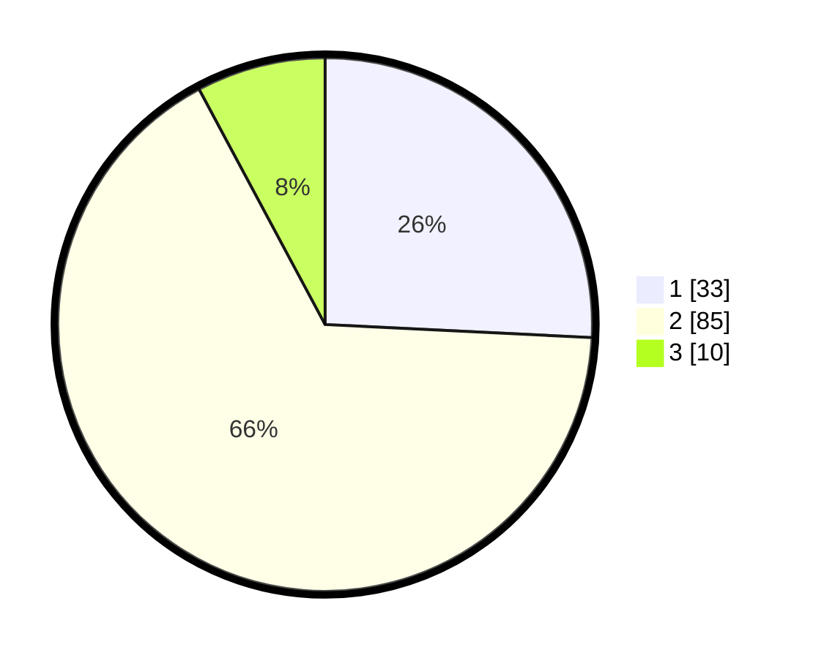

# Hasil

## Grafik

## Tabel

| No. | Nama Paslon    | Suara | Suara (raw) | Persentase |
|:--- |:-------------- | -----:| -----------:| ----------:|
| 1   | ANIES MUHAIMIN | 33    | [33][p-1]   | 25,78      |
| 2   | PRABOWO GIBRAN | 85    | [85][p-2]   | 66,41      |
| 3   | GANJAR MAHFUD  | 10    | [10][p-3]   | 7,81       |

[p-1]: https://github.com/gigit-pemilu/pemilu-2024-35-jawa-timur/blob/main/pilpres/hitung-suara/sub/35-jawa-timur/sub/25-gresik/sub/18-tambak/sub/2006-telukjatidawang/sub/006-tps/sub/paslon-1.txt
[p-2]: https://github.com/gigit-pemilu/pemilu-2024-35-jawa-timur/blob/main/pilpres/hitung-suara/sub/35-jawa-timur/sub/25-gresik/sub/18-tambak/sub/2006-telukjatidawang/sub/006-tps/sub/paslon-2.txt
[p-3]: https://github.com/gigit-pemilu/pemilu-2024-35-jawa-timur/blob/main/pilpres/hitung-suara/sub/35-jawa-timur/sub/25-gresik/sub/18-tambak/sub/2006-telukjatidawang/sub/006-tps/sub/paslon-3.txt

## Foto C Plano

https://sirekap-obj-formc.kpu.go.id/dd10/pemilu/ppwp/35/25/18/20/06/3525182006006-20240215-031018--dddd413a-e153-49d9-89c6-87ca50d3acbf.jpg

https://sirekap-obj-formc.kpu.go.id/dd10/pemilu/ppwp/35/25/18/20/06/3525182006006-20240215-031036--d69b3dbb-e346-474b-b626-9098e5fbf8b0.jpg

https://sirekap-obj-formc.kpu.go.id/dd10/pemilu/ppwp/35/25/18/20/06/3525182006006-20240218-121427--5d77db35-57fc-46ab-9b20-497dd36069e1.jpg

## Metadata

| Key        | Value               |
| ---------- | ------------------- |
| Time Stamp | 2024-02-19 06:16:00 |

