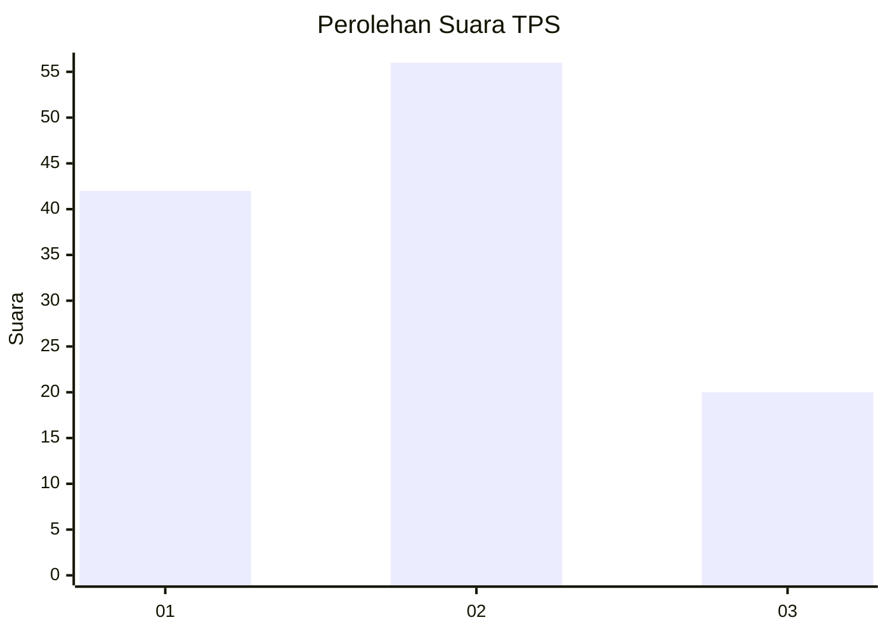
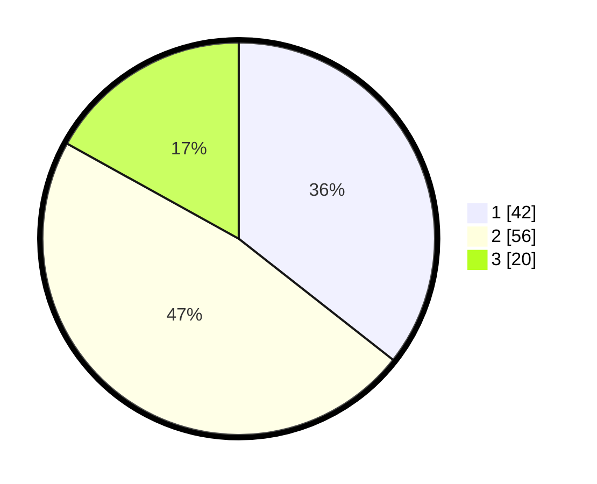

# Hasil

## Grafik

## Tabel

| No. | Nama Paslon    | Suara | Suara (raw) | Persentase |
|:--- |:-------------- | -----:| -----------:| ----------:|
| 1   | ANIES MUHAIMIN | 42    | [42][p-1]   | 35,59      |
| 2   | PRABOWO GIBRAN | 56    | [56][p-2]   | 47,46      |
| 3   | GANJAR MAHFUD  | 20    | [20][p-3]   | 16,95      |

[p-1]: https://github.com/gigit-pemilu/pemilu-2024/blob/main/pilpres/hitung-suara/sub/35-jawa-timur/sub/25-gresik/sub/18-tambak/sub/2006-telukjatidawang/sub/011-tps/sub/paslon-1.txt
[p-2]: https://github.com/gigit-pemilu/pemilu-2024/blob/main/pilpres/hitung-suara/sub/35-jawa-timur/sub/25-gresik/sub/18-tambak/sub/2006-telukjatidawang/sub/011-tps/sub/paslon-2.txt
[p-3]: https://github.com/gigit-pemilu/pemilu-2024/blob/main/pilpres/hitung-suara/sub/35-jawa-timur/sub/25-gresik/sub/18-tambak/sub/2006-telukjatidawang/sub/011-tps/sub/paslon-3.txt

## Foto C Plano

https://sirekap-obj-formc.kpu.go.id/5a8e/pemilu/ppwp/35/25/18/20/06/3525182006011-20240216-075052--3802bd54-88f7-41d7-9b3c-859a070b1093.jpg

https://sirekap-obj-formc.kpu.go.id/5a8e/pemilu/ppwp/35/25/18/20/06/3525182006011-20240216-095542--996c6414-b27b-4f3c-a078-d911137ac461.jpg

https://sirekap-obj-formc.kpu.go.id/5a8e/pemilu/ppwp/35/25/18/20/06/3525182006011-20240216-095617--b4afac18-959a-4c2b-8ad4-a0e01410517c.jpg

## Metadata

| Key        | Value               |
| ---------- | ------------------- |
| Time Stamp | 2024-02-16 16:25:10 |

