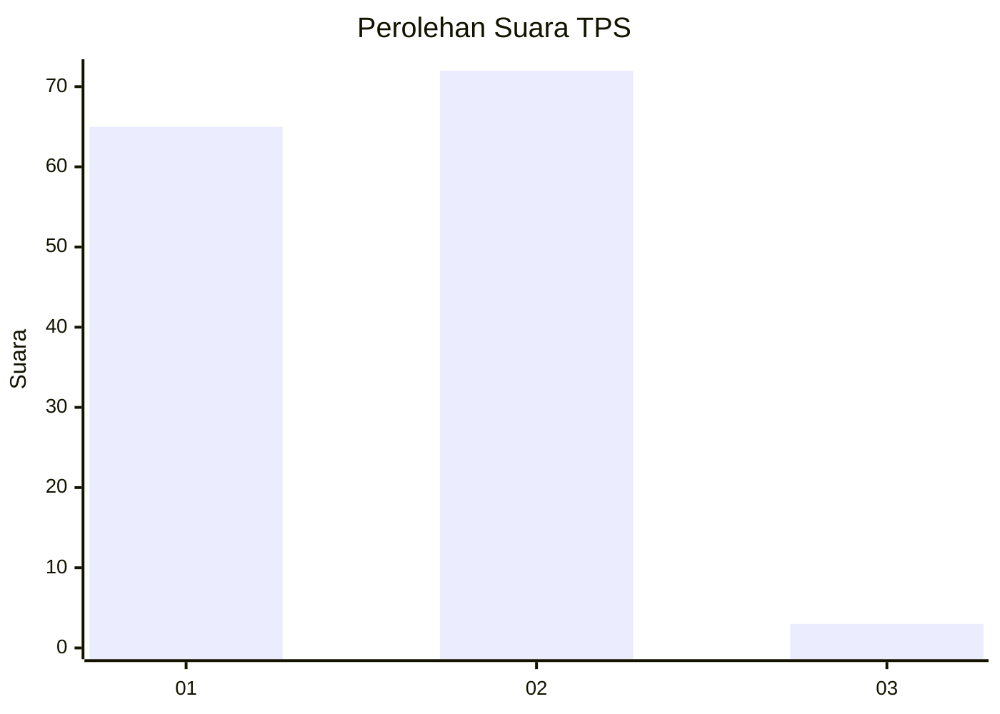
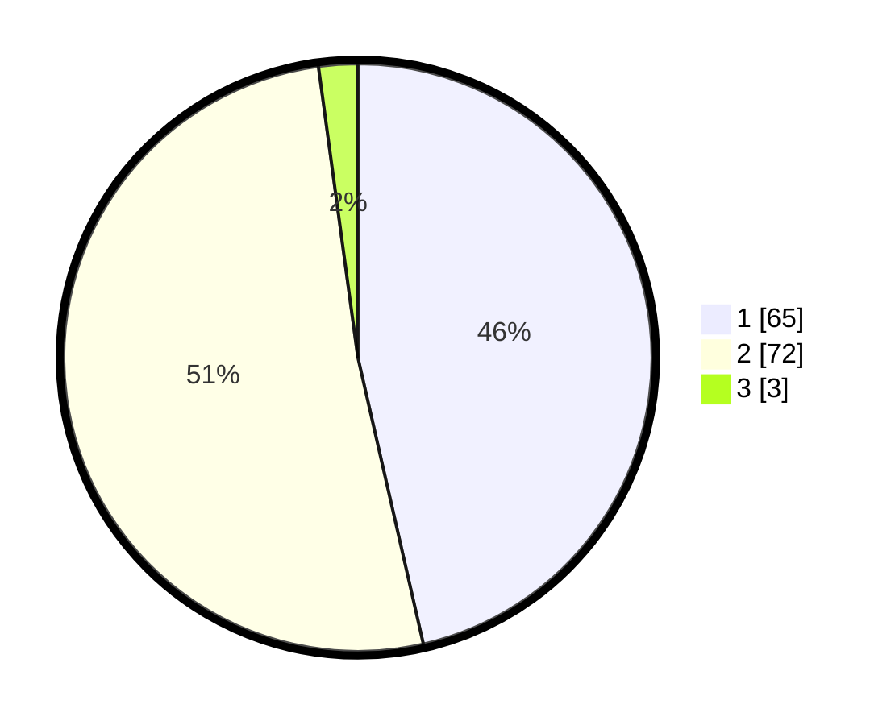

# Hasil

## Grafik

## Tabel

| No. | Nama Paslon    | Suara | Suara (raw) | Persentase |
|:--- |:-------------- | -----:| -----------:| ----------:|
| 1   | ANIES MUHAIMIN | 65    | [65][p-1]   | 46,43      |
| 2   | PRABOWO GIBRAN | 72    | [72][p-2]   | 51,43      |
| 3   | GANJAR MAHFUD  | 3     | [3][p-3]    | 2,14       |

[p-1]: https://github.com/gigit-pemilu/pemilu-2024/blob/main/pilpres/hitung-suara/sub/35-jawa-timur/sub/25-gresik/sub/18-tambak/sub/2007-klumpanggubug/sub/003-tps/sub/paslon-1.txt
[p-2]: https://github.com/gigit-pemilu/pemilu-2024/blob/main/pilpres/hitung-suara/sub/35-jawa-timur/sub/25-gresik/sub/18-tambak/sub/2007-klumpanggubug/sub/003-tps/sub/paslon-2.txt
[p-3]: https://github.com/gigit-pemilu/pemilu-2024/blob/main/pilpres/hitung-suara/sub/35-jawa-timur/sub/25-gresik/sub/18-tambak/sub/2007-klumpanggubug/sub/003-tps/sub/paslon-3.txt

## Foto C Plano

https://sirekap-obj-formc.kpu.go.id/67b2/pemilu/ppwp/35/25/18/20/07/3525182007003-20240220-094444--59a494e9-afc0-4853-b717-50a74f15bccd.jpg

https://sirekap-obj-formc.kpu.go.id/67b2/pemilu/ppwp/35/25/18/20/07/3525182007003-20240215-095247--f4b5303b-8053-4b4e-bf8c-4d7799528f6c.jpg

https://sirekap-obj-formc.kpu.go.id/67b2/pemilu/ppwp/35/25/18/20/07/3525182007003-20240215-095255--41fe007c-c27b-4d6d-a295-b490da31c024.jpg

## Metadata

| Key        | Value               |
| ---------- | ------------------- |
| Time Stamp | 2024-02-20 10:00:00 |

