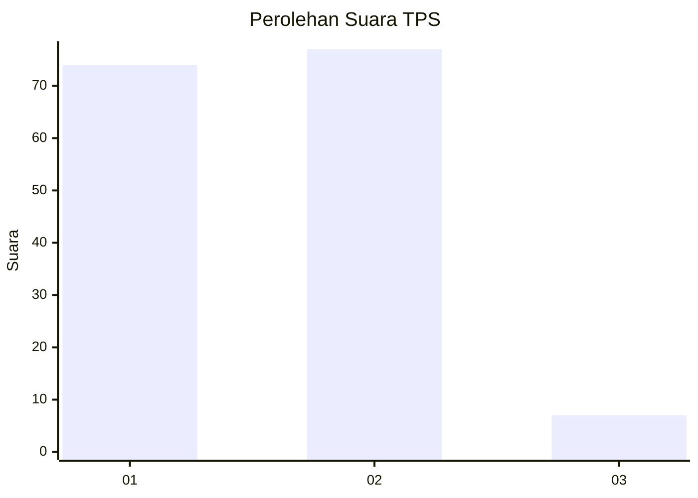
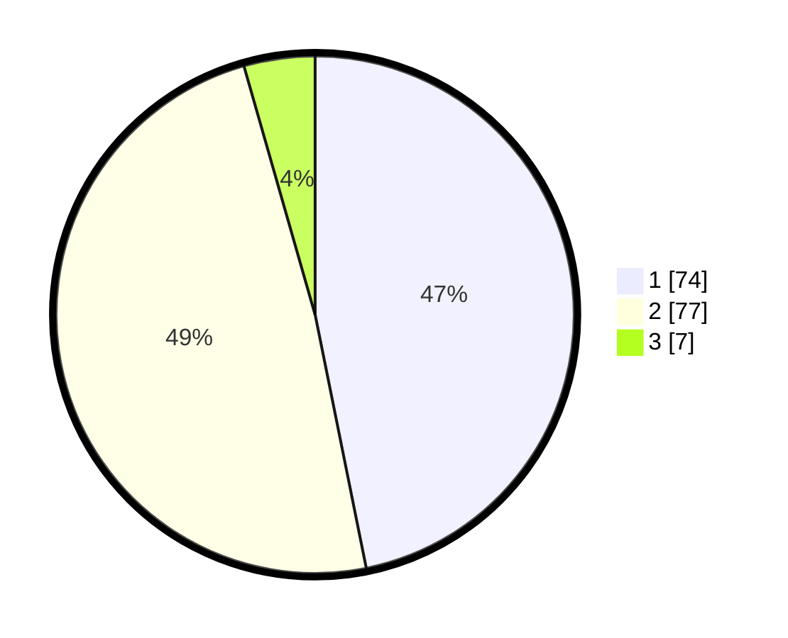

# Hasil

## Grafik

## Tabel

| No. | Nama Paslon    | Suara | Suara (raw) | Persentase |
|:--- |:-------------- | -----:| -----------:| ----------:|
| 1   | ANIES MUHAIMIN | 74    | [74][p-1]   | 46,84      |
| 2   | PRABOWO GIBRAN | 77    | [77][p-2]   | 48,73      |
| 3   | GANJAR MAHFUD  | 7     | [7][p-3]    | 4,43       |

[p-1]: https://github.com/gigit-pemilu/pemilu-2024/blob/main/pilpres/hitung-suara/sub/35-jawa-timur/sub/25-gresik/sub/18-tambak/sub/2007-klumpanggubug/sub/004-tps/sub/paslon-1.txt
[p-2]: https://github.com/gigit-pemilu/pemilu-2024/blob/main/pilpres/hitung-suara/sub/35-jawa-timur/sub/25-gresik/sub/18-tambak/sub/2007-klumpanggubug/sub/004-tps/sub/paslon-2.txt
[p-3]: https://github.com/gigit-pemilu/pemilu-2024/blob/main/pilpres/hitung-suara/sub/35-jawa-timur/sub/25-gresik/sub/18-tambak/sub/2007-klumpanggubug/sub/004-tps/sub/paslon-3.txt

## Foto C Plano

https://sirekap-obj-formc.kpu.go.id/cd5f/pemilu/ppwp/35/25/18/20/07/3525182007004-20240215-085520--538890d4-1b2f-4a60-900d-41476d1b4e24.jpg

https://sirekap-obj-formc.kpu.go.id/cd5f/pemilu/ppwp/35/25/18/20/07/3525182007004-20240215-085610--bc85c210-d22e-4e65-a0fa-70046fb480dd.jpg

https://sirekap-obj-formc.kpu.go.id/cd5f/pemilu/ppwp/35/25/18/20/07/3525182007004-20240215-085651--dd4e972f-4f38-4e64-b2d8-43818262315a.jpg

## Metadata

| Key        | Value               |
| ---------- | ------------------- |
| Time Stamp | 2024-02-16 16:25:10 |

