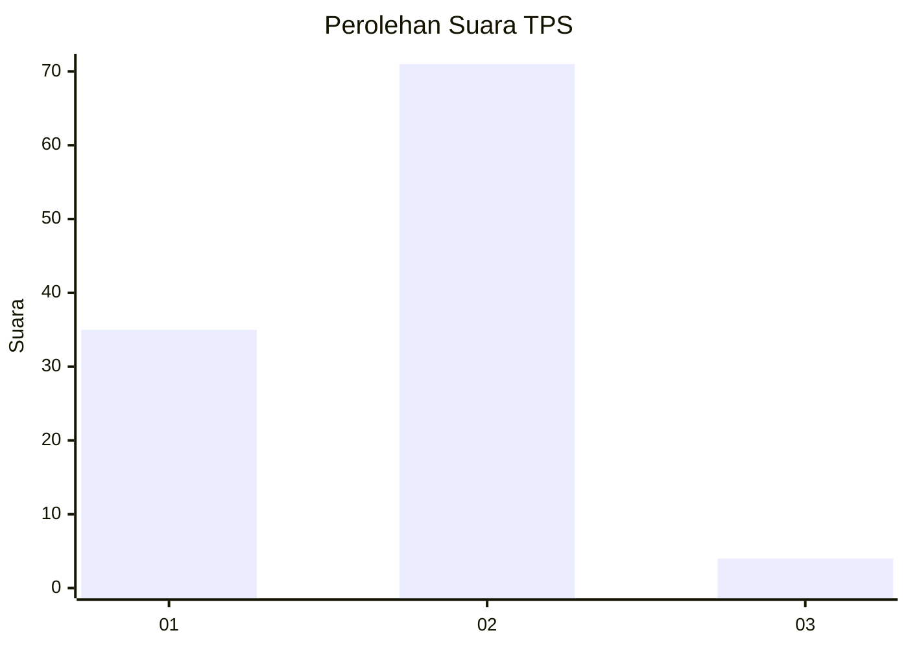
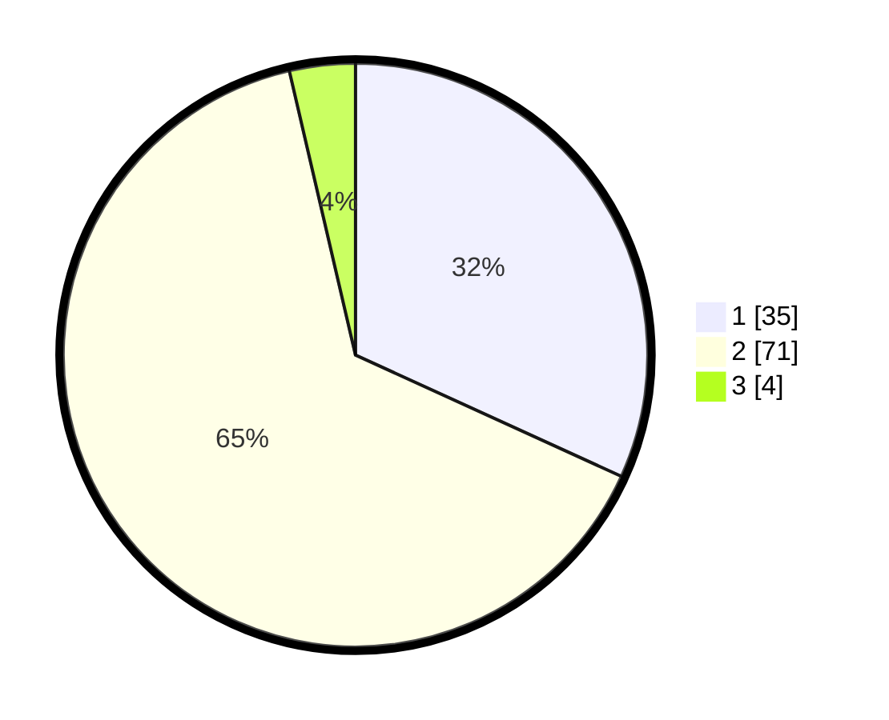

# Hasil

## Grafik

## Tabel

| No. | Nama Paslon    | Suara | Suara (raw) | Persentase |
|:--- |:-------------- | -----:| -----------:| ----------:|
| 1   | ANIES MUHAIMIN | 35    | [35][p-1]   | 31,82      |
| 2   | PRABOWO GIBRAN | 71    | [71][p-2]   | 64,55      |
| 3   | GANJAR MAHFUD  | 4     | [4][p-3]    | 3,64       |

[p-1]: https://github.com/gigit-pemilu/pemilu-2024/blob/main/pilpres/hitung-suara/sub/35-jawa-timur/sub/25-gresik/sub/18-tambak/sub/2007-klumpanggubug/sub/005-tps/sub/paslon-1.txt
[p-2]: https://github.com/gigit-pemilu/pemilu-2024/blob/main/pilpres/hitung-suara/sub/35-jawa-timur/sub/25-gresik/sub/18-tambak/sub/2007-klumpanggubug/sub/005-tps/sub/paslon-2.txt
[p-3]: https://github.com/gigit-pemilu/pemilu-2024/blob/main/pilpres/hitung-suara/sub/35-jawa-timur/sub/25-gresik/sub/18-tambak/sub/2007-klumpanggubug/sub/005-tps/sub/paslon-3.txt

## Foto C Plano

https://sirekap-obj-formc.kpu.go.id/85bc/pemilu/ppwp/35/25/18/20/07/3525182007005-20240214-215931--f1a1e0f1-21f1-4fe5-930a-de4909ca770d.jpg

https://sirekap-obj-formc.kpu.go.id/85bc/pemilu/ppwp/35/25/18/20/07/3525182007005-20240215-030759--e17b84fd-27ca-4f9a-af5d-b7dd31b1406f.jpg

https://sirekap-obj-formc.kpu.go.id/85bc/pemilu/ppwp/35/25/18/20/07/3525182007005-20240214-215939--180dedac-0559-4a5b-b45d-b4799b214f3e.jpg

## Metadata

| Key        | Value               |
| ---------- | ------------------- |
| Time Stamp | 2024-02-16 16:25:10 |

