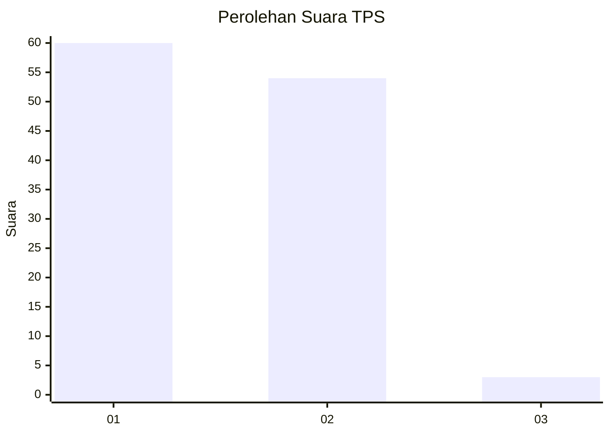
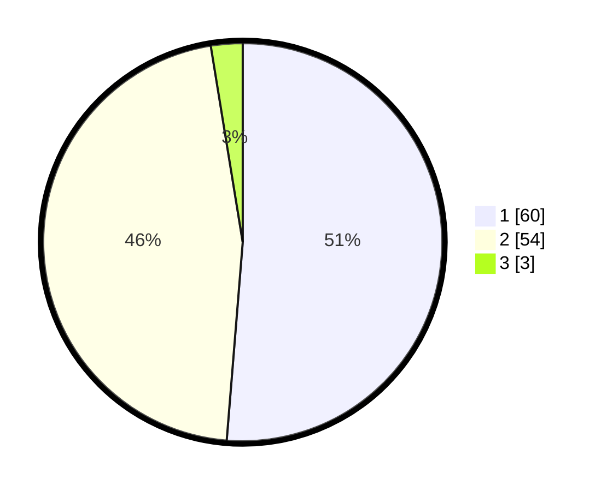

# Hasil

## Grafik

## Tabel

| No. | Nama Paslon    | Suara | Suara (raw) | Persentase |
|:--- |:-------------- | -----:| -----------:| ----------:|
| 1   | ANIES MUHAIMIN | 60    | [60][p-1]   | 51,28      |
| 2   | PRABOWO GIBRAN | 54    | [54][p-2]   | 46,15      |
| 3   | GANJAR MAHFUD  | 3     | [3][p-3]    | 2,56       |

[p-1]: https://github.com/gigit-pemilu/pemilu-2024-35-jawa-timur/blob/main/pilpres/hitung-suara/sub/35-jawa-timur/sub/25-gresik/sub/18-tambak/sub/2007-klumpanggubug/sub/006-tps/sub/paslon-1.txt
[p-2]: https://github.com/gigit-pemilu/pemilu-2024-35-jawa-timur/blob/main/pilpres/hitung-suara/sub/35-jawa-timur/sub/25-gresik/sub/18-tambak/sub/2007-klumpanggubug/sub/006-tps/sub/paslon-2.txt
[p-3]: https://github.com/gigit-pemilu/pemilu-2024-35-jawa-timur/blob/main/pilpres/hitung-suara/sub/35-jawa-timur/sub/25-gresik/sub/18-tambak/sub/2007-klumpanggubug/sub/006-tps/sub/paslon-3.txt

## Foto C Plano

https://sirekap-obj-formc.kpu.go.id/4b91/pemilu/ppwp/35/25/18/20/07/3525182007006-20240214-225223--385303c3-6f27-4c36-baba-1b120a147c6c.jpg

https://sirekap-obj-formc.kpu.go.id/4b91/pemilu/ppwp/35/25/18/20/07/3525182007006-20240214-225457--e49007a6-1590-4d7b-80d2-b2bd3258d985.jpg

https://sirekap-obj-formc.kpu.go.id/4b91/pemilu/ppwp/35/25/18/20/07/3525182007006-20240214-225554--59c6f65a-3eaf-484a-bd90-8c1f5929b158.jpg

## Metadata

| Key        | Value               |
| ---------- | ------------------- |
| Time Stamp | 2024-02-16 16:25:10 |

