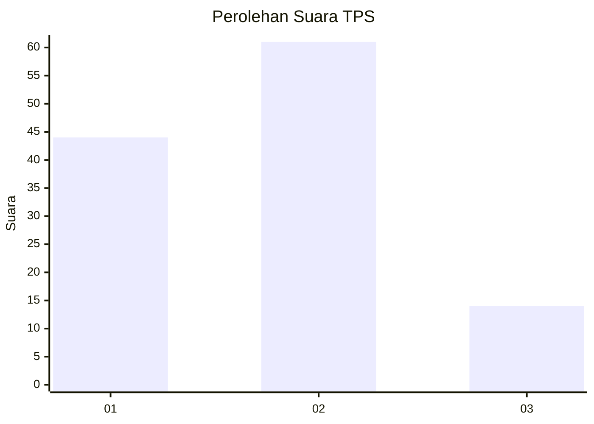
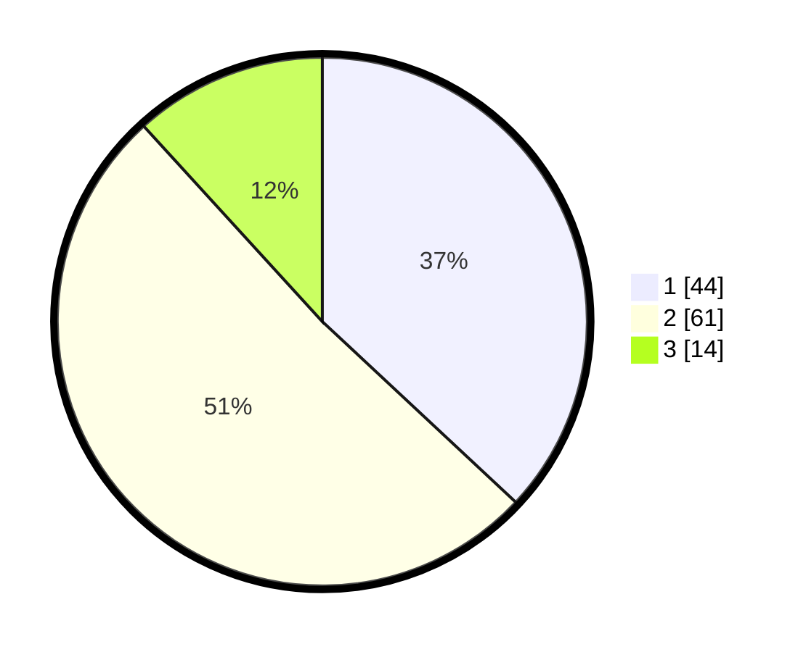

# Hasil

## Grafik

## Tabel

| No. | Nama Paslon    | Suara | Suara (raw) | Persentase |
|:--- |:-------------- | -----:| -----------:| ----------:|
| 1   | ANIES MUHAIMIN | 44    | [44][p-1]   | 36,97      |
| 2   | PRABOWO GIBRAN | 61    | [61][p-2]   | 51,26      |
| 3   | GANJAR MAHFUD  | 14    | [14][p-3]   | 11,76      |

[p-1]: https://github.com/gigit-pemilu/pemilu-2024/blob/main/pilpres/hitung-suara/sub/35-jawa-timur/sub/25-gresik/sub/18-tambak/sub/2008-grejeg/sub/002-tps/sub/paslon-1.txt
[p-2]: https://github.com/gigit-pemilu/pemilu-2024/blob/main/pilpres/hitung-suara/sub/35-jawa-timur/sub/25-gresik/sub/18-tambak/sub/2008-grejeg/sub/002-tps/sub/paslon-2.txt
[p-3]: https://github.com/gigit-pemilu/pemilu-2024/blob/main/pilpres/hitung-suara/sub/35-jawa-timur/sub/25-gresik/sub/18-tambak/sub/2008-grejeg/sub/002-tps/sub/paslon-3.txt

## Foto C Plano

https://sirekap-obj-formc.kpu.go.id/9203/pemilu/ppwp/35/25/18/20/08/3525182008002-20240215-044308--0f8d46a2-90ce-4df7-9651-d63d67fe6253.jpg

https://sirekap-obj-formc.kpu.go.id/9203/pemilu/ppwp/35/25/18/20/08/3525182008002-20240215-022254--525118ed-d343-429d-a3c1-c135a7333a52.jpg

https://sirekap-obj-formc.kpu.go.id/9203/pemilu/ppwp/35/25/18/20/08/3525182008002-20240215-022731--17f86690-5d81-4274-98b5-f10f4177c0ce.jpg

## Metadata

| Key        | Value               |
| ---------- | ------------------- |
| Time Stamp | 2024-02-16 16:25:10 |

