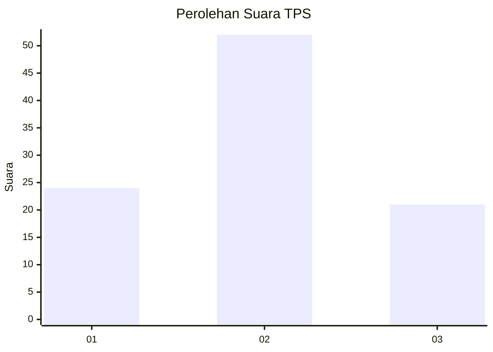
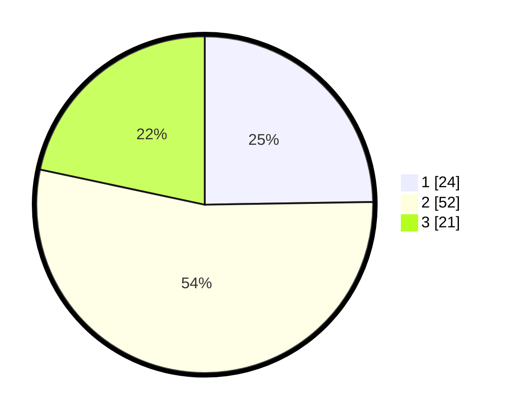

# Hasil

## Grafik

## Tabel

| No. | Nama Paslon    | Suara | Suara (raw) | Persentase |
|:--- |:-------------- | -----:| -----------:| ----------:|
| 1   | ANIES MUHAIMIN | 24    | [24][p-1]   | 24,74      |
| 2   | PRABOWO GIBRAN | 52    | [52][p-2]   | 53,61      |
| 3   | GANJAR MAHFUD  | 21    | [21][p-3]   | 21,65      |

[p-1]: https://github.com/gigit-pemilu/pemilu-2024/blob/main/pilpres/hitung-suara/sub/35-jawa-timur/sub/25-gresik/sub/18-tambak/sub/2009-tanjungori/sub/001-tps/sub/paslon-1.txt
[p-2]: https://github.com/gigit-pemilu/pemilu-2024/blob/main/pilpres/hitung-suara/sub/35-jawa-timur/sub/25-gresik/sub/18-tambak/sub/2009-tanjungori/sub/001-tps/sub/paslon-2.txt
[p-3]: https://github.com/gigit-pemilu/pemilu-2024/blob/main/pilpres/hitung-suara/sub/35-jawa-timur/sub/25-gresik/sub/18-tambak/sub/2009-tanjungori/sub/001-tps/sub/paslon-3.txt

## Foto C Plano

https://sirekap-obj-formc.kpu.go.id/f107/pemilu/ppwp/35/25/18/20/09/3525182009001-20240215-112038--dfac60d1-e7b0-40c6-863a-6bc9b9add664.jpg

https://sirekap-obj-formc.kpu.go.id/f107/pemilu/ppwp/35/25/18/20/09/3525182009001-20240221-093546--bc626c31-6253-431c-b56a-0c0548773f73.jpg

https://sirekap-obj-formc.kpu.go.id/f107/pemilu/ppwp/35/25/18/20/09/3525182009001-20240215-112423--31285691-6423-43eb-817f-28ab184810be.jpg

## Metadata

| Key        | Value               |
| ---------- | ------------------- |
| Time Stamp | 2024-02-21 11:00:00 |

