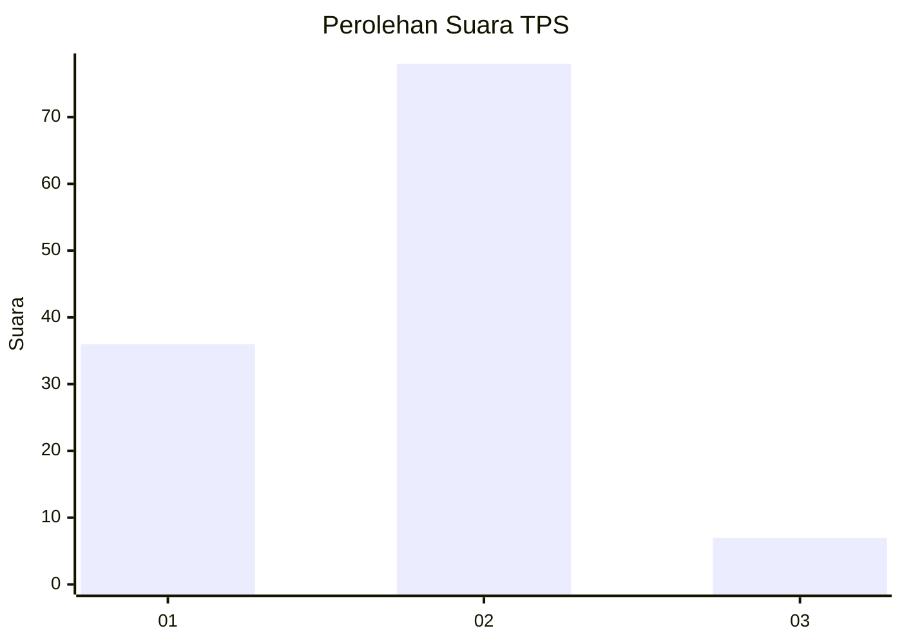
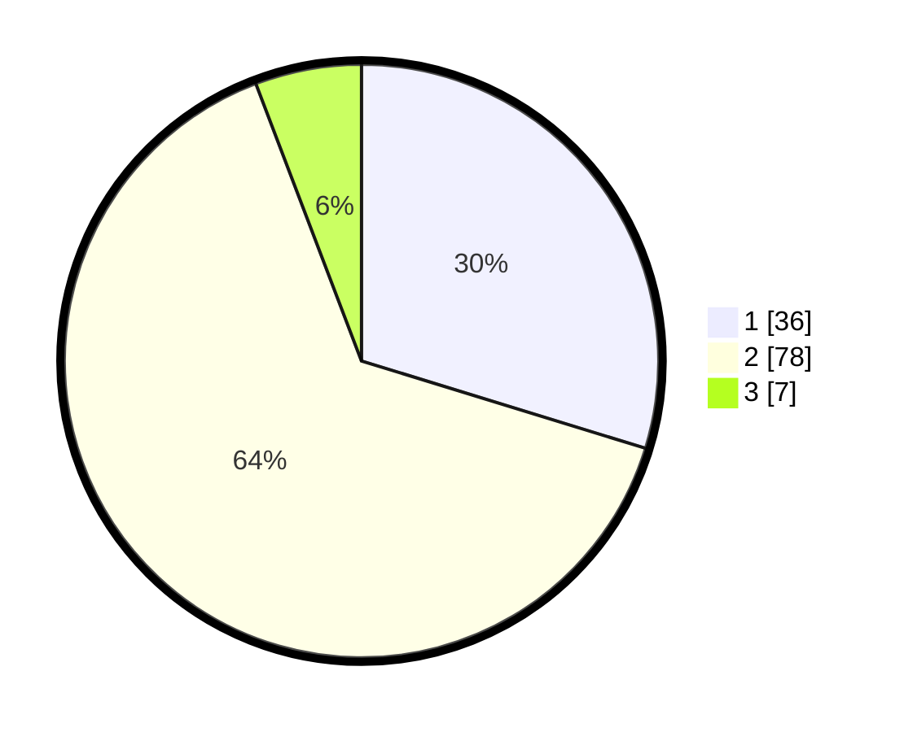

# Hasil

## Grafik

## Tabel

| No. | Nama Paslon    | Suara | Suara (raw) | Persentase |
|:--- |:-------------- | -----:| -----------:| ----------:|
| 1   | ANIES MUHAIMIN | 36    | [36][p-1]   | 29,75      |
| 2   | PRABOWO GIBRAN | 78    | [78][p-2]   | 64,46      |
| 3   | GANJAR MAHFUD  | 7     | [7][p-3]    | 5,79       |

[p-1]: https://github.com/gigit-pemilu/pemilu-2024-35-jawa-timur/blob/main/pilpres/hitung-suara/sub/35-jawa-timur/sub/25-gresik/sub/18-tambak/sub/2009-tanjungori/sub/006-tps/sub/paslon-1.txt
[p-2]: https://github.com/gigit-pemilu/pemilu-2024-35-jawa-timur/blob/main/pilpres/hitung-suara/sub/35-jawa-timur/sub/25-gresik/sub/18-tambak/sub/2009-tanjungori/sub/006-tps/sub/paslon-2.txt
[p-3]: https://github.com/gigit-pemilu/pemilu-2024-35-jawa-timur/blob/main/pilpres/hitung-suara/sub/35-jawa-timur/sub/25-gresik/sub/18-tambak/sub/2009-tanjungori/sub/006-tps/sub/paslon-3.txt

## Foto C Plano

https://sirekap-obj-formc.kpu.go.id/f0fd/pemilu/ppwp/35/25/18/20/09/3525182009006-20240221-120807--5c650b60-cae7-47aa-bace-84534fd03ad2.jpg

https://sirekap-obj-formc.kpu.go.id/f0fd/pemilu/ppwp/35/25/18/20/09/3525182009006-20240221-121123--6a106e40-cd18-4dfd-be55-510b9355a097.jpg

https://sirekap-obj-formc.kpu.go.id/f0fd/pemilu/ppwp/35/25/18/20/09/3525182009006-20240221-121432--8d1c70ba-fdfd-44e2-8ec0-55f8d7743da4.jpg

## Metadata

| Key        | Value               |
| ---------- | ------------------- |
| Time Stamp | 2024-02-25 12:00:00 |

