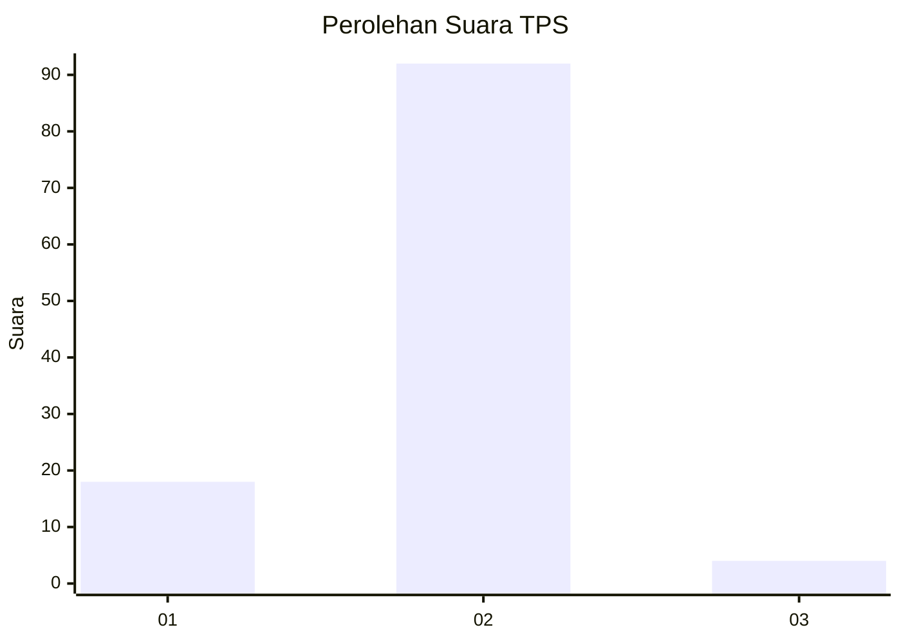
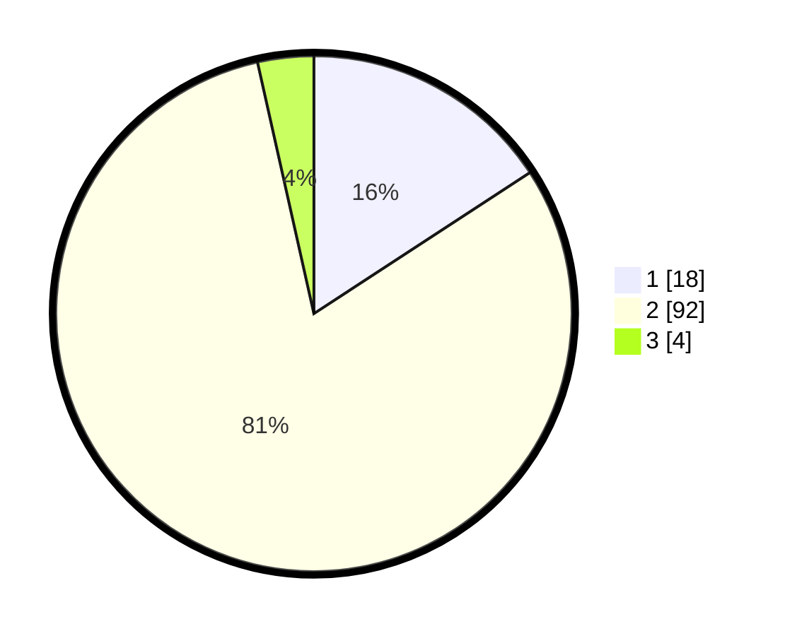

# Hasil

## Grafik

## Tabel

| No. | Nama Paslon    | Suara | Suara (raw) | Persentase |
|:--- |:-------------- | -----:| -----------:| ----------:|
| 1   | ANIES MUHAIMIN | 18    | [18][p-1]   | 15,79      |
| 2   | PRABOWO GIBRAN | 92    | [92][p-2]   | 80,70      |
| 3   | GANJAR MAHFUD  | 4     | [4][p-3]    | 3,51       |

[p-1]: https://github.com/gigit-pemilu/pemilu-2024-35-jawa-timur/blob/main/pilpres/hitung-suara/sub/35-jawa-timur/sub/25-gresik/sub/18-tambak/sub/2009-tanjungori/sub/008-tps/sub/paslon-1.txt
[p-2]: https://github.com/gigit-pemilu/pemilu-2024-35-jawa-timur/blob/main/pilpres/hitung-suara/sub/35-jawa-timur/sub/25-gresik/sub/18-tambak/sub/2009-tanjungori/sub/008-tps/sub/paslon-2.txt
[p-3]: https://github.com/gigit-pemilu/pemilu-2024-35-jawa-timur/blob/main/pilpres/hitung-suara/sub/35-jawa-timur/sub/25-gresik/sub/18-tambak/sub/2009-tanjungori/sub/008-tps/sub/paslon-3.txt

## Foto C Plano

https://sirekap-obj-formc.kpu.go.id/4d25/pemilu/ppwp/35/25/18/20/09/3525182009008-20240221-152445--f85edca1-b0e3-49b4-b2ec-447d11025b10.jpg

https://sirekap-obj-formc.kpu.go.id/4d25/pemilu/ppwp/35/25/18/20/09/3525182009008-20240221-152656--48ea60ff-76e1-4235-99e3-05f65906c63b.jpg

https://sirekap-obj-formc.kpu.go.id/4d25/pemilu/ppwp/35/25/18/20/09/3525182009008-20240221-152802--ddf3736c-7c69-47b0-a1f0-9441d9767cf6.jpg

## Metadata

| Key        | Value               |
| ---------- | ------------------- |
| Time Stamp | 2024-02-24 22:31:28 |

