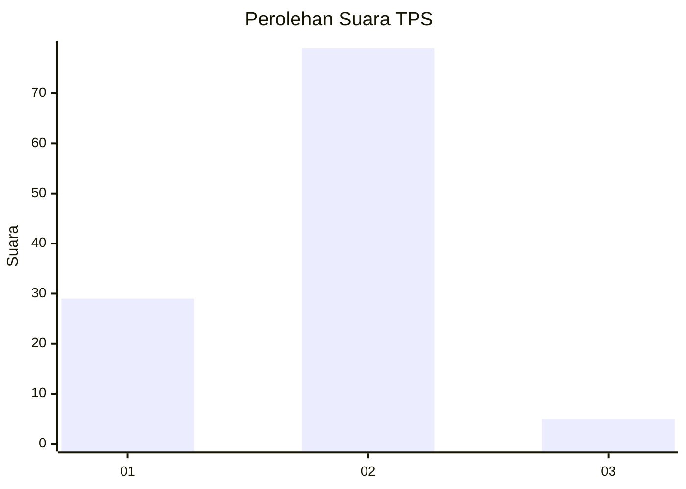
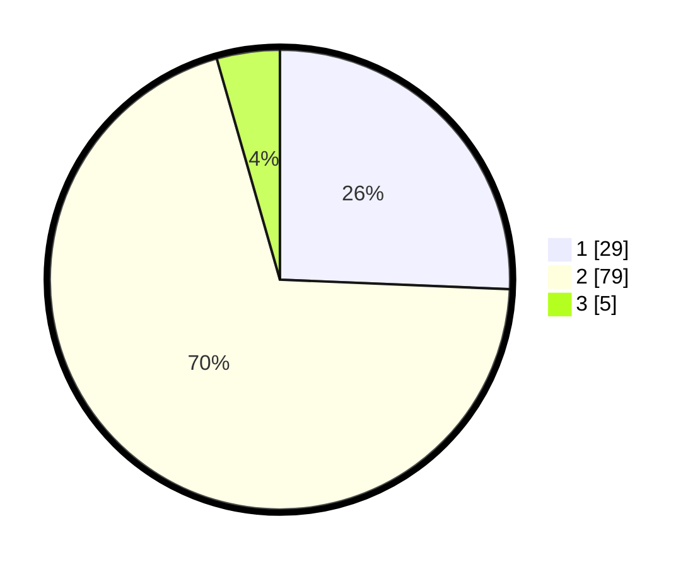

# Hasil

## Grafik

## Tabel

| No. | Nama Paslon    | Suara | Suara (raw) | Persentase |
|:--- |:-------------- | -----:| -----------:| ----------:|
| 1   | ANIES MUHAIMIN | 29    | [29][p-1]   | 25,66      |
| 2   | PRABOWO GIBRAN | 79    | [79][p-2]   | 69,91      |
| 3   | GANJAR MAHFUD  | 5     | [5][p-3]    | 4,42       |

[p-1]: https://github.com/gigit-pemilu/pemilu-2024/blob/main/pilpres/hitung-suara/sub/35-jawa-timur/sub/25-gresik/sub/18-tambak/sub/2009-tanjungori/sub/009-tps/sub/paslon-1.txt
[p-2]: https://github.com/gigit-pemilu/pemilu-2024/blob/main/pilpres/hitung-suara/sub/35-jawa-timur/sub/25-gresik/sub/18-tambak/sub/2009-tanjungori/sub/009-tps/sub/paslon-2.txt
[p-3]: https://github.com/gigit-pemilu/pemilu-2024/blob/main/pilpres/hitung-suara/sub/35-jawa-timur/sub/25-gresik/sub/18-tambak/sub/2009-tanjungori/sub/009-tps/sub/paslon-3.txt

## Foto C Plano

https://sirekap-obj-formc.kpu.go.id/2f72/pemilu/ppwp/35/25/18/20/09/3525182009009-20240215-113340--b12f0b36-4b65-4d00-bd5e-ad8bc71b565d.jpg

https://sirekap-obj-formc.kpu.go.id/2f72/pemilu/ppwp/35/25/18/20/09/3525182009009-20240214-214120--d4a5be81-6560-480e-ad9f-7dc409ddd46e.jpg

https://sirekap-obj-formc.kpu.go.id/2f72/pemilu/ppwp/35/25/18/20/09/3525182009009-20240214-214335--6b13d60e-6f53-4421-ad1f-1503d3a2f29a.jpg

## Metadata

| Key        | Value               |
| ---------- | ------------------- |
| Time Stamp | 2024-02-16 16:25:10 |

