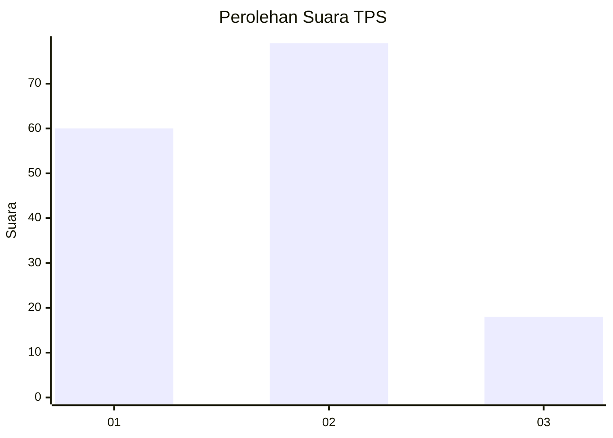
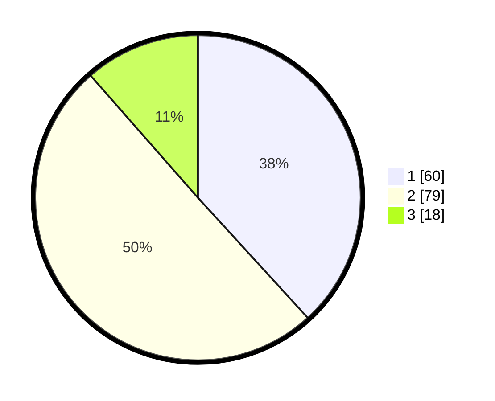

# Hasil

## Grafik

## Tabel

| No. | Nama Paslon    | Suara | Suara (raw) | Persentase |
|:--- |:-------------- | -----:| -----------:| ----------:|
| 1   | ANIES MUHAIMIN | 60    | [60][p-1]   | 38,22      |
| 2   | PRABOWO GIBRAN | 79    | [79][p-2]   | 50,32      |
| 3   | GANJAR MAHFUD  | 18    | [18][p-3]   | 11,46      |

[p-1]: https://github.com/gigit-pemilu/pemilu-2024-35-jawa-timur/blob/main/pilpres/hitung-suara/sub/35-jawa-timur/sub/25-gresik/sub/18-tambak/sub/2009-tanjungori/sub/010-tps/sub/paslon-1.txt
[p-2]: https://github.com/gigit-pemilu/pemilu-2024-35-jawa-timur/blob/main/pilpres/hitung-suara/sub/35-jawa-timur/sub/25-gresik/sub/18-tambak/sub/2009-tanjungori/sub/010-tps/sub/paslon-2.txt
[p-3]: https://github.com/gigit-pemilu/pemilu-2024-35-jawa-timur/blob/main/pilpres/hitung-suara/sub/35-jawa-timur/sub/25-gresik/sub/18-tambak/sub/2009-tanjungori/sub/010-tps/sub/paslon-3.txt

## Foto C Plano

https://sirekap-obj-formc.kpu.go.id/4b31/pemilu/ppwp/35/25/18/20/09/3525182009010-20240221-151808--375bd699-df12-46cf-b17e-2bd47c3d3f80.jpg

https://sirekap-obj-formc.kpu.go.id/4b31/pemilu/ppwp/35/25/18/20/09/3525182009010-20240221-151902--197fbaaa-f63f-4bb1-befc-62ab88a00e26.jpg

https://sirekap-obj-formc.kpu.go.id/4b31/pemilu/ppwp/35/25/18/20/09/3525182009010-20240221-151948--1e1ecbc1-047f-407a-bf5c-f8ca62a524a4.jpg

## Metadata

| Key        | Value               |
| ---------- | ------------------- |
| Time Stamp | 2024-02-25 12:00:00 |

