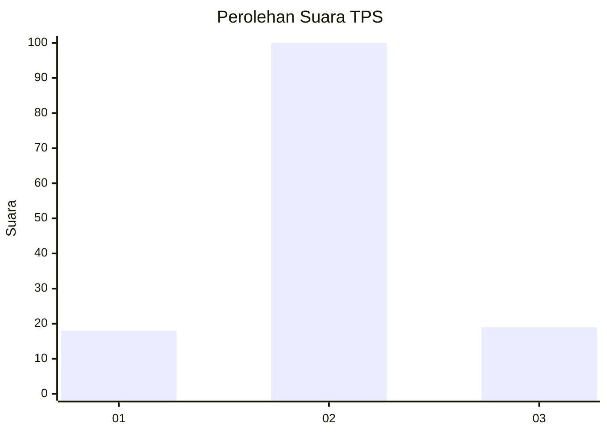
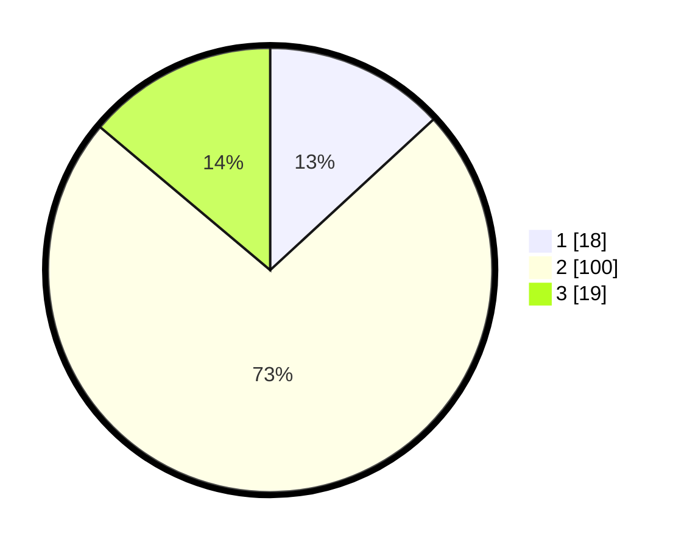

# Hasil

## Grafik

## Tabel

| No. | Nama Paslon    | Suara | Suara (raw) | Persentase |
|:--- |:-------------- | -----:| -----------:| ----------:|
| 1   | ANIES MUHAIMIN | 18    | [18][p-1]   | 13,14      |
| 2   | PRABOWO GIBRAN | 100   | [100][p-2]  | 72,99      |
| 3   | GANJAR MAHFUD  | 19    | [19][p-3]   | 13,87      |

[p-1]: https://github.com/gigit-pemilu/pemilu-2024/blob/main/pilpres/hitung-suara/sub/35-jawa-timur/sub/25-gresik/sub/18-tambak/sub/2009-tanjungori/sub/011-tps/sub/paslon-1.txt
[p-2]: https://github.com/gigit-pemilu/pemilu-2024/blob/main/pilpres/hitung-suara/sub/35-jawa-timur/sub/25-gresik/sub/18-tambak/sub/2009-tanjungori/sub/011-tps/sub/paslon-2.txt
[p-3]: https://github.com/gigit-pemilu/pemilu-2024/blob/main/pilpres/hitung-suara/sub/35-jawa-timur/sub/25-gresik/sub/18-tambak/sub/2009-tanjungori/sub/011-tps/sub/paslon-3.txt

## Foto C Plano

https://sirekap-obj-formc.kpu.go.id/7050/pemilu/ppwp/35/25/18/20/09/3525182009011-20240221-162751--04088773-0b84-49bb-b096-b4fcb75b0196.jpg

https://sirekap-obj-formc.kpu.go.id/7050/pemilu/ppwp/35/25/18/20/09/3525182009011-20240221-162908--946d0df2-84a0-40b9-bf82-7e510aaf982f.jpg

https://sirekap-obj-formc.kpu.go.id/7050/pemilu/ppwp/35/25/18/20/09/3525182009011-20240221-163000--f126b652-524f-41f0-898f-be7c73eae325.jpg

## Metadata

| Key        | Value               |
| ---------- | ------------------- |
| Time Stamp | 2024-02-25 16:00:00 |

