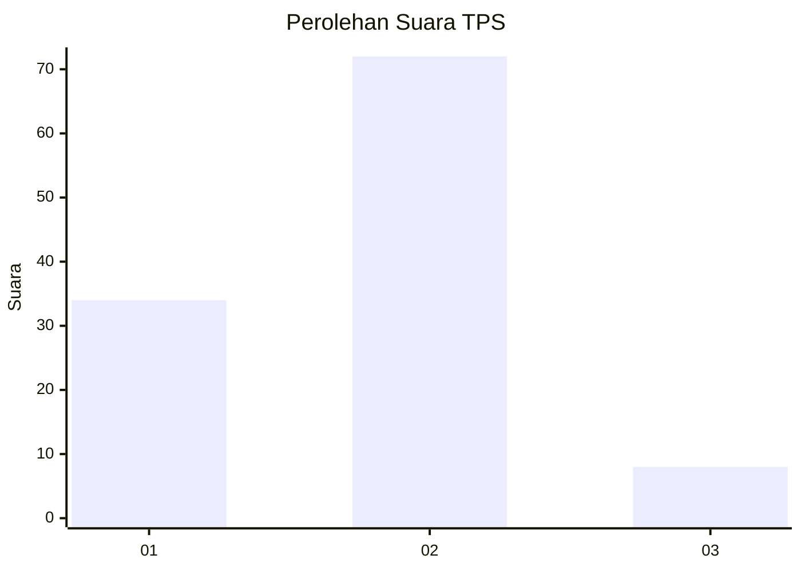
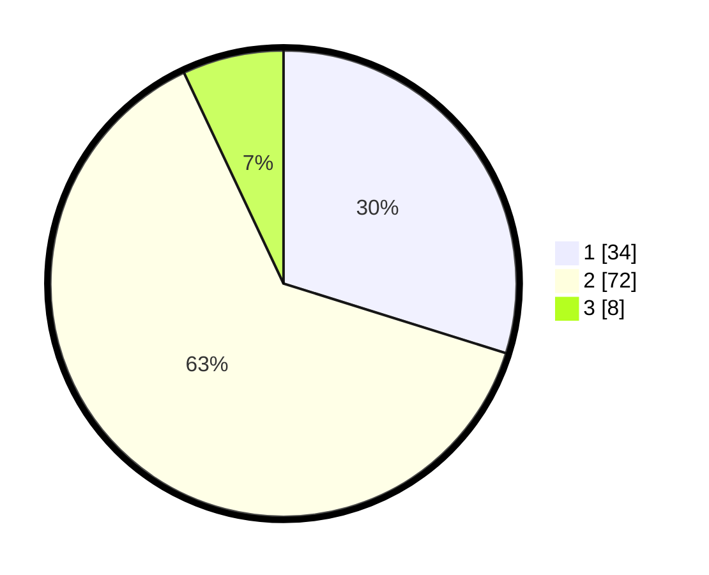

# Hasil

## Grafik

## Tabel

| No. | Nama Paslon    | Suara | Suara (raw) | Persentase |
|:--- |:-------------- | -----:| -----------:| ----------:|
| 1   | ANIES MUHAIMIN | 34    | [34][p-1]   | 29,82      |
| 2   | PRABOWO GIBRAN | 72    | [72][p-2]   | 63,16      |
| 3   | GANJAR MAHFUD  | 8     | [8][p-3]    | 7,02       |

[p-1]: https://github.com/gigit-pemilu/pemilu-2024-35-jawa-timur/blob/main/pilpres/hitung-suara/sub/35-jawa-timur/sub/25-gresik/sub/18-tambak/sub/2009-tanjungori/sub/015-tps/sub/paslon-1.txt
[p-2]: https://github.com/gigit-pemilu/pemilu-2024-35-jawa-timur/blob/main/pilpres/hitung-suara/sub/35-jawa-timur/sub/25-gresik/sub/18-tambak/sub/2009-tanjungori/sub/015-tps/sub/paslon-2.txt
[p-3]: https://github.com/gigit-pemilu/pemilu-2024-35-jawa-timur/blob/main/pilpres/hitung-suara/sub/35-jawa-timur/sub/25-gresik/sub/18-tambak/sub/2009-tanjungori/sub/015-tps/sub/paslon-3.txt

## Foto C Plano

https://sirekap-obj-formc.kpu.go.id/210d/pemilu/ppwp/35/25/18/20/09/3525182009015-20240214-234059--fbd9996a-79a7-4e3a-8873-267bfdbd172c.jpg

https://sirekap-obj-formc.kpu.go.id/210d/pemilu/ppwp/35/25/18/20/09/3525182009015-20240215-031829--2789f54b-6746-41b7-b909-6d252a524aaa.jpg

https://sirekap-obj-formc.kpu.go.id/210d/pemilu/ppwp/35/25/18/20/09/3525182009015-20240215-031945--31990186-093b-4039-ad41-0ccf616df283.jpg

## Metadata

| Key        | Value               |
| ---------- | ------------------- |
| Time Stamp | 2024-02-16 16:25:10 |

