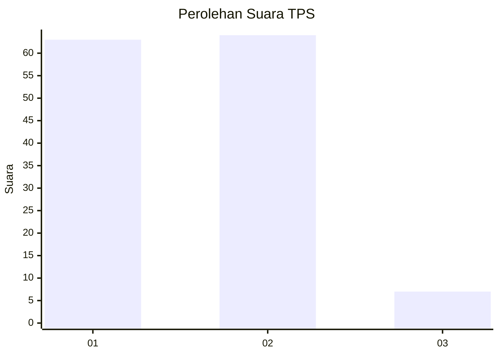
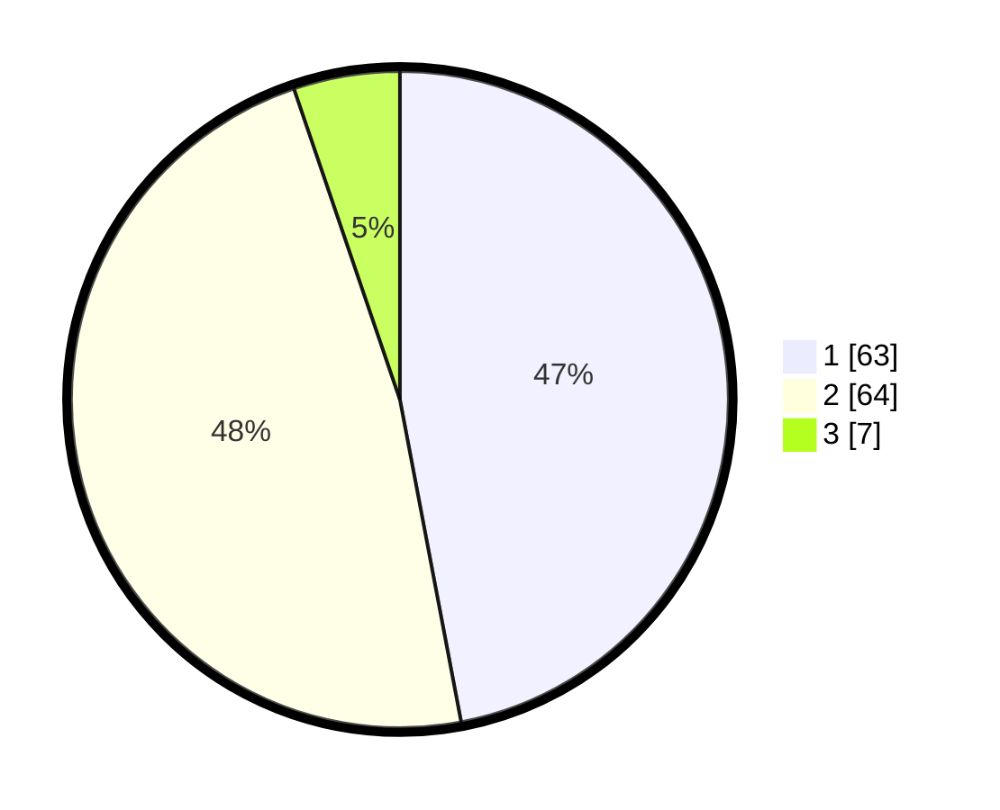

# Hasil

## Grafik

## Tabel

| No. | Nama Paslon    | Suara | Suara (raw) | Persentase |
|:--- |:-------------- | -----:| -----------:| ----------:|
| 1   | ANIES MUHAIMIN | 63    | [63][p-1]   | 47,01      |
| 2   | PRABOWO GIBRAN | 64    | [64][p-2]   | 47,76      |
| 3   | GANJAR MAHFUD  | 7     | [7][p-3]    | 5,22       |

[p-1]: https://github.com/gigit-pemilu/pemilu-2024/blob/main/pilpres/hitung-suara/sub/35-jawa-timur/sub/25-gresik/sub/18-tambak/sub/2009-tanjungori/sub/016-tps/sub/paslon-1.txt
[p-2]: https://github.com/gigit-pemilu/pemilu-2024/blob/main/pilpres/hitung-suara/sub/35-jawa-timur/sub/25-gresik/sub/18-tambak/sub/2009-tanjungori/sub/016-tps/sub/paslon-2.txt
[p-3]: https://github.com/gigit-pemilu/pemilu-2024/blob/main/pilpres/hitung-suara/sub/35-jawa-timur/sub/25-gresik/sub/18-tambak/sub/2009-tanjungori/sub/016-tps/sub/paslon-3.txt

## Foto C Plano

https://sirekap-obj-formc.kpu.go.id/c8c1/pemilu/ppwp/35/25/18/20/09/3525182009016-20240215-091552--2dc4c6b5-1c62-42d8-9ba2-e67ae7c24358.jpg

https://sirekap-obj-formc.kpu.go.id/c8c1/pemilu/ppwp/35/25/18/20/09/3525182009016-20240215-091747--555c3f11-a3e6-48f0-968b-6617eed3d4c7.jpg

https://sirekap-obj-formc.kpu.go.id/c8c1/pemilu/ppwp/35/25/18/20/09/3525182009016-20240215-091855--3db5af49-c1ef-46d3-ba4b-be4c78ccd0b2.jpg

## Metadata

| Key        | Value               |
| ---------- | ------------------- |
| Time Stamp | 2024-02-16 16:25:10 |

